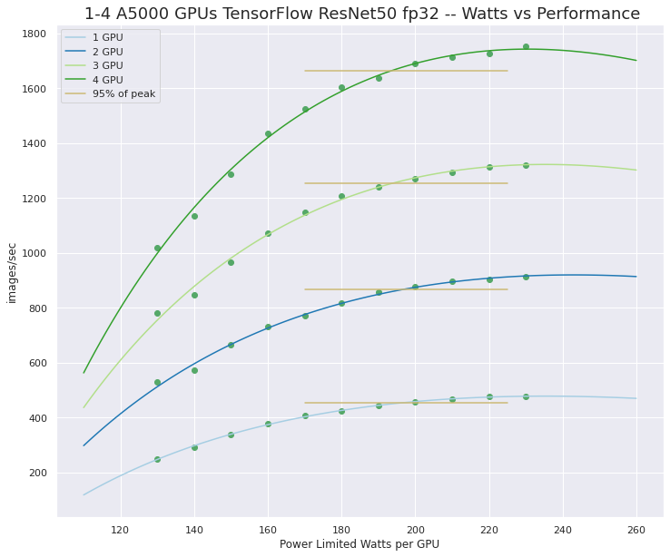
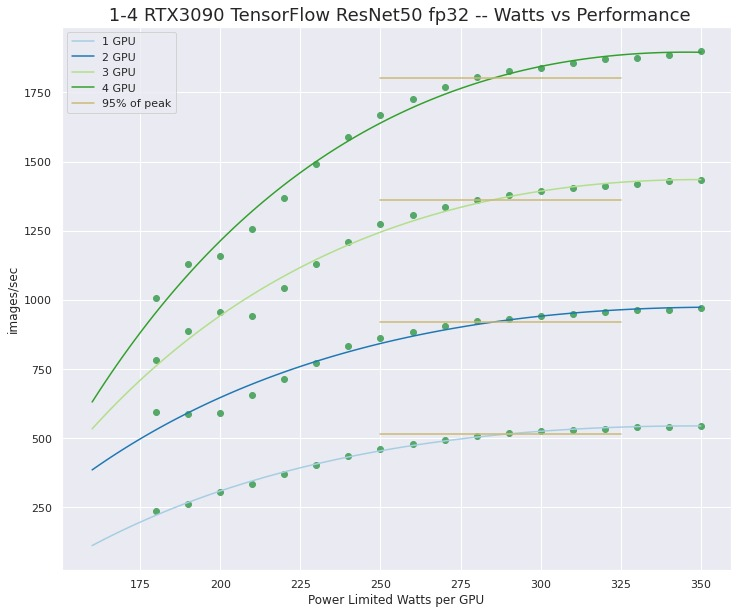

# NVIDIA GPU Power Limit vs Performance

## Introduction

This post presents testing data showing that power-limit reduction on NVIDIA GPUs have give significant benefits for both high wattage and lower wattage GPUs. Power-limit vs Performance data is presented for 1-4 A5000 and 1-4 RTX3090 GPUs.

I recently wrote a post (listed below) describing a Bash script that can be used to configure an Ubuntu Linux system to set NVIDIA GPU power limits automatically on boot, using systemd.

The motivation discussed in that post was;

> The higher end NVIDA RTX desktop GPUs like the RTX3090, A6000, etc.. Make wonderful compute devises in a multi-GPU setup. However the default power limits are set very high. As much as 350W! Those high power limits can strain the the capability of a system power supply cooling capability and possibly even overload the circuit that the system is is plugged into.

Testing that we have done shows that lowering the GPU power limit, to less aggressive values than the default, can have very little impact on compute performance.

Lowering the GPU power limit on multi-GPU systems that are under heavy compute load can,

- reduce stress on the total computer power delivery system,
- reduce power load "at the wall",
- reduce the heat dissipation load on the system, and external environment,
- reduce system noise level (because of lowered cooling needs),
- increase longevity of system components because of lowered power and heat stress.

A modest GPU power lowering of 10-20% can improve the conditions above at the cost of only a small, less that 5%, loss of performance. This power lowering may be a determining factor in the viability of running a high-end, quad-GPU compute workstation.

I feel that our testing has shown that for GPUs with 300W or greater power limits, reducing these limits has limited performance impact.

- **What about GPUs that are running at more modest power limits?**
- **Does GPU power limiting on lower powered NVIDIA GPUs still make sense?**

**I feel that power limiting even lower wattage GPUs can be beneficial.** All of the arguments for the high-powered GPUs still holds. For a high-powered multi-GPU setup power limiting may be a necessity for system viability. This may not be a necessity for lower powered GPUs but still a reasonable thing to consider. **But only if the power limit vs performance curves are similar to the high-power case.**

To check this we ran a TensorFlow CNN (ResNet50) workload on a workstation with 4 x A5000 NVIDIA GPUs. **The testing results show the same, power-limit vs performance, characteristics as what we had seen for a 4 x RTX3090 (350W GPU).**

**So, yes, setting GPU power limits on lower power NVIDIA GPUs is a reasonable thing to do.**

Other posts I've written on **GPU Power Scaling** are;

- [NVIDIA GPU Powerlimit Systemd Setup Script](https://www.pugetsystems.com/labs/hpc/NVIDIA-GPU-Powerlimit-Systemd-Setup-Script-2295/)
- [Quad RTX3090 GPU Power Limiting with Systemd and Nvidia-smi](https://www.pugetsystems.com/labs/hpc/Quad-RTX3090-GPU-Power-Limiting-with-Systemd-and-Nvidia-smi-1983/)
- [Quad RTX3090 GPU Wattage Limited "MaxQ" TensorFlow Performance](https://www.pugetsystems.com/labs/hpc/Quad-RTX3090-GPU-Wattage-Limited-MaxQ-TensorFlow-Performance-1974/)

**The systemd setup script is available on GitHub for use by anyone who may benefit from it.**

[https://github.com/dbkinghorn/nv-gpu-powerlimit-setup](https://github.com/dbkinghorn/nv-gpu-powerlimit-setup)

Note that this scrip is still under development but is currently in a usable state. Expect updates and of course feel free to download the script and modify it as you wish.

## GPU Power Scaling vs Performance Results

The setup and methodology in this new testing is very similar to that listed in the link for the [4 x RTX3090 testing](https://www.pugetsystems.com/labs/hpc/Quad-RTX3090-GPU-Wattage-Limited-MaxQ-TensorFlow-Performance-1974/). A newer release of the [NVIDIA maintained TensorFlow 1.15 container on NGC](https://catalog.ngc.nvidia.com/orgs/nvidia/containers/tensorflow) was used with the 4 x A5000 testing.

**4 x A5000 Power Scaling vs Performance**

Here is older testing results for 4 x RTX 3090 power scaling vs performance for comparison.
[https://www.pugetsystems.com/labs/hpc/Quad-RTX3090-GPU-Wattage-Limited-MaxQ-TensorFlow-Performance-1974/](https://www.pugetsystems.com/labs/hpc/Quad-RTX3090-GPU-Wattage-Limited-MaxQ-TensorFlow-Performance-1974/)

**4 x RTX3090 Power Scaling vs Performance**

**Happy Computing! --dbk @dbkinghorn**
