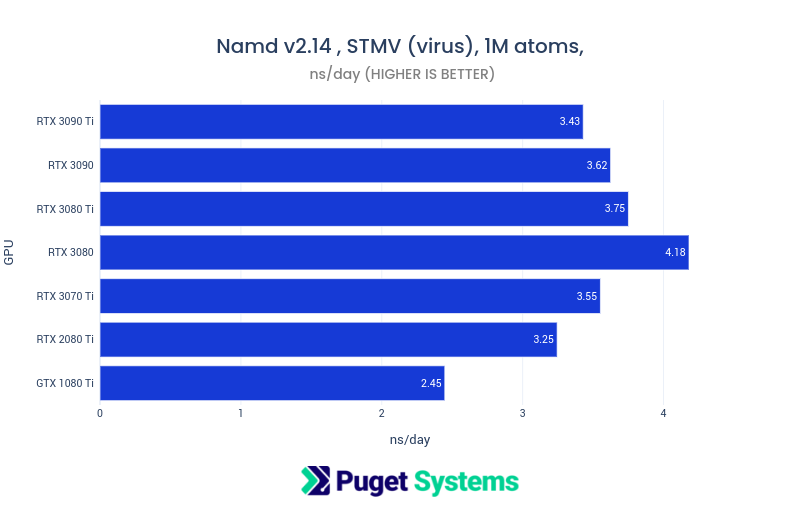

# Molecular Dynamics Benchmarks GPU Roundup Gromacs Namd2 Namd3alpha on 12 GPUs

## Introduction

Molecular Dynamics is an important tool in many areas of scientific research. We get deep satisfaction from providing workstations for this research. It's a feeling of contributing to the common good and "making a difference". To this end we make a serious effort to recommend appropriate hardware. Part of that effort is benchmarking!

We have a new collection of GPU accelerated Molecular Dynamics benchmark packages put together for GROMACS, NAMD 2, and NAMD 3-alpha10. (The benchmark packages will be available to the public soon.) In this post we present results for,

- 3 applications: GROMACS, NAND 2 and NAMD 3alpha10
- 8 MD simulations
- 12 different NVIDIA GPUs
- 96 total results

There are some surprising results, and some that are puzzling but, we are presenting them all.

## Benchmarks

## GROMACS and NAMD


## GROMACS 2022:

- [GROMACS Home](https://www.gromacs.org)
- [Current version documentation](https://manual.gromacs.org/current/reference-manual/preface.html)
- [Benchmark source input files:](https://www.mpinat.mpg.de/grubmueller/bench)
  - Dept. of Theoretical and Computational Biophysics, Max Planck Institute for Multidisciplinary Sciences, Göttingen, https://www.mpinat.mpg.de/grubmueller/bench.
- Application Sorce: Container bundle built from [https://hub.docker.com/r/gromacs/gromacs] tag: gmx-2022-cuda-11.6.0-avx2

**Benchmark References:**

**MEM:**
**de Groot, B. L.; Grubmueller, H.:** Water permeation across biological membranes: Mechanism and dynamics of Aquaporin-1 and GlpF. Science 294, pp. 2353 - 2357 (2001)

**RIB:**
**Bock, L. V.; Blau, C.; Schröder, G. F.; Davydov, I. I.; Fischer, N.; Stark, H.; Rodnina, M. V.; Vaiana, A. C.; Grubmüller, H.:** Energy barriers and driving forces in tRNA translocation through the ribosome. Nature Structural and Molecular Biology 20 (12), pp. 1390 - 1396 (2013)

**PEP:**
**Matthes, D.; Gapsys, V.; de Groot, B. L.:** Driving forces and structural determinants of steric zipper peptide oligomer formation elucidated by atomistic simulations. Journal of Molecular Biology 421 (2-3), pp. 390 - 416 (2012)

---


## NAMD v2.14 and v3 alpha10

- [NAMD Home](https://www.ks.uiuc.edu/Research/namd/)
- [Latest Namd reference paper](https://aip.scitation.org/doi/10.1063/5.0014475)
  **Scalable molecular dynamics on CPU and GPU architectures with NAMD**
  J. Chem. Phys. 153, 044130 (2020); https://doi.org/10.1063/5.0014475
- [NAMD 2.14 documentation](https://www.ks.uiuc.edu/Research/namd/2.14/ug/)
- [NAMD Downloads](https://www.ks.uiuc.edu/Development/Download/download.cgi?PackageName=NAMD) Requires registration to download.
- [NAMD v3 alpha information and test application downloads](https://www.ks.uiuc.edu/Research/namd/alpha/3.0alpha/)

**Benchmark Source:**

**apoa1:**
[ApoA1 benchmark (92,224 atoms, periodic, PME)](https://www.ks.uiuc.edu/Research/namd/utilities/apoa1/)
**f1atpase:**
[ATPase benchmark (327,506 atoms, periodic, PME)](https://www.ks.uiuc.edu/Research/namd/utilities/f1atpase/)  
**stmv:**
[STMV (virus) benchmark (1,066,628 atoms, periodic, PME)](https://www.ks.uiuc.edu/Research/namd/utilities/stmv/)

## NAMD 3 is GPU resident, soon, no more CPU bottleneck!

NAMD v3 is currently at alpha 10 and is already seeing significant performance gains over v2. Being GPU resident it will not be limited by CPU performance which has been a bottleneck with v2 for several years since recent NVIDIA GPUs have such high performance. The forces computed on GPU would finish so quickly that the GPUs would starve for work waiting on multi-CPU cores to finish.

Not all methods from NAMD 2 are implemented yet. The f1atpase benchmark failed with the following message,

```
( Bribe us with coffee to get your feature GPU-Resident! :)
FATAL ERROR: CUDASOA integration is incompatible with the following options:
minimization; pressure profiling; Berendsen pressure;
multigrator; Lowe-Andersen; fixed atoms; GBIS; LCPO;
zero momentum; TCL forces; Colvars;
temperature coupling, rescaling, or reassignment;
water models other than TIP3; lonepairs or Drude.
```

## Methodology

The benchmarks were run using Python wrapper scripts that collect system information, take user input for "jobs", gpu selection, cpu cores, repeats, output, etc. These scripts run the external benchmark applications after constructing appropriate command-lines and then gather job run performance output and statistics. The output files were then loaded to pandas data-frames in a jupyter notebook and charts generated with Plotly (styled to look somewhat like Excel)

**All jobs were run on the following CPU platform;**

- CPU: AMD Ryzen Threadripper PRO 3995WX 64-Cores
- Motherboard: ASUSTeK COMPUTER INC. Pro WS WRX80E-SAGE SE WIFI
- RAM: 8x DDR4-3200 16GB Reg. ECC (128GB total)
- OS: Ubuntu 20.04.4 LTS
- OS was network booted over 10G using [
  LTSP Configuration for Benchmark Platform of Diskless Workstations](https://www.pugetsystems.com/labs/hpc/LTSP-Configuration-for-Benchmark-Platform-of-Diskless-Workstations-2301/)

(TR Pro 3995WX 64 core was chosen to help limit CPU bottlenecks and give better discrimination of GPU performance)

**GPUs:** (NVIDIA Founders Editions)

- RTX 3090 Ti
- RTX 3090
- RTX 3080 Ti
- RTX 3080
- RTX 3070 Ti
- RTX 2080 Ti
- GTX 1080 Ti
- RTX A6000
- RTX A5500
- RTX A5000
- RTX A4500
- RTX A4000

**Representative Command Lines**

**GROMACS**

```
"commandline": "gmx mdrun -gpu_id 0 -pin on -noconfout -ntomp 64 -s gromacs/MEM/benchMEM.tpr -nsteps 10000"
```

**NAMD 2**

```
"commandline": "namd2 +p128 +setcpuaffinity +idlepoll +isomalloc_sync +devices 0 namd/f1atpase/f1atpase.namd"
```

**NAMD 3alpha**

```
"commandline": "namd3 +p1 +setcpuaffinity +idlepoll +isomalloc_sync +devices 0 namd3/apoa1/apoa1.namd"
```

The input files for v3 alpha needs this additional directive,

```
CUDASOAintegrate on
```

**Note the "+p1" on the command-line. NAMD 3 is "GPU resident", essentially everything runs on the GPU and only 1 CPU core is used per GPU!** GROMACS did well without Hyper/SMT threads and NAMD2 did better with them when using GPU acceleration.

## Results

There are 16 charts. 8 for the GeForce GPUs and 8 for the Professional GPUs. X-axis, i.e. performance, is the same scale for both.

There are anomalies!

- GROMACS did not perform well on A6000. This may be some quirk with how GROMACS loads memory of the 48GB on available on the A6000.
- The A4000 gave surprisingly poor performance on all test. I had naively expected it to perform relative to the (excellent) A4500.
- The RTX 3080 gave excellent performance with NAMD 2 on larger problem sizes. This was unexpected. I'm used to seeing flat performance with the higher-end GeForce GPUs since job runs often bottleneck by CPU performance limitations. I cannot explain the 3080s good performance.
- NAMD 3 alpha10 was a nice addition to the testing. This is GPU resident code so the performance scaling was more consistent with GPU specs. It is still early development code and by the excellent performance illustrated in the charts below speaks well for future releases.

---

## GROMACS:

---


This is the first of the anomalies. GROMACS did not do well with the A6000. I repeated the benchmarks may times but it was consistent. If you have an explanation or observation please add it to the comments.

---


---


---

## NAMD v2.14:

---


---


This is another anomaly. I cannot explain the great performance of the RTX 3080. This was a "Founders edition" card like all the rest.

Also not the apparent CPU bottleneck with the higher GPUs. The ATPase (f1atpase) benchmark uses more methods that are CPU dependent than the other NAMD benchmarks. Some of these methods have not yet been ported to NAMD 3, possibly because they are difficult to port entirely to GPU.

---




---

## NAMD v3 alpha10:

---


Notice how the GPU resident code of NAMD 3 alpha scales more smoothly with the specs of the GPUs and the significantly improved performance over NAMD 2. I'm Looking forward to seeing the "production" version!

---


## GeForce RTX vs Pro RTX

There is no denying that GeForce "gaming" GPUs can make powerful compute devices. It was experimentation on gaming GPUs that started the whole idea of general GPU compute acceleration. NVIDIA capitalized on this in the best way possible eventually leading to them becoming the most important scientific hardware vendor in history. (In my opinion.) Early adopters used gaming GPUs and Molecular Dynamics was one of the first areas of success.

Of course NVIDIA has higher-end Professional GPUs that used to be labeled as "Quadro" (after the quad buffering that was useful for stereo imaging). These (and AMD FirePro) have been the choice for serious workstation use for decades.

Beyond that there is the pinnacle of GPU compute acceleration offered by what was formerly "Tesla". GPUs like the A100 and upcoming Hopper H100 are astounding compute devices offering many advanced feature such as excellent double precision (FP64) floating point.

However, Molecular Dynamics force calculations are generally performed at FP32. Thus GeForce and Professional GPUs usually suffice. CPUs have been needed for some parts of the code that was difficult to port to GPU but the trend is to move as much as possible to the GPU since that is where the most compute performance exists. NAMD 3 alpha is an example of that.

In this post I used both GeForce and Professional GPUs since they are both worthy of consideration. For compute they are mostly the same since they use the same GPU cores. However, the RTX A series Pro GPUs are more expensive than the GeForce RTX at the same performance level. However, they offer a couple of advantages that might be worth the expenditure. They are certainly great GPUs!

- **The RTX Professional GPUs are highly reliable.** We sell thousands of GPUs annually and the Pro series have very low failure rates in the field. We track all failures in the field and "dead on arrival" or during stress testing. We looked at the failures for NVIDIA Professional and realized that the failure rate was almost entirely due to a batch of cards that came in with a bad video socket. There was only 1 or 2 failures other than that. The RTX GeForce cards are also very reliable but we have many more failures in the field and during testing. In the early to mid 2010's I would advise folks who were doing multi-GPU systems with GeForce to buy extra in anticipation of a failure approximately every 6-12 months. They are more reliable these days but the Professional cards are much better in this regard.

- **The Professional cards are better engineered** and use the best selected components. They are the best choice for multi-GPU configurations because of superior cooling offered with their blower fans and often more compact form. Most of the GeForce GPUs use a cooling system that exhausts into the chassis and requires at least one card space between devices. The Professional GPUs exhaust out the rear of the case and can be placed next to each other.

## Conclusions

I hope this testing is useful for you! It can be difficult to find performance test results on current hardware with a large enough test suite to inform decisions for system configurations. It's not feasible to test every job type and setup variation with these feature rich applications. Hopefully there is enough information in the text and charts to assist decisions.

This GPU performance "roundup" for Molecular Dynamics has been on my ToDo list for some time. The new benchmarking environment and automation was a big help. I had several ideas for improving the benchmark usability and will refactor my current code and then make it available to the public.

If I had to pick a "winner" it would have to be the RTX3080 however. **Really all of these GPUs, except the A4000, give several factors of performance improvement over CPU alone.** (see for example [AMD Threadripper Pro 3995x HPL HPCG NAMD Performance Testing (Preliminary)](https://www.pugetsystems.com/labs/hpc/AMD-Threadripper-Pro-3995x-HPL-HPCG-NAMD-Performance-Testing-Preliminary-2085/))

**Happy Computing!** --dbk @dbkinghorn
