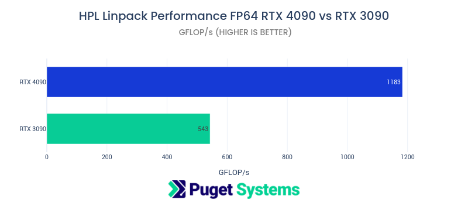
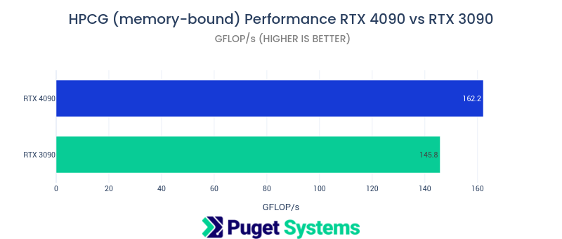
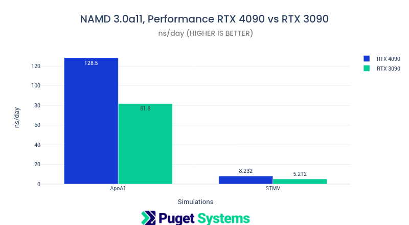
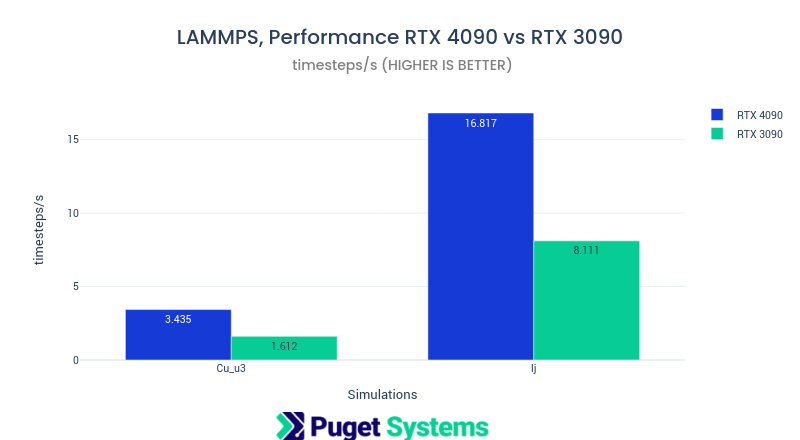
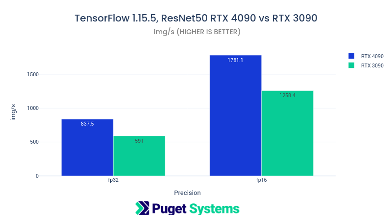
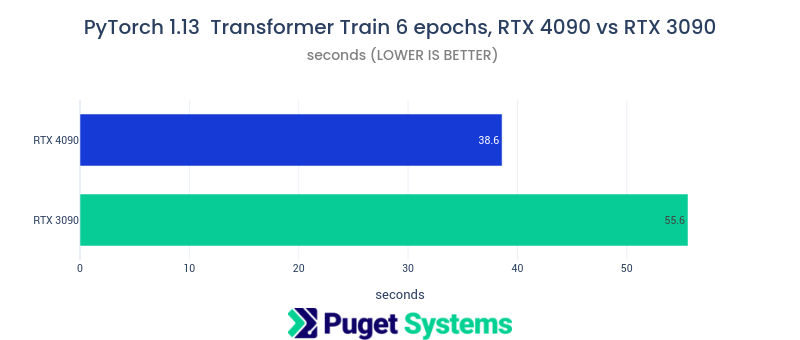

# NVIDIA RTX4090 ML-AI and Scientific Computing Performance (Preliminary)

## Introduction

This post presents preliminary ML-AI and Scientific application performance results comparing NVIDIA RTX 4090 and RTX 3090 GPUs. These are early results using the NVIDIA CUDA 11.8 driver.

**The applications tested are not yet fully optimized for compute capability 8.9 i.e. sm89, which is the compute CUDA level for the Ada Lovelace architecture. That should be fully supported with CUDA 12. The testing will be revisited after further launches of the Lovelace arch series GPUs and rebuilt applications at this higher CUDA compute capability.**

The RTX 4090 does not disappoint! NVIDIA has managed, yet again, to push performance improvements to nearly double over last generation. Those days are long gone on the CPU side and may be coming to an end for NVIDIA too, given CEO Jensen Huang's comment at GTC Fall 2022, “Moore’s Law is dead.” However, I suspect that they will still manage to impress with future generations. For now, the Ada Lovelace and Hopper architectures offer tremendous performance.

## Test Systems

**AMD Threadripper Pro Test Platform**

- CPU AMD Threadripper PRO 5995WX 64 Core
- CPU Cooler Noctua NH-U14S TR4-SP3
- Motherboard Asus Pro WS WRX80E-SAGE SE WIFI
- RAM 8x DDR4-3200 16GB ECC Reg. (128GB total)
- NVIDIA GeForce RTX 4090 24GB
- NVIDIA GeForce RTX 3090 24GB

- [Ubuntu 22.04 Linux](https://ubuntu.com)
- [NVIDIA Enroot 3.4](https://github.com/NVIDIA/enroot)

**Containerized Applications From [NVIDIA NGC](https://catalog.ngc.nvidia.com)**

- [HPL](https://www.netlib.org/benchmark/hpl/) High Performance Linpack tag: nvcr.io/nvidia/hpc-benchmarks:21.4-hpl
- [HPCG](https://www.hpcg-benchmark.org/) High Performance Conjugate Gradient solver tag: nvcr.io/nvidia/hpc-benchmarks:21.4-hpcg3.1
- [NAMD](https://www.ks.uiuc.edu/Research/namd/) 3.0a11 Molecular Dynamics tag: nvcr.io/hpc/namd:3.0-alpha11
- [LAMMPS](https://lammps.sandia.gov) Molecular Dynamics tag: nvcr.io/hpc/lammps:patch_4May2022
- [TensorFlow](https://www.tensorflow.org/) 1.15.5 ML/AI framework tag: nvcr.io/nvidia/tensorflow:22.09-tf1-py3
- [PyTorch](https://pytorch.org/docs/stable/index.html) 1.13.0a0 ML/AI framework tag: nvcr.io/nvidia/pytorch:22.09-py3

## Benchmarks

The charts below show the excellent compute performance of the RTX 4090 in comparison with the also excellent RTX 3090. **Keep in mind that these are preliminary results with application that are not fully optimized for the new compute level 8.9 for the Ada Lovelace architecture.**

There will be a few details about the benchmarks and command lines that were used to run them. I am including some output for only RTX 4090 job runs, however, the 4090 and 3090 were both tested in the same system back to back, i.e. all results are new testing.

## HPL (Linpack)

This is the HPL Linpack benchmark built to run on NVIDIA GPUs. It is intended to testing on the high-end compute GPUs like the A100 and H100. It is also setup for multi-GPU multi-node use. This is the standard benchmark used for ranking the Top500 supercomputers.

It is really not intended to be run on RTX GPUs! RTX GPU have very poor double precision (fp64) performance compared to compute GPUs. The single precision (fp32) performance is however excellent on RTX. There is a fp32 version of this benchmark named HPL-AI. Unfortunately I could not get it to properly converge with 1 or 2 RTX 4090s or 3090s.

I decided to include the fp64 HPL result because even though it is nearly 10 times lower performance than an A100 it is still respectable compared to a 16-24 core CPU! I feel that developers working on code that is intended for A100 or H100 could develop and test on a RTX 4090 before moving code to the (much more expensive) A100 or H100.

See [Outstanding Performance of NVIDIA A100 PCIe on HPL HPL-AI HPCG Benchmarks](https://www.pugetsystems.com/labs/hpc/Outstanding-Performance-of-NVIDIA-A100-PCIe-on-HPL-HPL-AI-HPCG-Benchmarks-2149/) for comparisons,

command line:

```
CUDA_VISIBLE_DEVICES=0 mpirun --mca btl smcuda,self -x UCX_TLS=sm,cuda,cuda_copy,cuda_ipc -np 1 hpl.sh --dat ./HPL.dat --cpu-affinity 0 --cpu-cores-per-rank 4 --gpu-affinity 0
```

4090 output:

```
2022-10-10 19:58:13.576
================================================================================
T/V                N    NB     P     Q               Time                 Gflops
--------------------------------------------------------------------------------
WR03L2L2       48000   288     1     1              62.41              1.183e+03
--------------------------------------------------------------------------------
||Ax-b||_oo/(eps*(||A||_oo*||x||_oo+||b||_oo)*N)=        0.0045393 ...... PASSED
================================================================================
```



Notes:

- This benchmark makes heavy use of double precision floating point capability which is greatly reduced on RTX GPUs.
- Over a tera-FLOP of fp64 performance from a GeForce GPU is impressive!

[https://www.netlib.org/benchmark/hpl/](https://www.netlib.org/benchmark/hpl/)

## HPCG

HPCG (High Performance Conjugate Gradient) is a memory-bound application, typical of many engineering "solvers". It is the secondary ranking benchmark of the Top500 supercomputer list. GPU results for this benchmark are typically much higher than even high end CPU due to the high performance memory on GPUs

command line:

```
mpirun --mca btl smcuda,self -x UCX_TLS=sm,cuda,cuda_copy,cuda_ipc -np 1 hpcg.sh --dat ./hpcg.dat --cpu-affinity 0 --cpu-cores-per-rank 4 --gpu-affinity 0
```

4090 output:

```
SpMV  =  145.6 GF ( 917.2 GB/s Effective)  145.6 GF_per ( 917.2 GB/s Effective)
SymGS =  181.1 GF (1397.8 GB/s Effective)  181.1 GF_per (1397.8 GB/s Effective)
total =  171.4 GF (1299.6 GB/s Effective)  171.4 GF_per (1299.6 GB/s Effective)
final =  162.2 GF (1230.1 GB/s Effective)  162.2 GF_per (1230.1 GB/s Effective)
```



Notes:

- The HPCG results are expected to be nearly the same for 4090 and 3090 since the memory performance is similar for both.

[https://www.hpcg-benchmark.org/](https://www.hpcg-benchmark.org/)

## NAMD

This is the GPU resident version of the molecular dynamics package NAMD 3.0 alpha 11. Performance is very good!

See [Molecular Dynamics Benchmarks GPU Roundup GROMACS NAMD2 NAMD 3alpha on 12 GPUs](https://www.pugetsystems.com/labs/hpc/Molecular-Dynamics-Benchmarks-GPU-Roundup-GROMACS-NAMD2-NAMD-3alpha-on-12-GPUs-2330/) for comparisons with the mixed CPU-GPU version 2,14

command line:

```
echo "CUDASOAintegrate on" >> v3-stmv.namd
namd3 +p1 +setcpuaffinity +idlepoll +devices 0 v3-stmv.namd
```

4090 STMV output:

```
Info: Benchmark time: 1 CPUs 0.0104954 s/step 8.23218 ns/day 0 MB memory
TIMING: 500  CPU: 6.17736, 0.0105293/step  Wall: 6.18515, 0.0104489/step, 8.2688 ns/days, 0 hours remaining, 0.000000 MB of memory in use.
ENERGY:     500    357236.6193    279300.1236     81947.6998      5091.0071       -4504684.2417    381649.5571         0.0000         0.0000    947494.7573       -2451964.4774       298.0115  -3399459.2347  -2443255.3272       297.9991           1256.7666        33.2244  10200288.8725       -42.3066       -11.3685
```



Notes:

- NAMD like most molecular dynamics applications has great GPU acceleration. This GPU resident version is large improvement over the CPU-GPU version.

[ApoA1 benchmark (92,224 atoms, periodic, PME)](https://www.ks.uiuc.edu/Research/namd/utilities/apoa1/)
[STMV (virus) benchmark (1,066,628 atoms, periodic, PME)](https://www.ks.uiuc.edu/Research/namd/utilities/stmv/)

## LAMMPS

command line:

```
mpirun -n 1 lmp  -k on g 1 -sf kk -pk kokkos cuda/aware on neigh full comm device binsize 2.8 -var x 8 -var y 8 -var z 8 -in in.lj
```

4090 lj output:

```
Loop time of 5.94622 on 1 procs for 100 steps with 16384000 atoms

Performance: 7265.125 tau/day, 16.817 timesteps/s
100.0% CPU use with 1 MPI tasks x 1 OpenMP threads
```



Notes:

- LAMMPS is another popular molecular dynamics application developed at Los Alamos National Lab.
- There are MANY build options for LAMMPS. I was happy to use the NVIDIA optimized container from NGC
- LAMMPS performance showed a doubling on the 4090 over the 3090!

Cu_u3: bulk Cu lattice 16384000 atoms
lj: 3d Lennard-Jones melt 55296000 atoms

[https://download.lammps.org/tars/lammps-10Mar2021.tar.gz](https://download.lammps.org/tars/lammps-10Mar2021.tar.gz)

## TensorFlow 1.15.5 ResNet50

This is the NVIDIA maintained version 1 of TensorFlow which typically offers somewhat better performance than version 2. The benchmark is training 100 steps of the ResNet 50 layer convolution neural network (CNN). The result is the highest images-per-second value from the run steps. FP32 and FP16 (tensorcore) jobs were run.

command line:

```
CUDA_VISIBLE_DEVICES=0 python resnet.py --layers=50 --batch_size=128 --precision=fp16
```



Notes:

- XLA was not used for the job runs for consistency with benchmark runs that I have done in the past. I will likely include that in future benchmarking.

[https://github.com/NVIDIA/DeepLearningExamples/tree/master/TensorFlow/Classification/ConvNets/resnet50v1.5](https://github.com/NVIDIA/DeepLearningExamples/tree/master/TensorFlow/Classification/ConvNets/resnet50v1.5)

## PyTorch 1.13 Transformer training

This benchmark is using PyTorch 1.13 for a 6 epoch train of a Transformer model on Wikitext-2 with CUDA.

command line:

```
time CUDA_VISIBLE_DEVICES=0 python main.py --cuda --epochs 6 --model Transformer --lr 5 --batch_size 640
```



Notes:

- I will run this (and other Transformer model) benchmark with dual GPUs after CUDA 12 is released to investigate performance on RTX 3090 with NVLINK and RTX 4090 without NVLINK (NVLINK is not available on Lovelace arch RTX GPUs).

[https://github.com/pytorch/examples/tree/main/word_language_model](https://github.com/pytorch/examples/tree/main/word_language_model)

## Conclusions

These preliminary compute results for the new NVIDIA RTX 4090 look very good and offer a significant performance boost over last generation RTX 3090 (which was already very good)! I expect results to be better with code compiled against CUDA 12 which will have full support for Ada Lovelace and Hopper arch GPUs. There will be more RTX 4000 series and Pro Axxx-ada series GPUs over the next few months. I will revisit testing.

One surprising result was how respectable the double precision floating point (fp64) was on RTX 4090. fp64 performance is not a highlighted feature of RTX GPUs. Single precision fp32 is typically 20 times fp64 for these GPUs. However, the fp64 performance of the RTX 4090 is competitive with 16-34 core CPUs. I feel this could be used for code testing and development that is target to run on high-end compute GPUs like A100 and H100.

Overall it looks like NVIDIA has kept the performance increase near doubling on successive GPU generations for another release. They have been doing this for over 10 years now. Impressive indeed!
