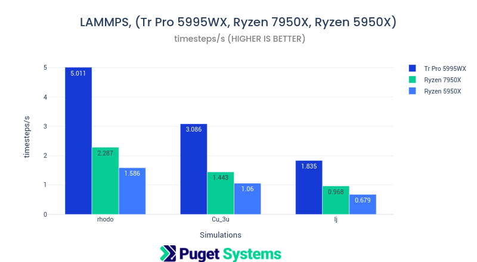
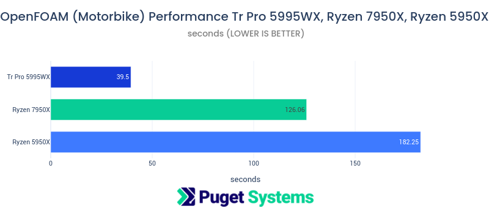
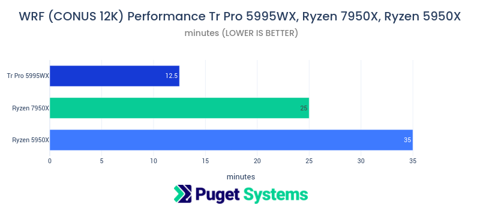

# AMD Ryzen 7950X Scientific Computing Performance - 7 Optimized Applications

## Introduction

This post presents scientific application performance testing on the new AMD Ryzen 7950X. I am impressed! Seven applications that are heavy parallel numerical compute workloads were tested. The 7950X outperformed the Ryzen 5950X by as much as 25-40%. For some of the applications it provided nearly 50% of the performance of the much larger and more expensive Threadripper Pro 5995WX 64-core processor. That's remarkable for a $700 CPU! The Ryzen 7950X is not in the same platform class as the Tr Pro but it is a respectable, budget friendly, numerical computing processor.

**Note:**
**The Ryzen 7950X is using the Zen4 cores and the 5950X and Tr Pro 5995WX are using Zen3. I created docker containers with applications compiled from source that were optimized for Zen3 using AMD compilers and libraries. The currently available AMD compilers (also gcc) do not have Zen4 specific optimization paths. This is significant since the Ryzen 7000 CPUs have AVX512 vector units that have not been exploited by builds used in this testing. That means that Ryzen 7000 performance will only get better once compilers with full Zen4 support are available. I will be watching out for the new compiler releases and will re-optimize the applications and write up the results.**

## Test Systems

**AMD Ryzen 7950X Test Platform**

- CPU AMD Ryzen 9 7950X 16 Core
- CPU Cooler Noctua NH-U12A
- Motherboard Gigabyte X670E AORUS MASTER
- RAM 2x DDR5-4800 32GB (64GB total)

**AMD Ryzen 5000 Test Platform**

- CPU AMD Ryzen 9 5950X 16 Core
- CPU Cooler Noctua NH-U12A
- Motherboard Gigabyte X570 AORUS ULTRA
- RAM 4x DDR4-3200 16GB (64GB total)

**AMD Threadripper Pro Test Platform**

- CPU AMD Threadripper PRO 5995WX 64 Core
- CPU Cooler Noctua NH-U14S TR4-SP3
- Motherboard Asus Pro WS WRX80E-SAGE SE WIFI
- RAM 8x DDR4-3200 16GB ECC Reg. (128GB total)

**Shared Hardware and Software**

- Video Card NVIDIA GeForce RTX 3080 10GB
- Hard Drive Seagate Firecuda 530 4TB Gen4 M.2 SSD

- [Ubuntu 22.04 Linux](https://ubuntu.com)
- [Docker 20.10.12](https://www.docker.com)
- [Spack 0.19.0.dev0](https://spack.io)
- [AMD AOCC 3.2.0 Compiler](https://developer.amd.com/amd-aocc/)
- [AMD AOCL 3.2 Numerical libraries](https://developer.amd.com/amd-aocl/)

**Containerized Applications (recompiled and optimized)**

- [HPL](https://www.netlib.org/benchmark/hpl/) 2.3 High Performance Linpack
- [HPCG](https://www.hpcg-benchmark.org/) 3.1 High Performance Conjugate Gradient solver
- [NAMD](https://www.ks.uiuc.edu/Research/namd/) 2.14 Molecular Dynamics
- [LAMMPS](https://lammps.sandia.gov) 20220623 Molecular Dynamics
- [NWChem](https://www.nwchem-sw.org) 7.0 Quantum Chemistry
- [OpenFOAM](https://www.openfoam.com) 2012 Computational Fluid Dynamics
- [WRF](https://www.mmm.ucar.edu/models/wrf) 4.3 Weather Simulation

## Application Containers Optimized for AMD

This testing is the first use of a (large) project I'm working on. I'm creating optimized application containers targeted to specific hardware platforms. AMD, Intel, and NVIDIA GPU. The applications used in this post are built from source using AMD AOCC compilers and AOCL libraries. I'm using a package build tool called "spack" for managing the build process and templates for multi-stage Dockerfiles. These containers will be available to the public on Docker Hub in the near future. All containers will have full application builds and include easy to use benchmark code. Full specification for the container builds will be hosted on GitHub. This is a long term project. I plan to maintain the container builds and automate the process as much as possible. In a few weeks I'll be writing posts on how this is being done.

## Benchmarks

The following charts show the excellent numerical performance of the Ryzen 7950X in relation to the previous generation 5950X and current high-end Threadripper Pro 5995WX 64-core.

There are Spack specs listed that were used in the application build process and benchmark job execution lines from my benchmark code for each package.

Note on GROMACS: I would have had gromacs benchmarks in this post but I had a mistake in my testing code. Gromacs writes result output on stderr rather than stdout. I only captured stdout, so no results, and I didn't catch the problem until analyzing the performance data.

## HPL (Linpack)

```
specs: [hpl@2.3%aocc@3.2.0+openmp ^amdblis@3.2 threads=openmp arch=linux-None-zen3]
```

```
OMP_NUM_THREADS=${NUM_CORES} OMP_PROC_BIND=TRUE OMP_PLACES=cores xhpl
```


Notes:

- This benchmark makes heavy use of floating point capability and is the ranking benchmark for the Top500 supercomputer list.
- AVX512 should make a significant improvement in performance. I'll test that when the new compilers are released.
- Nearly a tera-FLOP of fp64 performance from a $700 processors is impressive!

[https://www.netlib.org/benchmark/hpl/](https://www.netlib.org/benchmark/hpl/)

## HPCG

```
specs: [hpcg@3.1%aocc@3.2.0+openmp arch=linux-None-zen3 ^openmpi@4.1.1]
```

```
mpirun --allow-run-as-root -np ${NUM_CORES} --map-by l3cache --mca btl self,vader -x OMP_NUM_THREADS=1 xhpcg
```


Notes:

- HPCG is a memory-bound application, typical of many engineering "solvers". It is the secondary ranking benchmark of the Top500 supercomputer list.
- This job usually gives best performance at fewer than all cores. The Tr Pro has 8 memory channels and gave the best result with 16 core being used. The Ryzen CPUs have 2 memory channels and best results were with 4 cores.

[https://www.hpcg-benchmark.org/](https://www.hpcg-benchmark.org/)

## NAMD

```
specs: [namd@2.14%aocc@3.2.0 fftw=amdfftw arch=linux-None-zen3 ^amdfftw@3.2]
```

```
namd2 +p${NUM_CORES} +setcpuaffinity +idlepoll ${JOB}/${JOB}.namd
```


Notes:

- NAMD scales well so it is surprising to see the 7950X performing so close to the 64 core Tr Pro.
- NAMD like most molecular dynamics applications also has great GPU acceleration. Adding nearly any NVIDIA GPU would greatly improve performance. But, good CPU performance is also required to balance CPU resident code segments with the GPU. (NAMD 3 will be GPU resident so CPU will be less relevant)

[ApoA1 benchmark (92,224 atoms, periodic, PME)](https://www.ks.uiuc.edu/Research/namd/utilities/apoa1/)
[ATPase benchmark (327,506 atoms, periodic, PME)](https://www.ks.uiuc.edu/Research/namd/utilities/f1atpase/)
[STMV (virus) benchmark (1,066,628 atoms, periodic, PME)](https://www.ks.uiuc.edu/Research/namd/utilities/stmv/)

## LAMMPS

```
lammps@20220623%aocc@3.2.0+asphere+class2+granular~kim+kspace+manybody+molecule+mpiio+openmp+openmp-package+opt+replica+rigid build_type=Release arch=linux-None-zen3 ^amdfftw@3.2 ^openmpi fabrics=auto
```

```
mpirun --allow-run-as-root -np ${NUM_CORES} --oversubscribe --use-hwthread-cpus --map-by hwthread --bind-to core lmp -var x ${SCALE} -var y ${SCALE} -var z ${SCALE} -sf omp -in in.${JOB}
```



Notes:

- LAMMPS is another popular molecular dynamics application developed at Los Alamos National Lab.
- There are MANY build options for LAMMPS. I feel like I got a well performing build. (I will test that theory when I do the Intel build.)
- It looks like LAMMPS performance benefits from the 8 channel memory of the Tr Pro.

Rhodopsin model 32000 atoms
bulk Cu lattice 16384000 atoms
3d Lennard-Jones melt 55296000 atoms

[https://download.lammps.org/tars/lammps-10Mar2021.tar.gz](https://download.lammps.org/tars/lammps-10Mar2021.tar.gz)

## NWChem

```
specs: [nwchem@7.0.2%aocc@3.2.0+mpipr+openmp arch=linux-None-zen3 ^amdblis@3.2 threads=openmp ^amdfftw@3.2 ^amdlibflame@3.2 ^amdscalapack@3.2 ^openmpi]
```

```
mpirun -np ${NUM_CORES} --map-by l3cache -x KMP_WARNINGS=0 -x OMP_NUM_THREADS=1 -x OMP_STACKSIZE="32M" nwchem ./c240_631gs.nw
```


Notes:

- NWChem is a computational quantum chemistry application developed at Pacific Northwest National Lab. (I've had the pleasure of knowing several of the developers.)
- This benchmark is 4 SCF iterations as part of a DFT energy calculation on a C240 fullerene.

[https://www.nwchem-sw.org/index-php/Benchmarks.html](https://www.nwchem-sw.org/index-php/Benchmarks.html)

## OpenFOAM

```
specs: [openfoam@2012%aocc@3.2.0 arch=linux-None-zen3 ^amdfftw@3.2 ^openmpi]
```

```
mpirun --allow-run-as-root -np ${NUM_CORES} --map-by core simpleFoam -parallel
```



Notes:

- OpenFOAM is a Computational fluid Dynamics application.
- The benchmark is a simulation of the airflow around a Motorbike for 100 iterations with 2 million cells.

[https://openfoamwiki.net/index.php/Benchmarks](https://openfoamwiki.net/index.php/Benchmarks)

## WRF

```
specs: [wrf@4.3.3%aocc@3.2.0 build_type=dm+sm arch=linux-None-zen3 ^hdf5+fortran ^jemalloc ^netcdf-c ^netcdf-fortran ^openmpi+cxx]
```

```
OMP_NUM_THREADS=${NUM_OMP} mpirun -np ${NUM_MPI} --allow-run-as-root --map-by ppr:4:l3cache $wrf_exe
```



Notes:

- WRF Weather Research and Forecast software developed at the National Center for Atmospheric Research (NCAR)
- This benchmark is a weather simulation at 12 kilometer resolution of the continental US.
- WRF was the only application that benefited from using MPI ranks together with openMP thread. The other application did best with either MPI or openMP alone.

[https://www2.mmm.ucar.edu/wrf/bench/conus12km_v3911/bench_12km.tar.bz2](https://www2.mmm.ucar.edu/wrf/bench/conus12km_v3911/bench_12km.tar.bz2)

## Conclusions

1. Performance for numerical computing of the Ryzen 7950X coupled with the fast DDR5 memory sits 25-40% above it's predecessor the 5950X. It even makes a good showing against the current top of the line Threadripper Pro 5995WX 64 core processor.

2. The Ryzen 7950X is the first CPU with AMDs new Zen4 architecture. That architecture includes AVX512 vector units that were not exploited in this testing. **Recompiling the applications with compilers supporting Zen4 should only improve the results that were presented, maybe significantly.**

3. The utility of the performance optimized container project I'm working on was quite satisfying. Compiling the tested application from source with AMD specific optimization using AMD AOCC and AOCL gave a nice performance improvement over "standard" builds of these applications. I didn't compare this improvement in this post but will write more about that in future posts.
