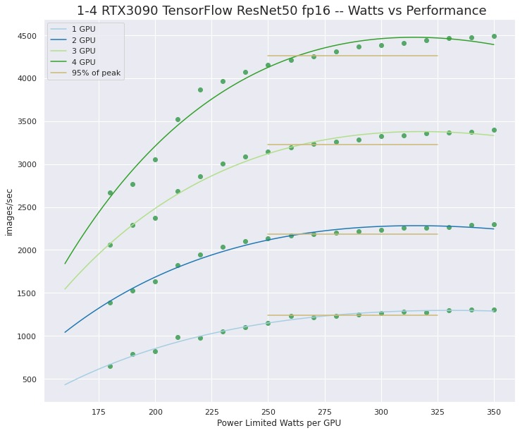

# UPDATE v0.2 NVIDIA GPU Powerlimit Setup

## Introduction

This is just a short post to announce a more usable version of the NVIDIA GPU powerlimit setup script that I released a few months ago. This update to version 0.2 uses an interactive mode to set GPU powerlimits and optionally setup a systemd unit file to set these limits on subsequent reboots.

Multi-GPU systems that are running heavy compute workloads like ML/DL or scientific applications can stress the system power delivery and cooling as well as placing a high load on the circuit that the system is plugged into. **We found that GPU powerlimits can be lowered by 10 to 20 percent with only a small impact on overall compute performance in multi-GPU setups.** This modest reduction in power limit can result in a more stable system setup when it is near the usable power threshold.

By default the power limit on many of the high-end NVIDIA GPUs is 300+ Watts. **AND the next generation NVIDIA GPUs will be significantly higher!**

Initial trials with GPU power limiting were discussed in these blog posts;

- [https://www.pugetsystems.com/labs/hpc/Quad-RTX3090-GPU-Wattage-Limited-MaxQ-TensorFlow-Performance-1974/](https://www.pugetsystems.com/labs/hpc/Quad-RTX3090-GPU-Wattage-Limited-MaxQ-TensorFlow-Performance-1974/)
- [https://www.pugetsystems.com/labs/hpc/Quad-RTX3090-GPU-Power-Limiting-with-Systemd-and-Nvidia-smi-1983/](https://www.pugetsystems.com/labs/hpc/Quad-RTX3090-GPU-Power-Limiting-with-Systemd-and-Nvidia-smi-1983/)

**The setup script is available on GitHub for use by anyone who may benefit from it.**

[https://github.com/dbkinghorn/nv-gpu-powerlimit-setup](https://github.com/dbkinghorn/nv-gpu-powerlimit-setup)

Note that this scrip is still under development but is currently in a usable state. Expect updates and of course feel free to download the script and modify it as you wish.

The following is from the [GitHub repository for this project](https://github.com/dbkinghorn/nv-gpu-powerlimit-setup).

---

## nv-gpu-powerlimit-setup

## NVIDIA GPU Powerlimit Setup Script

## nvpl.sh -- VERSION: 0.2

This scrip can be used to interactively change the powerlimits for detected NVIDIA GPUs. Optionally it will create and install a systemd unit file that will set the powerlimits for NVIDIA GPUs at system boot.

**The nvpl.sh bash script is for Ubuntu >= 18.04 but should be easy to adapt to other distributions**

## Usage:

(**nvpl.sh --help**)

```
USAGE:  sudo ./nvpl.sh
[You will be prompted for GPU powerlimits to set.]

OPTIONALLY a config file will be stored in /usr/local/etc/nv-powerlimit.conf
and a systemd unit file will be created and installed to reset powerlimits on boot.

see:
https://www.pugetsystems.com/labs/hpc/Quad-RTX3090-GPU-Power-Limiting-with-Systemd-and-Nvidia-smi-1983/
for concept and motivation.

This script will;
- make sanity checks for OS version and NVIDIA GPUs
- interactively set powerlimits for NVIDIA GPUs found on system
- OPTIONALLY:
- create a config /usr/local/etc/nv-powerlimit.conf with the powerlimit values
- create and install /usr/local/sbin/nv-powerlimit.sh
- create and install /etc/systemd/system/nv-powerlimit.service
- enable nv-powerlimit.service
```

## Uninstall:

To completely remove a systemd setup added by this script remove,

```
sudo rm /etc/nv-powerlimit.conf
sudo rm /usr/local/sbin/nv-powerlimit.sh
sudo rm /usr/local/etc/systemd/system/nv-powerlimit.service
sudo rm /etc/systemd/system/nv-powerlimit.service
```

## ToDo:

- add uninstall option
- add flags for non-interactive use
  i.e. `nvpl.sh --powerlimit 0:300 1:280 --set-at-boot`

## Motivation:

The higher end NVIDIA RTX desktop GPUs like the RTX3090, A5000, etc.. Make wonderful compute devises in a multi-GPU setup. However the default power limits are set very high. As much as 350W! **...next generation will be much higher than this!** Those high power limits can strain the the capability of a system power supply cooling capability and possibly even overload the circuit that the system is is plugged into.

Our testing has shown that lowering the power limit to more reasonable values has very little impact on performance. [https://www.pugetsystems.com/labs/hpc/Quad-RTX3090-GPU-Wattage-Limited-MaxQ-TensorFlow-Performance-1974/](https://www.pugetsystems.com/labs/hpc/Quad-RTX3090-GPU-Wattage-Limited-MaxQ-TensorFlow-Performance-1974/)



## Conclusion

NVIDIA GPUs are wonderful compute devices with incredible performance that have transformed modern scientific computing including facilitating breakthrough in ML/AI. However the power consumption can push the limits of system stability and usability when multi-GPUs are in use. Hopefully this script will help you to setup a more stable system for your work!

**Happy computing! --dbk @dbkinghorn**
