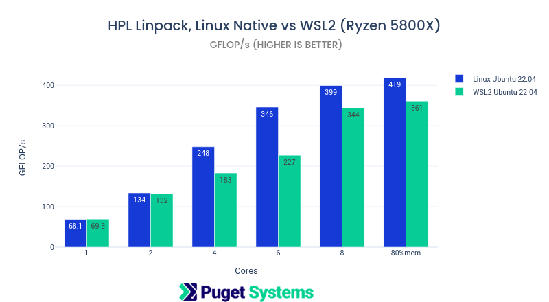
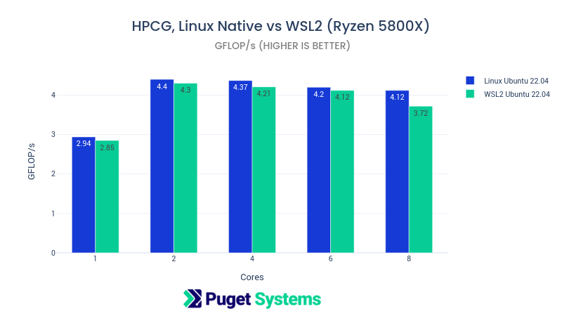
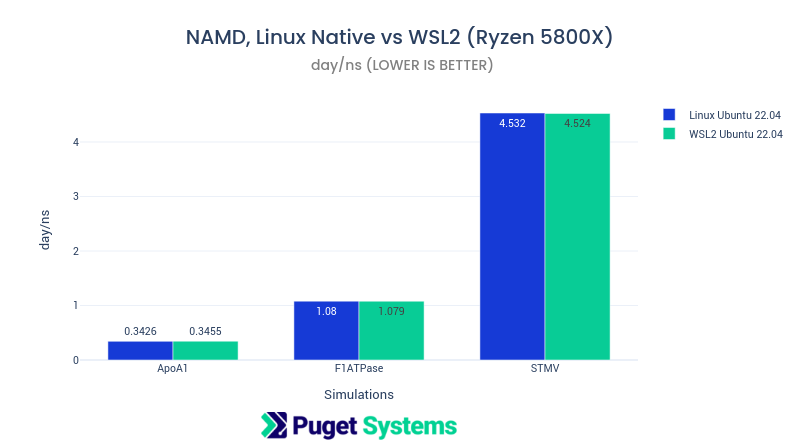

# WSL2 vs Linux (HPL HPCG NAMD)

## Introduction

We've been curious about the performance of WSL [(Microsoft WSL2)](https://docs.microsoft.com/en-us/windows/wsl/about) for scientific applications and decided to do a few relevant benchmarks. We do a lot of automated benchmark runs as part of our customer system builds. This benchmark automation is done on a Windows 11 install during our performance checks and stress testing for customer systems. It provides valuable hardware performance information for us and helps with out design and recommendation process. We also do new hardware testing and validation this way in labs. I also do native testing and benchmarking on Linux for our new hardware validation. I wanted to see how well WSL would do as a proxy for some of the automated part of our routine testing. This post is a first exploration of this idea.

There is another reason for doing this post. It is a teaser for some hardware-specific optimized application containerization that I've been working on! I'm doing a collection of containers for scientific application that are performance optimized for AMD, Intel and NVIDIA hardware platforms. These will serve as a basis for benchmarking and as a resource of optimized scientific application containers available to the public. I will be writing about this project in the following weeks.

For this post I've chosen 3 of my standard performance benchmarks,

- [HPL (High Performance Linpack):](https://en.wikipedia.org/wiki/LINPACK_benchmarks) Heavily optimized floating point numerical performance.
- [HPCG (High Performance Conjugate Gradient):](https://hpcg-benchmark.org) Memory performance evaluation. HPCG is representative of memory-bound applications. It is the secondary performance benchmark for the Top500 Supercomputer list. HPL being the primary benchmark.
- [NAMD:](https://www.ks.uiuc.edu/Research/namd/) Molecular dynamics application that is a favorite of mine for hardware testing. It is my "real world" testing application.

I used [Spack](https://spack.io) to create optimized [docker](https://www.docker.com) containers of these (and other applications) with a build target for AMD zen3 using [AMD AOCC compiler](https://developer.amd.com/amd-aocc/) and [AOCL performance libraries](https://developer.amd.com/amd-aocl/). These containers were then bundled as no-dependency self-running containers using [NVIDIA enroot](https://github.com/NVIDIA/enroot).

## Test System

The test system for this work is my personal AMD Ryzen 5800X 8-core system with 64GB DDR4 2400MHz memory. I use this system as a test platform, dual booting between Ubuntu 22.04 Linux and Windows 11. The Windows install is setup with WSL2 running Ubuntu 22.04. This is a very modest test system that was convenient to use for this proof-of-concept testing. Expect to see more extensive testing with high-end AMD, Intel, and NVIDIA hardware in the future.

Note: By default Windows only allocates 50% of available memory to WSL. I increased this to 56GB (out of 64GB) to accommodate the "80% memory Linpack job run". Linpack usually give the best performance with a problem size that uses 80-90% of memory. On the Linux run I used approx. 80% of 64GB and on WSL approx. 90% of 56GB for a problem size of Ns=81088 for both.

On to the results!

## HPL Linpack, Linux Native vs WSL2 (Ryzen 5800X)

Linpack benchmark is the "standard HPC" performance measure. It solves a system of linear equations using matrix methods with performance largely dependent on an optimized BLAS library. In this case the code was compiled with AMD AOCC and linked with AMD AOCL BLIS as the performance library. The target architecture is zen3.



Notes:

- The problems size was 32000 for all runs except the 80%mem run which was 81088
- This is the worst case for WSL! Windows needs to reserve more core clock cycles for itself than is required by Linux native. This gave a notable performance slowdown when more than 2 cores were in use.
- HPL was run using openMP threads on a since MPI rank (this gave better results than MPI alone or MPI+omp threads)

```
OMP_NUM_THREADS=${NUM_CORES} OMP_PROC_BIND=TRUE OMP_PLACES=cores xhpl
```

---

## HPCG, Linux Native vs WSL2 (Ryzen 5800X)

High Performance Conjugate Gradient, is the second standard HPC benchmark. It is a sparse 2nd order partial differential equation, multi-grid solver. It is memory-bound and does best on systems with higher numbers of memory-channels. The 5800X is not idea for this. It is often the case on systems with many cores for this benchmark to do best on 1/2 or 1/4 of the cores. On the 5800X both Linux native and WSL had there best results with 2 cores.



Notes:

- It is often the case on systems with many cores for this benchmark to do best on 1/2 or 1/4 of the cores. On the 5800X both Linux native and WSL had there best results with 2 cores.
- Native Linux and WSL are very close here, better than I expected.
- HPCG gave best performance running all processes on MPI ranks i.e. omp threads were set to 1.

```
mpirun --allow-run-as-root -np ${NUM_CORES} --map-by l3cache --mca btl self,vader -x OMP_NUM_THREADS=1 xhpcg
```

---

## NAMD, Linux Native vs WSL2 (Ryzen 5800X)

[NAMD](https://www.ks.uiuc.edu/Research/namd/) Molecular Dynamics program with excellent parallel scalability. It makes a very good "real-world" parallel performance benchmark. (It also has very good GPU acceleration and is most often used with GPU.)

These are 3 different job sizes and types.

- [ApoA1 benchmark (92,224 atoms, periodic, PME)](https://www.ks.uiuc.edu/Research/namd/utilities/apoa1/)
- [F1ATPase benchmark (327,506 atoms, periodic, PME)](https://www.ks.uiuc.edu/Research/namd/utilities/f1atpase/)
- [STMV (virus) benchmark (1,066,628 atoms, periodic, PME)](https://www.ks.uiuc.edu/Research/namd/utilities/stmv/)



Notes:

- This is the most encouraging results for WSL. They are basically the same as Linux native.
- On CPU NAMD usually does best using all cores + "hyperthreads". These jobs were run using 16 processes.
- This optimized build using AMD AOCC 3.2, AMDFFTW 3.2, with target zen3 was significantly faster than the pre-built binary that is often used for this application.

```
namd2 +p16 +setcpuaffinity +idlepoll ${JOB}.namd
```

## Conclusion

These results look very good for WSL2! I was surprised at how good NAMD was, both from the target optimizations and how similar native Linux and WSL were. HPL results were as expected worse on WSL. They would also be worse running directly on Windows although I didn't test that here. (We don't have a way to build optimized code with AMD tools for Windows). HPCG was very close between Linux native and WSL. That is encouraging for memory-bound application running on WSL.

I will certainly be doing more testing like this and I believe that the results in this post warrant moving forward with adding automated scientific benchmarks on WSL to our standard testing.

**Happy Computing! --dbk @dbkinghorn**
