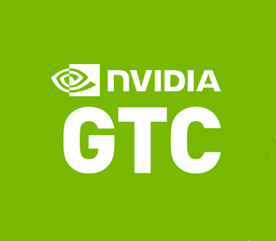

# GTC23  Notes And Selected Sessions

**
## Introduction 

NVIDIA GTC 2023 was outstanding! To say that about a virtual conference tells you how much I value it. I have been attending GTC for the last 9 years with the first 6 being wonderful in-person events (see the "Most Important Announcement" below). 

I consider NVIDIA to be the most important force in the HPC, Scientific and Creative computing domains. The Spring GTC is the showcase of progress at NVIDIA. New hardware, software and services are announced. It gives the researchers and developers from NVIDIA a chance to share their work and ideas. However, it's not exclusively NVIDIA researchers and developers. People from industry, academia, and government around the world also showcase their use of GPU technology at GTC. I consider GTC and SuperComputing the two most important conferences for developments in computing.  

GTC is a multi-faceted meeting but attending virtually I focus on the talks. This post is largely a catalog of the talks I found interesting along with titles that I think will be interesting to a larger audience and my colleagues at [Puget Systems](https://www.pugetsystems.com/). I also wanted to keep track of talks that I'll want to watch later "on demand". There are a lot of talk titles here. I hope you find some of them as interesting as I do.

## The Most Important Announcement at GTC23

The best announcement this year was that **next year GTC will be live and in-person again** (as well as available virtually). I have missed the in-person experience. GTC has been my favorite conference for the last 9 years. It will be great to have face-to-face conversations with people again! They will need to find a much larger venue than the San Jose, McEnery Convention Center!

## Stats

I couldn't find the registration count for this year's GTC but I know it was very attended. At least tens of thousands and over 100,000 would not surprise me. 

This information is from the attendee portal session list.
- 733 sessions
- 693 in English
- 499 Talks and Panels
- **71 Generative AI Sessions!**

## Accessing the GTC23 Session Recordings

I will include links to talks that are available when I post this blog. (It looks like most of them are now up on-demand!) I can't guarantee that every link I provided will work. I checked most but not all of them.

The first place to look is,
- **[NVIDIA On-Demand](https://www.nvidia.com/en-us/on-demand/)** Most talks are already there and I expect more to be added. If you want to look for something that I didn't list then try searching there.

For most of the talks listed at Nvidia On-Demand you will need to have, or create, an NVIDIA Developer account. It's free and easy to do. (They don't spam you or sell your information. I do like to get announcements and news from NVIDIA).
- **[NVIDIA Developer](https://developer.nvidia.com)**

Of course, you can search the web! If there is an interesting talk and you can't access it on NVIDIA On-Demand, try a web search using the title and/or speaker's name. You may find the exact talk or something similar. People are busy and talks and presentations tend to get reused in various places. Many of the most important/popular talks will show up on YouTube.

## The Keynote

The keynote was great! I won't give highlights because it was all excellent. I recommend watching the whole thing. 

**[GTC 2023 Keynote Jensen Huang](https://www.nvidia.com/en-us/on-demand/session/gtcspring23-s52226)**

The keynote presentation was polished and informative. The demos were great. But, I miss Jensen's stage humor, interaction with the audience, and occasional glitches. He's a great speaker and I look forward to seeing him live again next year. 

## Important Sessions (mostly my interests!)**

There were so many sessions!

Following is a (very) long list of sessions that I watched or will be watching on **[NVIDIA On-Demand](https://www.nvidia.com/en-us/on-demand/)**. I have included a few notes on the sessions I found particularly interesting. I have also included a few sessions that are not in my area of interest but that may have broader appeal.

Note: The bracketed numbers are the session numbers at GTC23. I added authors/speakers and institutions for many of the sessions.

### Highly Recommended

**[CUDA: New Features and Beyond [S51225] Stephen Jones (NVIDIA) (Must see)](https://www.nvidia.com/en-us/on-demand/session/gtcspring23-S51225/)**

Stephen Jones does a talk with this title every year. It is always good and gives you more than you would expect from the title. The year his talk was exceptional! The first 20min or so give a brilliant illustration of the evolution of computing scalability. He is one of my favorite presenters at GTC. He is very knowledgeable and engaging. Watch at least the first part of the talk, it's great! He has another more technical talk on CUDA development that is also excellent. 
**[How to Write a CUDA Program [S51210]](https://www.nvidia.com/en-us/on-demand/session/gtcspring23-S51210/)** 

**[Insights from NVIDIA Research [S52291] Bill Dally (NVIDIA Research)](https://www.nvidia.com/en-us/on-demand/session/gtcspring23-S52291/)**

Bill Dally is the head of NVIDIA Research. He is a brilliant researcher and leader. This is where a lot of the breakthrough ideas come from for NVIDIA. And it's not just ideas. They do the hard work to make them real. This talk is a great overview of the current state of NVIDIA Research. 

**[Are Generative Models the Key to Achieving Artificial General Intelligence? [S52122]  Anima Anandkumar](https://www.nvidia.com/en-us/on-demand/session/gtcspring23-S52122/)**

Anima Anandkumar is a skilled, insightful researcher and a great speaker. She always has interesting and important things to say. Another of her talks addressing an important issue (Bias testing) is listed in the AI section below.

**[Generative AI Demystified [S52089] Bryan Catanzaro](https://www.nvidia.com/en-us/on-demand/session/gtcspring23-S52089/)**

**[How Generative AI is Transforming the Creative Process: Fireside Chat with Scott Belsky (Adobe) and Bryan Catanzaro (NVIDIA) [S52090] Scott Belsky Bryan Catanzaro](https://www.nvidia.com/en-us/on-demand/session/gtcspring23-S52090/)**

Two good ones from Bryan Catanzaro. He is another excellent NVIDIA researcher and an engaging speaker. His talks are consistently good. He is a unique character at NVIDIA and he has great hair! (He admits his hair is one of his hobbies. Look'n good Bryan!)**

**[Fireside Chat with Ilya Sutskever and Jensen Huang: AI Today and Vision of the Future [S52092] Ilya Sutskever Jensen Huang.](https://www.nvidia.com/en-us/on-demand/session/gtcspring23-S52092/)**

This is a peek into the mind of Ilya Sutskever about AI and the future. He is a founding researcher at OpenAI and a principal developer of ChatGPT. Good reality checks on the state of AI and the future. 

**[Using AI to Accelerate Scientific Discovery [S51831] Demis Hassabis (CEO DeepMind)](https://www.nvidia.com/en-us/on-demand/session/gtcspring23-S51831/)**

Demis Hassabis is a luminary in AI. He is the CEO of Deepmind. Deepmind has been driving many advances including AI in Science including the AlphaFold project. This is a great talk on the history and current state of AI in Science.

**[The Future of Generative AI for Content Creation [S52095]  Patrick Esser (Runway Research)](https://www.nvidia.com/en-us/on-demand/session/gtcspring23-S52095/)**

Patrick Esser was the co-lead of the team that created Stable Diffusion. Runway is developing amazing creative tools with Generative AI.

**[A Demonstration of AI and HPC Applications for NVIDIA Grace CPU [S51880] David Lecomber, John Linford (really good demo )](https://www.nvidia.com/en-us/on-demand/session/gtcspring23-S51880/)**

I particularly liked this talk because it was a great demo of porting code to ARM (NVIDIA Grace CPU). It should help to alleviate some of the concerns about porting code to ARM. (It does get a bit technical.)**

## More Talks!

This is a long list but there is a lot that I didn't even touch on! For example, I didn't look at NVIDIA Omniverse, AR/VR, Autonomous Vehicles, or Robotics. So much! Have a look through the list, you might find something interesting or surprising to check out.

### AI

**[AI for Software Development [S51548] Eran Yahav](https://www.nvidia.com/en-us/on-demand/session/gtcspring23-S51548/)**

**[Power of Large Language Models: The Current State and Future Potential [S52113] Panel](https://www.nvidia.com/en-us/on-demand/session/gtcspring23-S52113/)**

**[GANs to Diffusion - the path to Generative AI [S52051] Arash Vahdat, Mitesh Patel](https://www.nvidia.com/en-us/on-demand/session/gtcspring23-S52051/)**

**[Generating Opportunities: Creative Powers of AI in Education and Innovation [S52572] Panel](https://www.nvidia.com/en-us/on-demand/session/gtcspring23-S52572/)**

**[The Future of Generative AI in Architectural Design Practices [S52133] Panel](https://www.nvidia.com/en-us/on-demand/session/gtcspring23-S52133/)**

**[Natural Language Generation and Knowledge Extraction as Tools to Automatically Understand User-Generated Textual Content [S51816] Estevam Hruschka](https://www.nvidia.com/en-us/on-demand/session/gtcspring23-S51816/)**

**[FasterTransformer v5.4: New Features and Beyond [S51196] Bo Yang Hsueh](https://www.nvidia.com/en-us/on-demand/session/gtcspring23-S51196/)** 

**[Audio Research at NVIDIA's Applied Deep Learning Research [S51464] Kevin Shih](https://www.nvidia.com/en-us/on-demand/session/gtcspring23-S51464/)**

---

**[Automated Bias Testing of Language Models [S51185] Anama Anandkumar](https://www.nvidia.com/en-us/on-demand/session/gtcspring23-S51185/)**

**[Foundations for Deploying Trustworthy AI [S51181]  Panel](https://www.nvidia.com/en-us/on-demand/session/gtcspring23-S51181/)**

**[How to Assess and Mitigate Bias in AI Models [S51179] Nikki Pope Cathy O’Neil]([https://www.nvidia.com/en-us/on-demand/session/gtcspring23-S51181/)**

---

**[Learn How Artists Use Generative AI in their Workflows [S51850] Panel](https://www.nvidia.com/en-us/on-demand/session/gtcspring23-S51850/)**

**[Future of Art and Design with AI [S52114] Panel](https://www.nvidia.com/en-us/on-demand/session/gtcspring23-S52114/)**

**[Generating Modern Masterpieces: MoMA Dreams Become a Reality [S52060] Panel](https://www.nvidia.com/en-us/on-demand/session/gtcspring23-S52060/)**

**[Learn How Artists Use Generative AI in their Workflows [S51850] Panel](https://www.nvidia.com/en-us/on-demand/session/gtcspring23-S51850/)**

---

**[High-Resolution Image Synthesis via Two-Stage Generative Models [S51531] Emad Mostaque, Robin Rombach (Stability AI)](https://www.nvidia.com/en-us/on-demand/session/gtcspring23-S51531/)**

**[Generative AI Text-to-Video: Humanizing the Way We Interact with Machines [S51123]  Panel (D-ID)](https://www.nvidia.com/en-us/on-demand/session/gtcspring23-S51123/)**

**[Emerging Tech in Animation Pre-Production [S52298] Yiotis Katsambas, Executive Director of Technology, Sony Pictures Animation](https://www.nvidia.com/en-us/on-demand/session/gtcspring23-S52298/)**

**[Deep Learning, LLM's & Generative Models for Computer Games and Creative Industries [S51879] Andrew Edelsten](https://www.nvidia.com/en-us/on-demand/session/gtcspring23-S51879/)**

**[How to use Generative AI to Build Content for Real-World Applications [S51486] Zenodia Charpy](https://www.nvidia.com/en-us/on-demand/session/gtcspring23-S51486/)**

**[Leveraging Large Language Models for Generating Content [S51947] Panel](https://www.nvidia.com/en-us/on-demand/session/gtcspring23-S51947/)**

**[3D by AI: Using Generative AI and NeRFs for Building Virtual Worlds [S52163] Gavriel State](https://www.nvidia.com/en-us/on-demand/session/gtcspring23-S52163/)**

**[Nerfstudio: A Modular Framework for Neural Radiance Field Development [S51842] Angjoo Kanazawa (UC Berkeley)](https://www.nvidia.com/en-us/on-demand/session/gtcspring23-S51842/)**

**[Advances in Data-Parallel Production Rendering at Scale [S52062] (Pixar)](https://www.nvidia.com/en-us/on-demand/session/gtcspring23-S52062/)**

**[Modeling and Simulation Meet AI: AI for Science and Art [S51071] Panel](https://www.nvidia.com/en-us/on-demand/session/gtcspring23-S51071/)**

**[AI-Powered, Real-Time, Markerless: The New Era of Motion Capture [S51845] Niall Hendry (Move AI)](https://www.nvidia.com/en-us/on-demand/session/gtcspring23-S51845/)**

**[AI-Powered Visual Effects with Wonder Dynamics [S52567] (Wonder Dynamics)](https://www.nvidia.com/en-us/on-demand/session/gtcspring23-S52567/)**

**[Emerging Tech in Animation Pre-Production [S52298] (Sony)](https://www.nvidia.com/en-us/on-demand/session/gtcspring23-S52298/)**

### Science and HPC

**[Best Practices for Programming GPUs using Fortran, OpenACC, and CUDA [S51857] David Appelhans](https://www.nvidia.com/en-us/on-demand/session/gtcspring23-S51857/)**

**[No More Porting: GPU Computing with Standard C++ and Fortran [S51043] Jeff Larkin, Athena Elafrou](https://www.nvidia.com/en-us/on-demand/session/gtcspring23-S51043/)**

**[A Deep Dive into the Latest HPC Software [S51074] Timothy Costa](https://www.nvidia.com/en-us/on-demand/session/gtcspring23-S51074/)**

**[Advances in Accelerated Computing for AI and Scientific Computing [S52137] Ian Buck](https://www.nvidia.com/en-us/on-demand/session/gtcspring23-S52137/)**

**[Colossal-AI: Scaling AI Models in the Big Model Era [S51482] James Demmel, Yang You (HPC-AI Technology Inc.)](https://www.nvidia.com/en-us/on-demand/session/gtcspring23-S51482/)**

**[Destination Earth and Digital Twins: A European Opportunity For HPC [S51708] Peter Bauer (Director Destination Earth, European Centre for Medium-Range Weather Forecasts)](https://www.nvidia.com/en-us/on-demand/session/gtcspring23-S51708/)**

**[Accelerated Computing for Giant Optical Telescopes: Past, Present, and Future [S51674] Damien Gratadour, Hatem Ltaief](https://www.nvidia.com/en-us/on-demand/session/gtcspring23-S51674/)**

**[Powering the Next Revolution in Radio Astronomy with GPUs [S51899] Gregg Hallinan, Martin Pokorny (Caltech)](https://www.nvidia.com/en-us/on-demand/session/gtcspring23-S51899/)**

**[Applying Large Language Models and HPC in a Workflow to Predict New COVID Variants [S51272] Arvind Ramanathan (Argonna National Lab)](https://www.nvidia.com/en-us/on-demand/session/gtcspring23-S51272/)**

**[Pushing Quantum Mechanics to the Exascale with JAX and Fermionic Neural Networks [S51805] Matthew Foulkes, Gino Cassella](https://www.nvidia.com/en-us/on-demand/session/gtcspring23-S51805/)**

---

**[GPU-Resident NAMD 3: High Performance, Greater Throughput Molecular Dynamics Simulations of Biomolecular Complexes [S51693] David Hardy (UIUC), David Clark](https://www.nvidia.com/en-us/on-demand/session/gtcspring23-S51693/)**

**[unning 100,000-Atom Molecular Dynamics with Accurate NN Potential on a GPU using Automatic Recomputation [S51498] Zijian Xu (Preferred Networks)](https://www.nvidia.com/en-us/on-demand/session/gtcspring23-S51498/)**

**[3D Molecule Generation with the Equivariant Score-Based Diffusion Process [S52380] Xiaoyun Wang](https://www.nvidia.com/en-us/on-demand/session/gtcspring23-S52380/)**

**[AI Driven Atomistic Simulation For Materials and Reactive Chemistry [S51840] Justin Smith, Benjamin Nebegen](https://www.nvidia.com/en-us/on-demand/session/gtcspring23-S51840/)** 

**[Fast Electronic Structure Calculations on Materials Using a GPU-Accelerated Stochastic Algorithm [S51184] Phillip Thomas (NERSC)](https://www.nvidia.com/en-us/on-demand/session/gtcspring23-S51184/)**

---

**[Accelerating Generative AI in Biology and Healthcare [S51257] Kimberly Powell](https://www.nvidia.com/en-us/on-demand/session/gtcspring23-S51257/)**

**[AI-Powered Drug Discovery [S51263] Abraham Stern](https://www.nvidia.com/en-us/on-demand/session/gtcspring23-S51263/)**

**[A Transformative AI Platform to Accelerate Biologics Discovery [S52391] Christopher Langmead](https://www.nvidia.com/en-us/on-demand/session/gtcspring23-S52391/)**

**[Generative Deep Learning with BioNeMo for Protein Therapeutics [S51713] Panel (Evosyne)](https://www.nvidia.com/en-us/on-demand/session/gtcspring23-S51713/)**

**[Multimodal Deep Learning for Protein Engineering [S51260] Kevin Yang](https://www.nvidia.com/en-us/on-demand/session/gtcspring23-S51260/)**

**[RadImageGAN: Multi-Modal Generative AI for Medical Imaging [S51264] Panel](https://www.nvidia.com/en-us/on-demand/session/gtcspring23-S51264/)**

**[Acceleration and Deep Learning for Genomics on GPUs [S51265] Harry Clifford](https://www.nvidia.com/en-us/on-demand/session/gtcspring23-S51265/)**

## Conclusion

Whew! That's quite a list. If you have found something to watch and enjoyed it then I succeeded in my primary goal. If you didn't then at least I've created a reference list for myself. GTC is a great event and the talks are just the easiest thing to focus on when it's virtual. Next year I hope to see you there in person!

**Happy Computing! --dbk  @dbkinghorn**