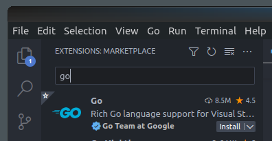
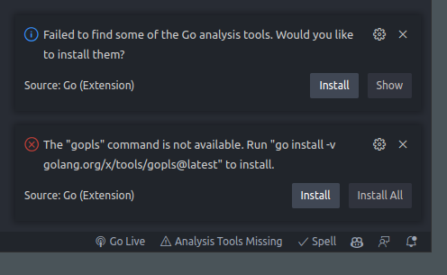
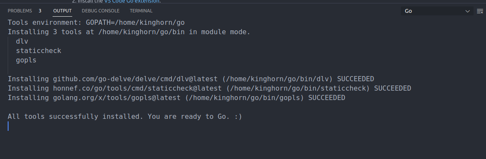

# Install Golang In Your Home Directory And Configure VScode

Learning go (Golang) is one of my resolutions for 2023. It looks like a great cross platform compiled language with a straightforward simple syntax with modern features. I have multi-OS projects in mind where I expect it to be ideal. So, I'll get started ...

**Note:** 
*One of my other resolutions for 2023 is to do more writing and documenting things that I'm working on. "Learning Go" is a personal project but I will use it in some of the work I'm doing at [Puget Systems](pugetsystems.com). You can find my posts at [https://www.pugetsystems.com/all-hpc/](https://www.pugetsystems.com/all-hpc/)*   

This is my own opinion on how I'd like *my* personal Go dev install done on Linux. You may have differing opinions. I thought I would share in case this is helpful for someone else and as a reference for myself.

The "official" place to install go (on Linux) is in /usr/local. Well, I don't want it there! I also don't want to install it from the (out-of-date) Ubuntu 22.04 package repositories. It's *my* go development environment and I want it in *my* home directory. I don't want it to be owned by root under /usr/local. It seems strange to me that I haven't seen any guides or references to installing under $HOME!?  That may be because I haven't looked hard enough, but I did search for that and didn't find anything appropriate. I'm just going to do it *my* way and see how it goes ... or should that be go's ...

I'll document the install and setup.

## References
**Go Home** 
[https://go.dev](https://go.dev)

**Arch Linux Wiki (always go to check out)**
[https://wiki.archlinux.org/title/Go](https://wiki.archlinux.org/title/Go)

**VScode Go Extension**
[https://github.com/golang/vscode-go](https://github.com/golang/vscode-go)


## Get Go

**Check for current version at [go.dev](go.dev)**

We will get a fresh copy of Go, un-tar it in $HOME directory, and then rename it to include the version. This will be our current Go ROOT directory. 
```
cd $HOME

wget https://go.dev/dl/go1.19.5.linux-amd64.tar.gz

tar xf go1.19.5.linux-amd64.tar.gz

mv go go-1.19.5

mkdir go
```
Add environment variables to .bashrc

I am setting the go language path to point to `$HOME/go-{installed version}` and the traditional go workspace to `$HOME/go`

```
# go tools
export GOROOT=$HOME/go-1.19.5
export GOPATH=$HOME/go
export PATH=$PATH:$GOROOT/bin:$GOPATH/bin
```
```
source .bashrc
```

Installed and ready to "go".

## Quick check

```
kinghorn@i9:~$ go version
go version go1.19.5 linux/amd64
```

See where everything is in the environment
```
kinghorn@i9:~$ go env
GO111MODULE=""
GOARCH="amd64"
GOBIN=""
GOCACHE="/home/kinghorn/.cache/go-build"
GOENV="/home/kinghorn/.config/go/env"
GOEXE=""
GOEXPERIMENT=""
GOFLAGS=""
GOHOSTARCH="amd64"
GOHOSTOS="linux"
GOINSECURE=""
GOMODCACHE="/home/kinghorn/go/pkg/mod"
GONOPROXY=""
GONOSUMDB=""
GOOS="linux"
GOPATH="/home/kinghorn/go"
GOPRIVATE=""
GOPROXY="https://proxy.golang.org,direct"
GOROOT="/home/kinghorn/go"
GOSUMDB="sum.golang.org"
GOTMPDIR=""
GOTOOLDIR="/home/kinghorn/go/pkg/tool/linux_amd64"
GOVCS=""
GOVERSION="go1.19.4"
GCCGO="gccgo"
GOAMD64="v1"
AR="ar"
CC="gcc"
CXX="g++"
CGO_ENABLED="1"
GOMOD="/dev/null"
GOWORK=""
CGO_CFLAGS="-g -O2"
CGO_CPPFLAGS=""
CGO_CXXFLAGS="-g -O2"
CGO_FFLAGS="-g -O2"
CGO_LDFLAGS="-g -O2"
PKG_CONFIG="pkg-config"
GOGCCFLAGS="-fPIC -m64 -pthread -Wl,--no-gc-sections -fmessage-length=0 -fdebug-prefix-map=/tmp/go-build3811837131=/tmp/go-build -gno-record-gcc-switches"
```

## Setup vscode

[https://code.visualstudio.com/docs/languages/go](https://code.visualstudio.com/docs/languages/go)

Add the main go vscode extension.


Click on "Analysis Tools Missing" and Install those ...




## Other Go dev tools

Some of these may be useful [gopls, dlv (Delve), and staticcheck were installed by vscode]. This is just a few that look interesting to me personally. There are many others.

- **Go tools** — An assortment of Go packages mostly for static analysis.
[https://cs.opensource.google/go/x/tools](https://cs.opensource.google/go/x/tools) 
```
go install golang.org/x/tools/cmd/goimports@latest
```

- **gopls** — The Go language server.
[https://pkg.go.dev/golang.org/x/tools/gopls](https://pkg.go.dev/golang.org/x/tools/gopls)
```
go install golang.org/x/tools/gopls@latest
```

- **Delve** — Debugger for Go.
[https://github.com/go-delve/delve](https://github.com/go-delve/delve)
```
go install github.com/go-delve/delve/cmd/dlv@latest
```

- **go-bindata** — A tool to generate Go code from any file. Example embedding binary data in a Go program.
[https://github.com/shuLhan/go-bindata](https://github.com/shuLhan/go-bindata) 
```
go install github.com/shuLhan/go-bindata/v4/cmd/go-bindata
```

- **gox** — Gox is a simple, no-frills tool for Go cross compilation ... in parallel.
[https://github.com/mitchellh/gox](https://github.com/mitchellh/gox)
```
go install github.com/mitchellh/gox@latest
```

- **ko** — A container image builder for Go applications.
[https://github.com/ko-build/ko](https://github.com/ko-build/ko)
```
go install github.com/google/ko@latest
```

- **Staticcheck** — A state of the art linter for the Go programming language.
[https://staticcheck.io/](https://staticcheck.io/)
```
go install honnef.co/go/tools/cmd/staticcheck@latest
```

**Happy Computing! --dbk @dbkinghorn**

