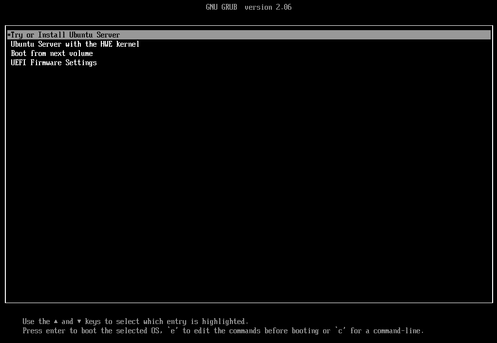
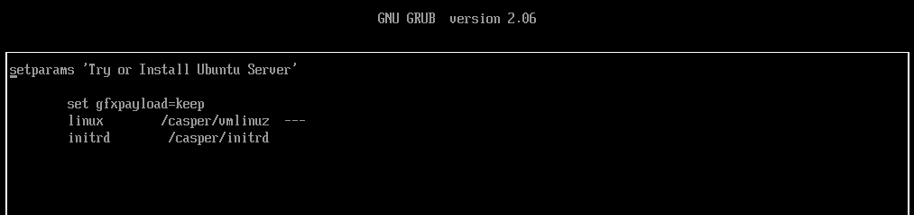
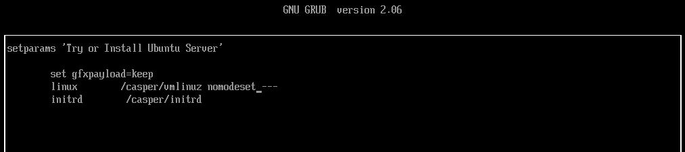
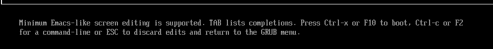

# How To Use Linux Kernel Boot Options

## Introduction

This post is a short HowTo on passing Linux kernel boot options during OS installation and persisting them for future system starts.

The Linux kernel can accept "switches" (flags) that can change behavior at boot time. This can be useful for,

- handling hardware quirks,
- making temporary changes to some kernel properties,
- workarounds for installation difficulties,
- special use cases,
- setting install source directives,
- passing options to underlying installer code,
- auto-install configuration,
- passing options to modules, etc. 

I'll give two cases where passing kernel flags are helpful.

- Using "nomodeset" to handle "black screens" during installation before proper display drivers are loaded. This is a case where the X-display configuration is forced to not attempt early display-mode settings. This is not uncommon! It is a good "trick" to know.
- Fixing IOMMU configuration on AMD motherboards.

There are a great number of optional Linux boot parameters. The official kernel documentation lists many, see, [The kernel's command-line parameters](https://www.kernel.org/doc/html/latest/admin-guide/kernel-parameters.html).  That is just one type of option parameter. There are many others. The common way in which they are used at boot time and as part of a permanent configuration is presented in the following examples.  

## Using 'nomodeset' from the Grub boot line during system startup.

If you are doing a Linux install on new hardware and/or with a new OS version and you get a black screen after the installation starts, then this is the first thing to try.

This involves interrupting the boot process before it loads an install kernel and initrd file.

This is most often done by hitting the "e" key to get a temporary editable line to add boot options. The following image shows this option near the bottom of the screen,



After hitting the 'e' key you will see the boot command line,

 On this screen, you would use the arrow keys to move the cursor to the space before '---' and add the `nomodeset`.



After making that change use [Ctrl-x] or F10 to continue the boot process and start the installation.



That will often be all that is needed to get an installation that was hung on a 'black screen' to start its installation. It is usually not necessary to make that change permanent after proper display drivers have been installed. 

We will now look at a case where the boot option changes need to be persisted for the proper functioning of the system.

## Setting 'amd-iommu=on iommu=pt pci=nommconf' on AMD WRX80 motherboards

This next example is needed on some AMD WRX80 Threadripper Pro motherboards as well as in some cases on EPYC systems. Without these boot options, the system may hang during boot trying to access USB devices like keyboard and mouse or other devices on the PCIe BUS. After installation, these options are needed for multi-GPU configurations. AMD has a reference to this in their [knowledge base regarding setup with Instinct compute GPUs](https://community.amd.com/t5/knowledge-base/iommu-advisory-for-amd-instinct/ta-p/484601).

At [Puget Systems](https://www.pugetsystems.com) we set these options by default on WRX80 motherboards.

During installation the same procedure as described above for `nomodeset` is used except `amd-iommu=on iommu=pt pci=nommconf` is added before '---'.

These parameters force AMD IOMMU to be enabled and set the mode to 'pass through' (pt). The third optional parameter `pci-nommconf` allows the kernel to bypass the memory-mapped PCI config registers. This last option is not needed in all cases but it doesn't hurt since the kernel will "do the right thing" to properly start up the system. 

**Setting these parameters during installation is the same as in the previous section, but in this case, we need to persist the changes.**

To force the kernel to use boot options by default we need to edit the 
`/etc/defaults/grub` file.
Initially, that file will contain a line that looks something like
```
GRUB_CMDLINE_LINUX_DEFAULT="quiet splash"
```

To make the boot options take effect on subsequent starts the parameters are added to this line,
```
GRUB_CMDLINE_LINUX_DEFAULT=" amd-iommu=on iommu=pt pci=nommconf quiet splash"
```

Then the last step is to update the grub.cfg file

Debian/Ubuntu
```
update-grub
```
which is a short command for grub-mkconfig 'path to grub.cfg'

RedHat
```
grub2-mkconfig -o 'path to grub.cfg'
```
Note: if using grub(2)-mkconfig, check the path to the grub.cfg file it may be in an `efi/EFI` subdirectory or under `/boot/grub/`.

## Conclusion

I hope this is a helpful reference. This is the kind of configuration adjustment that often confuses new (and experienced!) Linux users. I've wanted to have an online reference to refer people to. Here it is!

**Happy Computing! --dbk @dbkinghorn**

