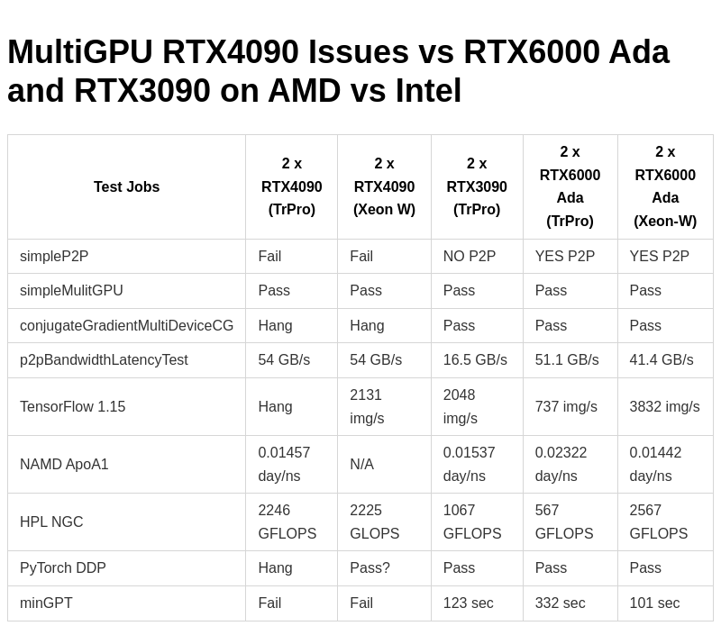

# MultiGPU RTX4090 and AMD vs Intel Issues vs RTX6000Ada or RTX3090 

## Introduction
I was prompted to do some testing by a commenter on one of my recent posts, [NVIDIA RTX4090 ML-AI and Scientific Computing Performance (Preliminary)](https://www.pugetsystems.com/labs/hpc/nvidia-rtx4090-ml-ai-and-scientific-computing-performance-preliminary-2382/). They had concerns about problems with dual NVIDIA RTX4090s on AMD Threadripper Pro platforms.

They pointed out the following links, 
- [Parallel training with 4 cards 4090 cannot be performed on AMD 5975WX， stuck at the beginning](https://forums.developer.nvidia.com/t/parallel-training-with-4-cards-4090-cannot-be-performed-on-amd-5975wx-stuck-at-the-beginning/237813)

- [Standard nVidia CUDA tests fail with dual RTX 4090 Linux box](https://forums.developer.nvidia.com/t/standard-nvidia-cuda-tests-fail-with-dual-rtx-4090-linux-box/233202)

- [DDP training on RTX 4090 (ADA, cu118)](https://discuss.pytorch.org/t/ddp-training-on-rtx-4090-ada-cu118/168366/10)

I ran some applications to reproduce the problems reported above and tried to dig deeper into the issues with more extensive testing. The included table below tells all!  

Before we get to the table and testing of results and comments here are the hardware and software that were used for testing.

## Test Hardware and Configurations
This is the most relevant component information.  
### AMD
- ASUS Pro WS WRX80E-SAGE SE WIFI
- BIOS 1003
- Ryzen Threadripper PRO 5995WX 64-Cores
- With GRUB_CMDLINE_LINUX="amd_iommu=on iommu=pt"

### Intel
- Supermicro X12SPA-TF
- BIOS 1.4a
- Xeon(R) W-3365 32-Cores

### NVIDIA
- NVIDIA GeForce RTX 4090
- NVIDIA RTX 6000 Ada Generation
- NVIDIA GeForce RTX 3090

### OS Info
- Ubuntu 22.04.1 LTS
- NVIDIA Driver Version: 525.85.05    
- CUDA Version: 12.0

### Test Applications
#### From [NVIDIA CUDA 12 Samples](https://github.com/NVIDIA/cuda-samples) 
- simpleP2P
- simpleMulitGPU
- conjugateGradientMultiDeviceCG
- p2pBandwidthLatencyTest
#### From [NVIDIA NGC](https://catalog.ngc.nvidia.com) Containers
- TensorFlow 1.15 ResNet50
- HPL (FP 64 Linpack performs many times faster on NVIDIA Compute GPUs but I still like to run this benchmark on GeForce and Pro GPUs)
- PyTorch DDP
#### Local install
- [NAMD](https://www.ks.uiuc.edu/Development/Download/download.cgi?PackageName=NAMD) 2.14 ApoA1
- PugetBench-minGPT (Based on [Andrej Karpathy's minGPT](https://github.com/karpathy/minGPT) uses PyTorch DDP)
## Testing Results

#### Table: MultiGPU RTX4090 and AMD vs Intel Issues vs RTX6000Ada or RTX3090

|Test Jobs|2 x RTX4090 (TrPro)|2 x RTX4090 (Xeon W)|2 x RTX3090 (TrPro)|2 x RTX6000 Ada (TrPro)|2 x RTX6000 Ada (Xeon-W)|
|---------|-------------------|--------------------|-------------------|-----------------------|------------------------|
|simpleP2P| Fail | Fail | NO P2P | YES P2P | YES P2P |
|simpleMulitGPU|Pass|Pass|Pass|Pass|Pass|
|conjugateGradientMultiDeviceCG|Hang|Hang|Pass|Pass|Pass|
|p2pBandwidthLatencyTest|54 GB/s|54 GB/s|16.5 GB/s|51.1 GB/s|41.4 GB/s|
|TensorFlow 1.15|Hang|2131 img/s|2048 img/s|737 img/s|3832 img/s|
|NAMD ApoA1|0.01457 day/ns|N/A|0.01537 day/ns|0.02322 day/ns|0.01442 day/ns|
|HPL NGC|2246 GFLOPS|2225 GLOPS|1067 GFLOPS|567 GFLOPS| 2567 GFLOPS|
|PyTorch DDP|Hang|Pass?|Pass|Pass|Pass|
|minGPT|Fail|Fail|123 sec|332 sec|101 sec|

#### Notes:

### There are 2 major problems;

**NVIDIA:**  

- It looks like there is a "partially" broken P2P functionality with 2 x 4090. Some jobs that use that either fail or are corrupt. 
- However, P2P is available and shows good GPU-GPU bandwidth.
PyTorch distributed data-parallel (DDP) corrupts or hangs. It finishes/returns on Xeon-W but there is no success verification.
- minGPT (also using DDP) corrupts and fails. 
- Everything works as expected with 2 x 3090 on the AMD Tr Pro system.
- Everything works with 2 x 6000 Ada on both AMD Tr Pro and Intel Xeon-W systems but performance is very bad on the AMD Tr Pro system.

**AMD:**

- All the issues with 2 x 4090 are present on the AMD Tr Pro system and also on the Xeon-W except for the TensorFlow ResNet job run. 
- On TrPro TensorFlow 1.15 ResNet50 2x4090 (using NV NCCL) hangs, It runs fine on Xeon. 
- Performance is very bad with 2 x 6000 Ada on TrPro (GPU clock stays at 629MHz and power usage is low). 

**The tests in the table were mainly for functionality rather than performance.  But, I did use higher performance input parameters on the 2x6000 Ada testing on Xeon. Optimal **performance input parameters were NOT used on the dual RTX4090 and RTX3090 job runs. Don't use this post as a performance comparison!**  

 
NVIDIA and AMD were made aware of these test results 1 week before this post was published, but have not replied.

**I do not have workarounds or fixes for these problems!**  The performance issues on the AMD platform are particularly troubling and we will do more troubleshooting to see if a solution to the issues can be found.

## Conclusion
I hope that publishing these results will make the issues with RTX4090 multi GPU and AMD WRX80 motherboards more visible to the public. I also hope NVIDIA and AMD will be prompted to address the reported problems.

My testing was on Linux however, we have also seen issues with some of our Windows testing that is consistent. In particular differences between behavior between 2 x RTX4090 and 2 x 6000 Ada. 

If fixes or workarounds are found they will be posted back here as notes at the top of the page. 

## Appendix Select job output excerpts and comments

### P2P
On both the AMD and Intel test platforms `simpleP2P` fails with a Verification error but `p2pBandwidthLatencyTest` shows increased bandwidth with P2P enabled. For example on the AMD platform,

#### simpleP2P
```
(cuda12-20.04)kinghorn@trp64:~/cuda-samples-12.0/bin/x86_64/linux/release$ ./simpleP2P 
[./simpleP2P] - Starting...
Checking for multiple GPUs...
CUDA-capable device count: 2

Checking GPU(s) for support of peer to peer memory access...
> Peer access from NVIDIA GeForce RTX 4090 (GPU0) -> NVIDIA GeForce RTX 4090 (GPU1) : Yes
> Peer access from NVIDIA GeForce RTX 4090 (GPU1) -> NVIDIA GeForce RTX 4090 (GPU0) : Yes
Enabling peer access between GPU0 and GPU1...
Allocating buffers (64MB on GPU0, GPU1 and CPU Host)...
Creating event handles...
cudaMemcpyPeer / cudaMemcpy between GPU0 and GPU1: 25.07GB/s
Preparing host buffer and memcpy to GPU0...
Run kernel on GPU1, taking source data from GPU0 and writing to GPU1...
Run kernel on GPU0, taking source data from GPU1 and writing to GPU0...
Copy data back to host from GPU0 and verify results...
Verification error @ element 1: val = 0.000000, ref = 4.000000
Verification error @ element 2: val = 0.000000, ref = 8.000000
Verification error @ element 3: val = 0.000000, ref = 12.000000
Verification error @ element 4: val = 0.000000, ref = 16.000000
Verification error @ element 5: val = 0.000000, ref = 20.000000
Verification error @ element 6: val = 0.000000, ref = 24.000000
Verification error @ element 7: val = 0.000000, ref = 28.000000
Verification error @ element 8: val = 0.000000, ref = 32.000000
Verification error @ element 9: val = 0.000000, ref = 36.000000
Verification error @ element 10: val = 0.000000, ref = 40.000000
Verification error @ element 11: val = 0.000000, ref = 44.000000
Verification error @ element 12: val = 0.000000, ref = 48.000000
Disabling peer access...
Shutting down...
Test failed!
```
#### bandwidthLatencyTest
```
...
Bidirectional P2P=Disabled Bandwidth Matrix (GB/s)
   D\D     0      1 
     0 916.96  30.98 
     1  30.75 922.65 
Bidirectional P2P=Enabled Bandwidth Matrix (GB/s)
   D\D     0      1 
     0 918.04  54.12 
     1  54.12 923.09 
...
```

### PugetBench-minGPT

minGPT fails with apparent data corruption on both AMD and Intel. This is using PyTorch DDP for multiGPU. 
```
...
RuntimeError: probability tensor contains either `inf`, `nan` or element < 0
```

### Console screenshot on Tr Pro during HPL job run
This screenshot shows the "stuck" GPU clock frequency on the AMD system. Performance monitoring shows only a small fraction of the GPU power being used. 

