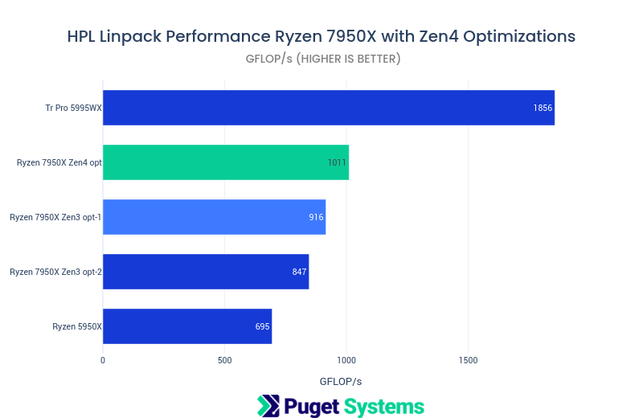
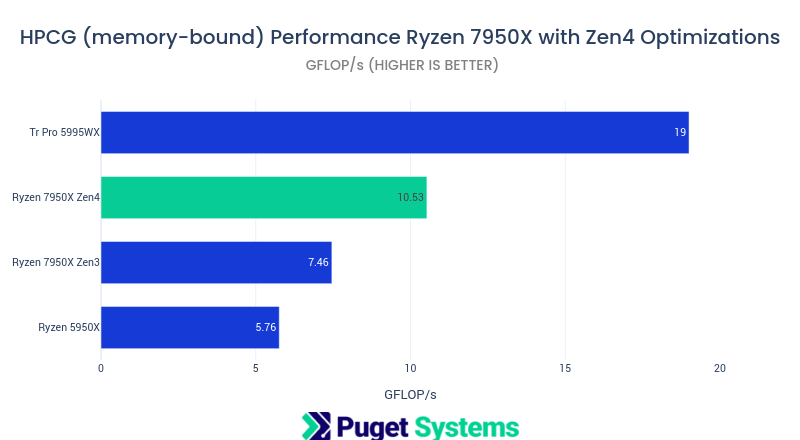
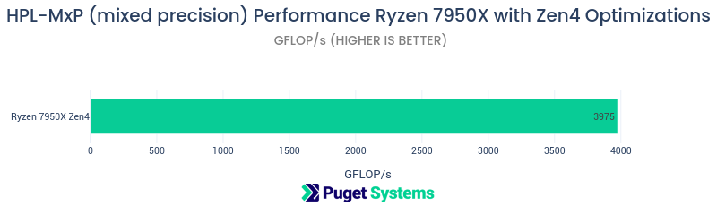

# Ryzen 7950x Zen4 AVX512 Performance With AMD AOCCv4 HPL HPCG HPL-MxP

This post is a first-look at performance of the Ryzen7 7950x CPU using the latest AMD compiler release with support for Zen4 arch including AVX512 vector instructions. Performance is tested using the HPC standard benchmarks, HPL (High Performance Linpack), HPCG (High Performance Conjugate Gradient) and the newer HPC Top500 benchmark, HPL-MxP (formerly HPL-AI).  

Late 2022 AMD released version 4.0 of their AOCC compilers and AOCL performance libraries. These include support for the Zen4 architecture which has, the long awaited, AVX512 vector hardware available on Ryzen7 and EPYC Genoa. The consumer CPUs on Zen4 arch include the 16-core Ryzen7 7950x. 

I tested this impressive "consumer" CPU in the post [AMD Ryzen 7950X Scientific Computing Performance – 7 Optimized Applications](https://www.pugetsystems.com/labs/hpc/amd-ryzen-7950x-scientific-computing-performance-7-optimized-applications-2368/). That testing was prior to the AMD AOCCv4 compiler release. It was done using optimized container builds using Spack, Docker and AOCCv3.2(Zen3). **I am awaiting a proper build setup to redo all of those container builds with Zen 4 optimizations. In the mean time I am posting results using AMDs recently released binary builds of HPL, HPCG and HPL-MxP.**

## The benchmarks

The following benchmarks are from binary builds done by AMD. They are optimized for Zen4 architecture, including the new AVX512 support. [AMD Pre-built-applications](https://www.amd.com/en/developer/zen-software-studio/applications/pre-built-applications.html)

These benchmarks exhibit improved performance with targeted optimizations for the Zen4 arch using AMD AOCCv4.0.0 compilers and AOCLv4.0 performance libraries.

### HPL
[HPL v2.3 --](https://netlib.org/benchmark/hpl/) High Performance Linpack is the primary performance measure used to rank the [Top500 supercomputer](https://top500.org) list. It is heavily dependent on a good BLAS (Basic Linear Algebra Subprograms) library implementation. BLAS support in this case is provided by the AMD BLIS library in AOCLv4.0.

### HPCG
[HPCG v3.1 --](https://hpcg-benchmark.org/software/index.html)  High Performance Conjugate Gradient benchmark is a newer secondary benchmark used in the Top500 rankings. **This is a memory-bound code** that is reflective of many real-world applications.  

### HPL-MxP
[HPL-MxP --](https://hpl-mxp.org) **High Performance Linpack Auto Mixed Precision** "HPL-MxP benchmark seeks to highlight the emerging convergence of high-performance computing (HPC) and artificial intelligence (AI) workloads." This benchmark has just recently been used on the Top500 list. **It was formerly called HPL-AI.**  The benchmark takes advantage of lower precision data types that offer significant extra performance during some phases of the "solver" and uses iterative refinement after factorizations to obtain high precision results. (This is a common "trick" for high performance with GPUs in the context of ML/AI.)

## The system under test
**AMD Ryzen 7950X Test Platform**

- CPU AMD Ryzen 7950X 16 Core
- CPU Cooler Noctua NH-U12A
- Motherboard Gigabyte X670E AORUS MASTER (**auto-overclocing disabled**)
- RAM 2x DDR5-4800 32GB (64GB total)
- [Ubuntu 22.04 Linux](https://ubuntu.com)
- [AMD AOCC 4.0.0 Compiler](https://developer.amd.com/amd-aocc/)
- [AMD AOCL 4.0 Numerical libraries](https://developer.amd.com/amd-aocl/)


## Results
HPL, HPCG and HPL-MxP benchmarks compiled with Zen4 optimizations with the new AMD AOCCv4 compilers and AOCLv4 libraries, definitely show that there was more performance to be gained over my earlier testing that only utilized Zen3 arch optimizations. 

The results and notes below will illustrate more of the potential performance of the 7950x.  

### HPL
HPL makes heavy use of the double precision floating point compute capabilities of the CPU and is highly dependent on a well optimized BLAS library (AMD BLIS from AOCLv4 in this case).

**Command Line**
```
OMP_NUM_THREADS=16 OMP_PROC_BIND=TRUE OMP_PLACES=cores ./xhpl
```

**Brief output data for 7950x Zen4 job run**
```
================================================================================
T/V                N    NB     P     Q               Time                 Gflops
--------------------------------------------------------------------------------
WR0XR8C48       80576   384     1     1             344.99             1.0110e+03

--------------------------------------------------------------------------------
||Ax-b||_oo/(eps*(||A||_oo*||x||_oo+||b||_oo)*N)=   4.80122068e-03 ...... PASSED
================================================================================
```


#### Notes:
- This build of HPL with targeted Zen4 optimization is does indeed show improved performance over the previous results. It is not a dramatic improvement over the build using the more mature version 3.2 version of the compilers and libs. I would expect this to improve over time along with improvements in the v4 compilers.
- The 16-core 7950x is delivering more than half the FP64 compute performance of the much larger 64-core Tr Pro 5995WX!
- The **Zen3 opt-1** result was using a block size parameter, NB=768, which offered better performance compared to the NB=384 job run **Zen3 opt2** result. The **Zen4** job run had it's best results at NB=384.   

### HPCG

HPCG is a memory-bound benchmark. It depends heavily on mem performance and number of mem channels. It is representative of many workloads involving "solvers" for ODEs, Physics simulations, and Engineering simulations. This benchmarks can has it's best performance with fewer than the maximal number of CPU cores (limited by mem access paterns). 

**Command Line**
```
mpirun --allow-run-as-root -np ${NUM_CORES} --map-by l3cache  -x OMP_NUM_THREADS=1 xhpcg --nx=104 --ny=104 --nz=104 --rt=60
```
**Brief job run output**
```
Running HPCG with 6 cores ...
Final Summary::HPCG result is VALID with a GFLOP/s rating of=10.5261
```



#### Notes:
- HPCG is a good benchmark of memory performance during computation. **The memory performance improvement using the AOCCv4 compiler is quite significant!**
- The Tr Pro 5995WX has a large advantage with this benchmark by way of its 8 memory channels vs 2 for the 7950x. However the fast DDR5 memory on the 7950x system offsets some of disadvantages of having only 2 memory channels.  

### HPL-MxP

HPL-MxP is a modern mixed precision linear equation solver benchmark with very impressive performance. Is intended to reflect computational performance that could be expected from ML/AI model training and inference applications. 

See the following document on how the code works and it's use as a benchmark.
[https://icl.utk.edu/files/print/2022/hpl-mxp-sc22.pdf](https://icl.utk.edu/files/print/2022/hpl-mxp-sc22.pdf)

"... traditional HPC focused on simulation runs for modeling phenomena in
physics, chemistry, biology, and so on, the mathematical models that drive
these computations require, for the most part, 64-bit accuracy. On the other
hand, the machine learning methods that fuel advances in AI achieve desired
results at 32-bit and even lower floating-point precision..."

This is the first time that I have run this benchmark on CPU. Only a single result will be presented.

**Command Line**
```
OMP_PROC_BIND=TRUE OMP_NUM_THREADS=16 OMP_PLACES=cores ./hplMxP.x -N 98303 -B 1024
```
**Brief job run output**
```
=============================================================================
matrix size (N): 98304
block size (B): 1024
epoch_size: 1024
LU alg 0
Right panel tiled
nbuf: 2
total MPIs: 1
MPI map: P*Q, P: 1, Q: 1
numa size: 1
pmap: ROWDIST
Ring type: 0, bi-direction
LU factorization time: 157.463137 s
IR time: 1.85711 s
overall time: 159.32 s
overall performance: 3975.22 GFlops
Avg performance per MPI: 3975.22 GFlops
=============================================================================
```



#### Notes:
- I hope to able to build this benchmark for future comparative testing. It looks very promising!
- The mathematical problem being solved with this benchmark is the same as that of HPL (large system of linear equations). However, this algorithm provides dramatic performance improvement! Nearly 4 Tera FLOP/s of mixed precision performance. This is nearly 4 times the performance of the double precision solution obtained from the standard HPL benchmark. The end result precision to the same precision as HPL by using an iterative refinement procedure at 64 bit precision for the finial result. 
- I did experiment with different problem sizes and parameters. The parameters listed in the "Brief output" above were provided the best performance from my limited experimentation.

## Conclusions

Using benchmarks targeted specifically to the Zen4 architecture of the 7950x showed a significant performance improvement over pervious results targeted to Zen3. One of the significant changes from Zen3 to Zen4 is the change from AVX2-256 to AVX512 vector hardware and instructions. Although my results are not specifically isolating this change they do show a definite improvement in performance achieved by using code builds that could exploit this feature.

I continue to be impressed with the AMD Ryzen 7950x. It offers very good compute and memory performance for a "consumer desktop" processor. At much less cost than professional workstation or server CPUs. It is an easy recommendation for a budget compute workstation. Especially if was coupled with a newer NVIDIA GPU.

I plan on doing more benchmark builds targeted to Zen4 as well as Zen3, Intel and NVIDIA processors. expect to see more comparative charts of results in the future!

**Happy computing! --dbk @dbkinghorn** 
