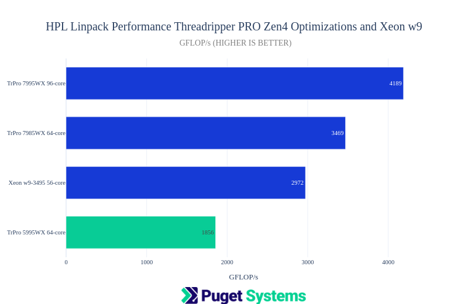
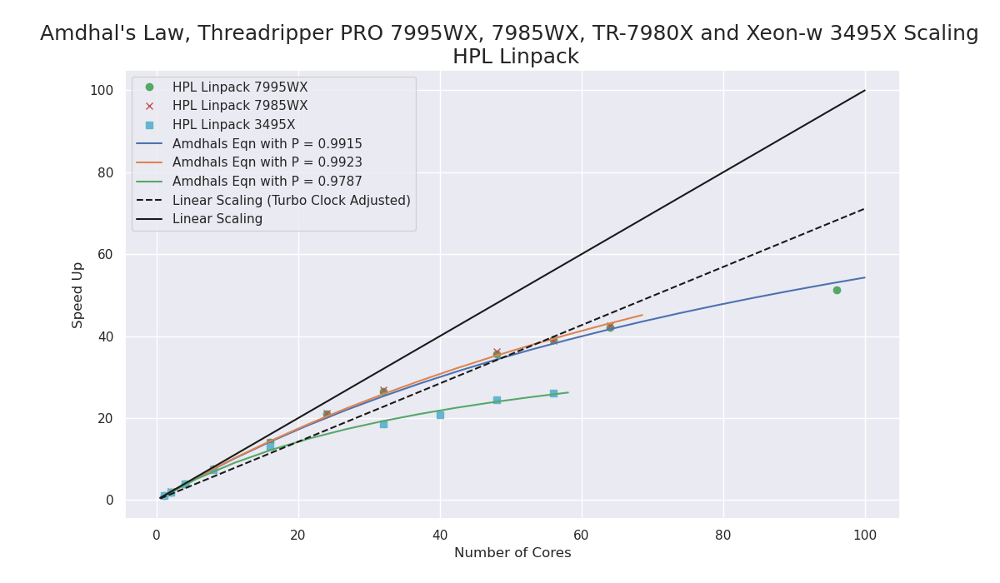
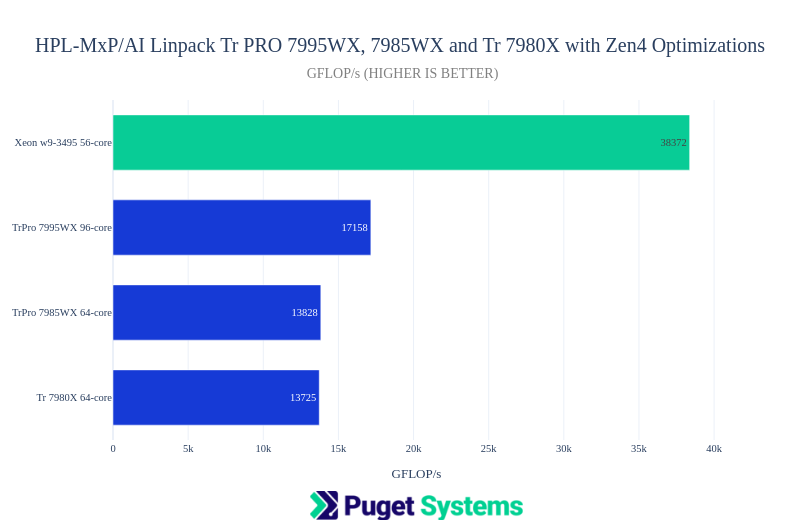
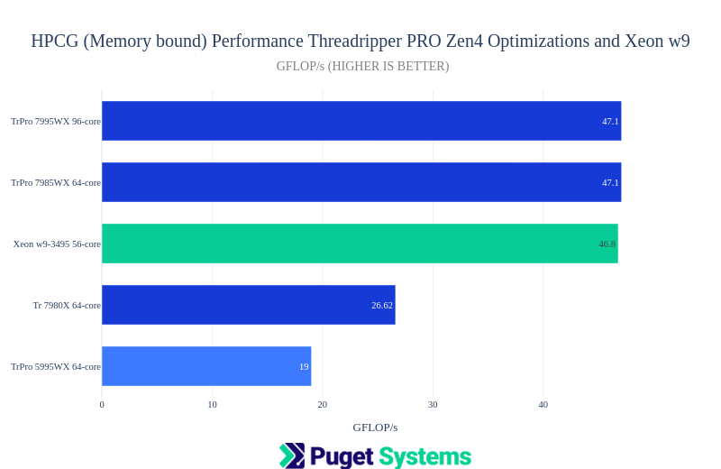
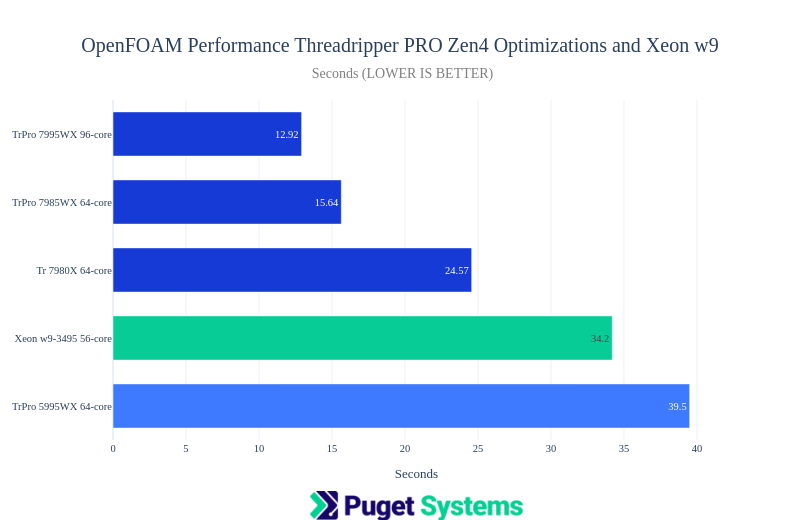
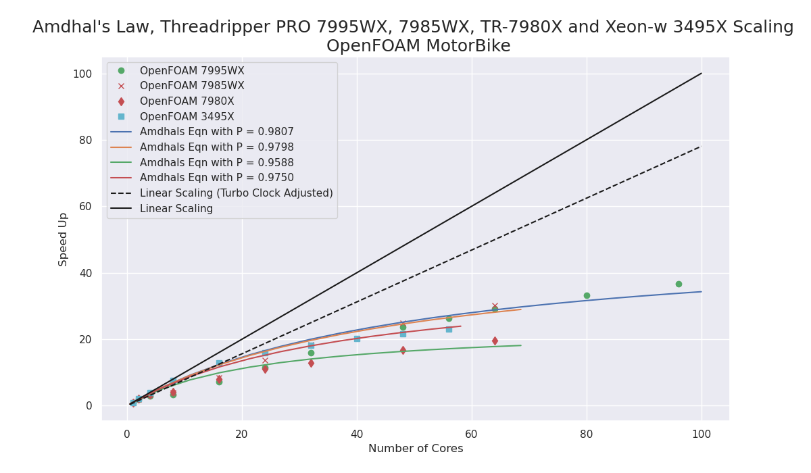

# AMD Zen4 Threadripper PRO vs Intel Xeon-w9 CPUs Compute Performance Testing HPL HPCG HPL-MxP OpenFOAM

# AMD Zen4 Threadripper PRO vs Intel Xeon-w9 For Science and Engineering 

This post is my first look at the numerical computing performance on the new (and very impressive!) AMD Zen4 Threadripper PRO 7995WX and 7985WX. I have included a comparison with the non-PRO Threadripper 7980X, the Intel Xeon-w9 3495X and older testing for the Threadripper PRO 5995WX with Zen3 optimizations.    

[I'll abbreviate Threadripper as Tr]

**In brief, I would highly recommend the Zen4 TrPRO for Scientific and Engineering workloads.** It offers a significant performance improvement over the last generation 5900WX series and outperforms The Intel Xeon-w9 3495X in most of the testing. 

I would still recommend the Xeon for code that has been developed with Intel tools and MKL but, I would also look for builds that are optimized with AMD Zen4 tools and libraries. It should be noted that the Xeon w9-3495X generally gave better performance at few numbers of cores than did the TrPRO and that is not illustrated in the charts below. However performance falls off more severely when higher numbers of cores are used. **However, I still feel that a Xeon system makes a very good platform for scientific and engineering work.**   

I did test with non-PRO Tr 64-core 7980X but would not recommend it because of anomalies I found in testing, poorer scalability and much lower memory performance.    

**NOTE!: The Tr 7980X (non-PRO) gave inconsistent results with HPL and showed poor scaling with OpenFOAM as well as the expected lower results for HPCG (it only has 4 memory channels). For these reasons, I can not recommend using this CPU for Scientific and Engineering workloads at this time.**

There are bar charts and Amdhal's Law scaling charts for comparison. They speak for themselves but please read the notes under them. 

## Systems under test

I used the same test platforms that were used in other recent tests here at Puget Systems. There are more details in these posts,
- [https://www.pugetsystems.com/labs/articles/amd-ryzen-threadripper-7000-vs-threadripper-pro-7000wx-for-content-creation/](https://www.pugetsystems.com/labs/articles/amd-ryzen-threadripper-7000-vs-threadripper-pro-7000wx-for-content-creation/)
- [https://www.pugetsystems.com/labs/articles/amd-ryzen-threadripper-7000-content-creation-review/]

### Hardware,
- AMD TrPRO 7995WX 96-core and 7985WX 64-core, 128GB DDR5, WRX90 motherboard
- AMD Tr 7980X 64-core, 128GB DDR5, TRX50 motherboard
- Intel Xeon w9-3495X 56-core, W790 motherboard  

### Software,
- Ubuntu Server 22.04
- Docker 25.03
- OpenMPI 4.1.2
- [AMD Zen4 Studio Pre-Built Applications](https://www.amd.com/en/developer/zen-software-studio/applications/pre-built-applications.html)
    - amd-zen-hpl-2023_07_18.tar.gz
    - amd-zen-hpl-mxp-2022_12.tar.gz
    - amd-zen-hpcg-2022_11.tar.gz
- [Intel OneAPI HPC-Kit docker container 2024.0.1-devel-ubuntu22.04](https://hub.docker.com/r/intel/hpckit/tags) MKL Benchmarks
    - linpack/xlinpack_xeon64
    - mp_linpack/xhpl-ai_intel64_dynamic
    - hpcg/bin/xhpcg_skx
- [OpenFOAM-v2312](https://www.openfoam.com/current-release) docker container script startup.
    - Motorbike [https://openfoamwiki.net/index.php/Benchmarks](https://openfoamwiki.net/index.php/Benchmarks)

Note: The results for AMD TrPRO 5995WX are from my post [https://www.pugetsystems.com/labs/hpc/amd-ryzen-7950x-scientific-computing-performance-7-optimized-applications-2368/](https://www.pugetsystems.com/labs/hpc/amd-ryzen-7950x-scientific-computing-performance-7-optimized-applications-2368/)
Those applications were optimized Zen3 builds using Spack and AMD AOAC 3.2 compiler and AOCL BLIS 3.2. HPL-MxP was not run for the TrPRO 5995WX.

## Benchmarks

### HPL

High Performance LINPACK (HPL) is a software package that solves a system of linear equations and measures the time it takes to factor and solve the system. This benchmark makes heavy use of floating point capability and is the ranking benchmark for the Top500 supercomputer list.

### HPCG 
[High Performance Conjugate Gradients (HPCG)](https://digital.library.unt.edu/ark:/67531/metadc866601/m2/1/high_res_d/1113870.pdf) is a simple additive Schwarz, symmetric Gauss-Seidel preconditioned conjugate gradient solver. This is a memory-bound application, with characteristics typical of many engineering "solvers". It is the secondary ranking benchmark of the Top500 supercomputer list. 

### HPL-MxP(AI)
[HPL Mixed Precision Benchmark](https://hpl-mxp.org/) is a tool that highlights the convergence of high-performance computing (HPC) and artificial intelligence (AI) workloads by solving a system of linear equations using novel, mixed-precision algorithms.

### OpenFOAM (Motorbike Benchmark)
[OpenFOAM](https://www.openfoam.com) is a free, open-source CFD (Computational Fluid Dynamics) software package developed by OpenCFD Ltd at ESI Group and distributed by the OpenFOAM Foundation³⁷. It has a large user base across most areas of engineering and science, from both commercial and academic organizations.
The Motorbike benchmark template is available here [https://openfoamwiki.net/images/6/62/Motorbike_bench_template.tar.gz](https://openfoamwiki.net/images/6/62/Motorbike_bench_template.tar.gz) 

## Result Charts

### HPL

#### Notes:
- The change from Zen3 to Zen4 Architecture is pretty dramatic! It looks like AMD has managed the shift from AVX2 to AVX512 and other improvements with no apparent compromise for power load (unlike when Intel made that change.) They have achieved a 2x fp64 floating point performance improvement.
- The problem size for these job runs was the largest multiple of 64 less than 80% of RAM i.e. NS=114560 with 128GB of system memory.
- Block size NB=384
- All jobs were run with OMP threads.
- Tr 7980X results were excluded since I was seeing inconsistent results with that CPU.   

#### Notes:
- **The Zen4 TrPRO exhibited excellent scaling performance!**
- The dotted line is a straight line based on the change from max-turbo clock (5.3GHz) to the 32-core clock which I measured at 4.5GHz (all-core was 3.2GHz). This is a compromise for the speed-up from "perfect linear scaling" which is the solid black line.  
- The TrPRO held max-turbo clock up to 8 cores in use.
- The [Amdhal's Law](https://en.wikipedia.org/wiki/Amdahl%27s_law) curve fit to find P from f(n:P) = 1/((1-P)+(P/n)) for n=1 to all cores and the speed-up at n. 
- The Tr 7980X was not included since it showed consistently bad results with 32 cores and occasionally very poor scaling beyond that. I was not able to determine the reason for this.

### HPL-MxP(AI)

#### Notes:
- This is the mixed precision Linpack benchmark. It achieves the same accuracy as HPL by using lower precision calculations to find an approximate solution and then does iterative-refinement until the required accuracy is reached. It is amazingly fast!
- The code used was optimized by AMD (HPL-MxP), and Intel (HPL-AI)
- **The Intel Xeon w9-3495X gave outstanding performance on this benchmark! I believe this is from Intel tuning to use the new Xeon features BF16 and AMX (advanced matrix extensions). For those considering running LLM inference on CPU the Xeon looks promising (I will test that at some point.)**
- I did include the Tr 7980X result here and it was comparable to the TrPRO 64-core. However, I didn't do much repeated testing and don't know if I would see erratic behavior as I did for HPL.  

### HPCG

#### Notes:
- This is a memory-bound benchmark. The Tr 7980X with 4 memory channels gave the expected lower result. The surprise is the much better performance with Zen4 with DDR5 memory was than the Zen3 5995WX.
- The maximal result for HPCG typically comes at fewer than all cores. The 7995WX was best at 24-56 cores, the 7985WX at 16 cores, the 7980X at 8 cores, and the Xeon 3495X at all 56 cores. 

### OpenFOAM

#### Notes:
- OpenFOAM is a computational fluid dynamics application and this "Motorbike" benchmark is the most "real-world" in this testing. The build optimizations for this application are not done by AMD or Intel like the others in this post.
- The Zen4 TrPRO showed excellent performance.
- The Tr 7980X is going to be limited by memory and it's overall worse performance than PRO.
- Again the performance improvement of Zen4 compared to Zen3 5995WX is highly notable.    

#### Notes:
- The TrPRO showed worthwhile scaling with larger numbers of cores the Xeon 3495X being slightly worse but with better scaling at fewer cores. 
- This chart also illustrates why I do not recommend the non-PRO Tr for this kind of workflow. 

## Conclusion

The performance improvement with the new Zen4 TrPRO over the Zen3 TrPRO is very impressive!
My first recommendation for a Scientific and Engineering workstation CPU would now be the AMD Zen4 architecture as either Zen4 Threadripper PRO or Zen4 EPYC for multi-socket systems.

I do not recommend using the non-PRO Threadripper in this domain.

There are still strong arguments for using an Intel Xeon based system in this domain, especially if you are invested in Intel's excellent software development ecosystem.

**Happy computing! --dbk @dbkinghorn**

