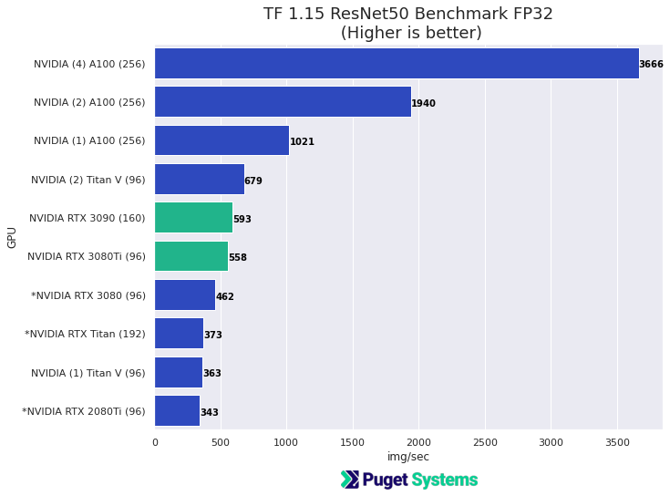

# NVIDIA 3080Ti Compute Performance ML/AI HPC

## Introduction

The NVIDIA RTX3080Ti is out and will hopefully be available to ease the difficulty that people are having finding high-end GPUs for their work (or play). I think the intention for the 3080Ti is to provide a GPU with performance near the RTX3090 but with the 12GB memory size being more appropriate for gaming use.

 For computing tasks like Machine Learning and some Scientific computing the RTX3080Ti is an alternative to the RTX3090 when the 12GB of GDDR6X is sufficient. (Compared to the 24GB available of the RTX3090). 12GB is in line with former NVIDIA GPUs that were "work horses" for ML/AI like the wonderful 2080Ti. 

 There is definitely a use case for the RTX3080Ti for computing. It may be reasonable to use 3 of them in a system with the blower designed cards. 4 GPUs would likely require [power limiting](https://www.pugetsystems.com/labs/hpc/Quad-RTX3090-GPU-Power-Limiting-with-Systemd-and-Nvidia-smi-1983/)  They do run a hotter than a RTX3080 though, and use what seems to be the same cooler as the 3080(on the FE cards) 
 
 Given the "relatively small" price difference and advantages of the RTX3090's larger memory size. I would probably recommend "leave the RTX3080Tis for the gamers!" ... but, these days you may have to go with whatever is available! It may come do to needing the extra memory of the RTX3090 or not. The "OOM" (out of memory) error when you are working on a problem can be very discouraging.       

In this post I present a few HPC and ML benchmarks with the 3080Ti mostly comparing against the 3090. This is not a comprehensive evaluation of the 3080Ti but should give you and idea of performance for numerical computing tasks. Note I have comparisons in the charts using the NVIDIA A100 PCIe, 40GB, high-end compute-GPU. The A100 is in a whole different class over the RTX series! It's the most impressive computing device I've every used! (but, very expensive and passively cooled)


## The benchmarks ResNet50, HPC, HPC-AI, HPCG 

- [**ResNet50:** 50 layer residual ANN](https://en.wikipedia.org/wiki/Residual_neural_network). ResNet50 is a Deep Neural Network model that makes a good hardware benchmark when using synthetic data. Results are model-training performance as images/second at a given batch_size and precision (fp32 or fp16). ResNet50 is one of the models used in [MLPerf](mlperf.org) where is it trained on 1.28 Million image ImageNet dataset to "74.9% Top-1 accuracy".    

- [**HPL:** The HPL Linpack benchmark](https://www.netlib.org/benchmark/hpl/) is used to rank the [Top500 supercomputers](https://www.top500.org/) and is an optimized measure of double precision floating point performance from matrix operations. The benchmark finds a solution to large dense sets of linear equations.

- [**HPL-AI:** Mixed Precision Benchmark](https://icl.bitbucket.io/hpl-ai/) Is the same HPL benchmark but using lower/mixed precision that would more typically be used for training ML/AI models. On the A100 this utilizes TF32, 32-bit Tensor-Cores. This benchmark is now also part of the Top500 supercomputer rankings.

- [**HPCG:** High Performance Conjugate Gradients](https://www.hpcg-benchmark.org/), this is another benchmark used for ranking on the Top500 list. It is a multigrid preconditioned conjugate gradient algorithm, with sparse matrix-vector multiplication with global IO patterns. It is a workload typical of many problems involving numerical solutions of sets of differential equations. This is very much memory/IO-bound!

**Keep in mind these are "Benchmarks"!** I made an effort to find (large) problem sizes and good parameters that would showcase the hardware. Measured GPU performance is particularly sensitive to problems size (larger is generally better). For the GPU benchmarks I have used NVIDIA's optimized ["NVIDIA HPC-Benchmarks 21.4" container from NGC](https://ngc.nvidia.com/catalog/containers/nvidia:hpc-benchmarks). That is their Supercomputer benchmark set!  


## Test Systems

**NVIDIA RTX3080Ti system**
-  **CPU** - 2 x Intel Xeon 6258R 28-core
- **Motherboard** - ASUS WS-C621E-SAGE
- **Memory** - 12 x 32GB Reg ECC DDR4 (384GB total)
- **GPU** - 1 NVIDIA RTX3080Ti 12GB 320W

**NVIDIA RTX3090 system**
-  **CPU** - 2 x Intel Xeon 6258R 28-core
- **Motherboard** - ASUS WS-C621E-SAGE
- **Memory** - 12 x 32GB Reg ECC DDR4 (384GB total)
- **GPU** - 1 NVIDIA RTX3090 24GB 350W

**NVIDIA A100 system**
-  **CPU** - 2 x Intel Xeon Platinum 8180 28-core
- **Motherboard** - Tyan Thunder HX GA88-B5631 Rack Server
- **Memory** - 12 x 32GB Reg ECC DDR4 (384GB total)
- **GPU** - 1-4 NVIDIA A100 PCIe 40GB 250W

**NVIDIA Titan-V system**
- **CPU** - Intel Xeon W-2295 18 Core
- **Motherboard** - Asus WS C422 PRO_SE
- **Memory** - Kingston 128GB DDR4-2400 (128GB total) [My personal system]
- **GPU** - 1-2 NVIDIA Titan-V PCIe 12GB

The other machines are from older CPU HPC benchmark posts (HPL and HPCG). See, for example the, recent [Intel Rocket Lake post](https://www.pugetsystems.com/labs/hpc/Intel-Rocket-Lake-Compute-Performance-Results-HPL-HPCG-NAMD-and-Numpy-2116/) or [AMD Threadripper Pro post](https://www.pugetsystems.com/labs/hpc/AMD-Threadripper-Pro-3995x-HPL-HPCG-NAMD-Performance-Testing-Preliminary-2085/) for references.

**Software**
- Ubuntu 20.04
- NVIDIA driver 465
- [NVIDIA HPC-Benchmarks 21.4](https://ngc.nvidia.com/catalog/containers/nvidia:hpc-benchmarks) (NGC containers)
- [NVIDIA TensorFlow 1.15 21.05-tf1-py3](https://ngc.nvidia.com/catalog/containers/nvidia:tensorflow/tags) (NGC container)
- [NVIDIA Enroot 3.3](https://github.com/NVIDIA/enroot) (for running containers )

For details on how the Enroot container runtime was used please see these posts,
-  [Run "Docker" Containers with NVIDIA Enroot](https://www.pugetsystems.com/labs/hpc/Run-Docker-Containers-with-NVIDIA-Enroot-2142/)
- [Outstanding Performance of NVIDIA A100 PCIe on HPL, HPL-AI, HPCG Benchmarks](https://www.pugetsystems.com/labs/hpc/Outstanding-Performance-of-NVIDIA-A100-PCIe-on-HPL-HPL-AI-HPCG-Benchmarks-2149/)

## Results
The charts and discussion below should give you a sense of the numerical computing performance of the RTX3080Ti. 

## TensorFlow ResNet50



Notes: 

- The RTX 3080Ti and 3090 provide similar performance with the 3090 getting a little performance boost from the larger batch size that its 24GB of memory allowed.
- The "*" indicates results that were done in other recent testing with slightly older versions of the TensorFlow 1.15 container.
- The A100 is, as expected, more than twice the performance of RTX GPUs and scales well to 4 GPUs.


Notes:
- Again at lower precision (FP16) with Tensor-cores the overall img/sec is much higher and the RTX 3080Ti and 3090 provide similar performance. Again, the 3090 get is little performance gain from the larger batch size.
- The "*" indicates results that were done in other recent testing with slightly older versions of the TensorFlow 1.15 container.
- A100 is again, as expected, much faster than the RTX GPUs. 
- The "Volta" based Titan V also performs well when utilizing its Tensor core FP16 capabilities. (Volta is the GPU code name for the processor in the Tesla V100. The Titan V and Quadro GV100 were the only non-Tesla GPUs to use the Volta processor. ) 

## HPL


Notes:
- HPL is a Supercomputer double precision floating point (FP64) performance benchmark. Running it on a consumer GPU is not likely to give good results and that is indeed the case! **NVIDIA gaming and most Quadro GPUs do not have good FP64 performance. It's just not necessary for their intended uses. The modern NVIDIA Tesla/Compute line of GPUs do have outstanding FP64 performance.** 
- The chart shows how staggeringly good the A100 is compared against even high-end CPU based systems. For applications in Scientific computing requiring double precision it can be worth the effort to try to utilizes GPU acceleration.
- **The RTX 3080Ti and 3090 have approximately 30 times less performance at FP64 than they do at FP32.** However, this is still comparable to mid-range desktop CPUs 


## HPL-AI


Notes:
- This is is the HPL benchmark run at lower mixed precision FP32. It is now included as a ranking criteria for the Top500 Supercomputer list. It reflects the usage of ML/AI currently taking hold in the HPC world.
- The "0" result for the single A100 was because at a reasonable problem size I was unable to get a result that passed residual error (i.e. the calculation blew up) That is precisely the reason that much of Scientific computing is done at the higher FP64 precision.
- **The results for the RTX 3080Ti and 3090 are very good!** That is 15 Trillion floating point operations per second. For application where FP32 mixed precision is sufficient consumer GPUs can offer outstanding performance.
- The multiple A100 results are just stunning!
- **The results from the HPL-AI are sensitive to the problem size, larger problems usually give better performance. The RTX 3090 results in this chart is using the same problem size as the RTX 3080Ti. This is because at larger problem sizes the 3090 failed residual error criteria the same way the single A100 did.** I had hoped this would be a place where I could show the potential performance advantage of the 3090s extra memory. I have included some of the job output in an Appendix at the end of the post.    

## HPCG


Notes:
- HPCG is also a Top500 Supercomputer ranking benchmark. **HPCG is memory bound!** This is a place where the high performance GDDR memory used on NVIDIA GPUs gives massively better performance than CPU memory.
- The RTX 3080Ti and 3090 both have excellent GDDR6x memory with similar data-width and give similar performance for this memory bound code. 

## Conclusions


The main takeaways are:
1. The RTX 3080Ti is very similar to the 3090 but with twice the memory. 
2. For the most serious scientific computing performance the A100 is much more capable (and expensive!).

A couple of other things to consider about the RTX 3080Ti,
- The 3080Ti is using what appears to be the same cooler on the FE edition as the RTX 3080.
- The 3080Ti runs a little hotter than the 3080 (but not excessively hot). The fans on the 3080Ti run a bit harder i.e. louder, than the 3080.
- The RTX 3090 (FE addition) not only has twice the memory but it is in a much larger housing with a significantly more powerful cooler.
- The 3080Ti is using enough power under load that a 4 x GPU setup is probably not advised. (...At least without doing "power-limiting" for the GPUs i.e. [Quad RTX3090 GPU Power Limiting with Systemd and Nvidia-smi ](https://www.pugetsystems.com/labs/hpc/Quad-RTX3090-GPU-Power-Limiting-with-Systemd-and-Nvidia-smi-1983/))
- Think about the extra memory on the 3090. That means the possibility of doing larger problems, using larger images, bigger batch sizes, more features, etc.. It can require difficult workarounds for dealing with usages that need more memory than you have available! 

**Recomendation:**
I think the RTX 3080Ti is a very good GPU and would do well in a ML/Ai or Molecular Dynamics Workstation. However, **my recommendation is to spend the extra money on the 3090 and have twice the memory** and "maybe" a better designed card. I think the 3090 is more likely to hold up better under heavy compute usage but I can't substantiate that! The extra memory alone on the 3090 is reason enough to recommend it for compute. When you need the memory it is a "showstopper" or, at least a big nuisance, when you don't have it. In any case availability is unknown at this point. Hopefully cards will be available and the RTX 3080Ti will relieve some of the pressure for the high-end card availability.

**Happy computing!** --dbk  @dbkinghorn 

## Appendix

Here is some output data from the HPL-AI testing to illustrate the "residual error" failure on the 3090 at larger problem sizes.


**3080Ti 44000 equations**
```
Convergence history: Classical Iterative Refinement
Iteration      Residual
        0     6.868E-06
        1     1.000E-10
        2     1.528E-14


info===> HPL_Classic_IR_niter 2 timer total   1.318/  1.318= redit   0.000 + Classic_IR   1.318/  1.318 :    MV   0.943    Pcond   0.375    dot   0.000 

================================================================================================================================================================
         T/V                N    NB     P     Q               Time                 Gflops          FGMRES          Gflops_IRS
--------------------------------------------------------------------------------------------------------------------------------------------------------------
HPL_AI   WR03L2L2       44000   288     1     1               3.74              1.517e+04         1.32214           1.121e+04
--------------------------------------------------------------------------------
||Ax-b||_oo/(eps*(||A||_oo*||x||_oo+||b||_oo)*N)=       2.774020E-03 ...... PASSED

```

**3090 44000 equations**
```
Convergence history: Classical Iterative Refinement
Iteration      Residual
        0     6.868E-06
        1     1.000E-10
        2     1.528E-14


info===> HPL_Classic_IR_niter 2 timer total   1.320/  1.319= redit   0.000 + Classic_IR   1.320/  1.319 :    MV   0.944    Pcond   0.375    dot   0.000 

================================================================================================================================================================
         T/V                N    NB     P     Q               Time                 Gflops          FGMRES          Gflops_IRS
--------------------------------------------------------------------------------------------------------------------------------------------------------------
HPL_AI   WR03L2L2       44000   288     1     1               3.82              1.488e+04         1.32339           1.105e+04
--------------------------------------------------------------------------------
||Ax-b||_oo/(eps*(||A||_oo*||x||_oo+||b||_oo)*N)=       2.774020E-03 ...... PASSED

```

**3090 Fail 64000 equations**
```
Convergence history: Classical Iterative Refinement
Iteration      Residual
        0           NAN
        1           NAN
        2           NAN
        3           NAN
        4           NAN
        5           NAN
        6           NAN
        7           NAN
        8           NAN
        9           NAN
       10           NAN


info===> HPL_Classic_IR_niter 10 timer total  10.976/ 10.976= redit   0.000 + Classic_IR  10.976/ 10.976 :    MV   7.258    Pcond   3.717    dot   0.001 

================================================================================================================================================================
         T/V                N    NB     P     Q               Time                 Gflops          FGMRES          Gflops_IRS
--------------------------------------------------------------------------------------------------------------------------------------------------------------
HPL_AI   WR03L2L2       64000   288     1     1               8.32              2.100e+04        10.98160           9.054e+03
--------------------------------------------------------------------------------
||Ax-b||_oo/(eps*(||A||_oo*||x||_oo+||b||_oo)*N)=                NAN ...... FAILED

```
