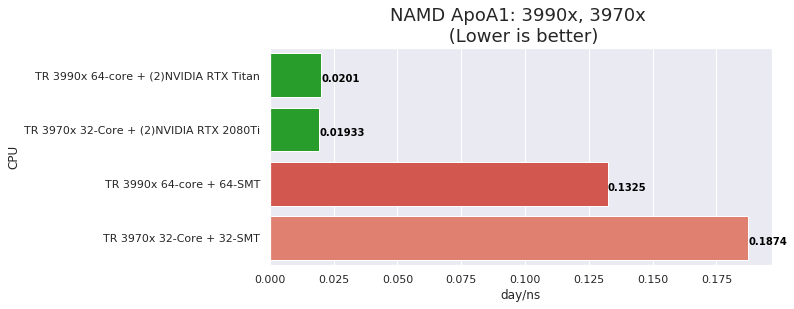

# 3990x vs 3970x Performance and Scaling (HPL, Numpy, NAMD plus GPUs)

## Introduction

Is 32-cores enough? I had some testing time again on an AMD Threadripper 32-core 3970x and thought it would be interesting to compare that to the 64-core 3990x. 

I have two recent post on the 3990x, [Threadripper 3990x 64-core Parallel Scaling](https://www.pugetsystems.com/labs/hpc/Threadripper-3990x-64-core-Parallel-Scaling-1680/) and [AMD Threadripper 3990x 64-core Linpack and NAMD Performance (Linux)](https://www.pugetsystems.com/labs/hpc/AMD-Threadripper-3990x-64-core-Linpack-and-NAMD-Performance-Linux-1666/). I'll be running the same testing jobs from those posts on the 3970x and generating charts with direct comparisons.

## System Configuration

- AMD Threadripper 3990x and 3970x
- Motherboard Gigabyte TRX40 AORUS 
- Memory 8x DDR4-2933 16GB (128GB total)
- 1TB Samsung 960 EVO M.2
- NVIDIA RTX 2080Ti GPU and RTX Titan
- Ubuntu 20.04 (pre-release)
- Kernel 5.4.0-14-generic 
- gcc/g++ 9.2.1
- [AMD BLIS library v 2.0](https://developer.amd.com/amd-aocl/blas-library/) 
- [HPL Linpack 2.2](Using pre-compiled binary at link above)
- [OpenMPI 3.1.3](installed from source)
- [NAMD 2.13 (Molecular Dynamics)](http://www.ks.uiuc.edu/Research/namd/)
- [Anaconda Python](https://www.anaconda.com/distribution/): numpy with OpenBLAS

## Amdhal's Law and Performance Charts

For a discussion and python code examples of how the Amdhal's Law charts are generated please see the 3990x parallel scaling post linked in the introduction. Those plots were used with an additional subplot overlay of the 3970x scaling results. 

In case it's useful for you, the performance charts are simple Seaborn bar charts from Pandas dataframes. Here's a code fragment for the HPL plot,

```
import pandas as pd
import seaborn as sns

dfhpl = pd.DataFrame({'CPU':[
    'TR 3990x 64-core AVX2 BLIS v2.0',
    'TR 3970x 32-Core AVX2 BLIS v2.0'
     ], 
    'GFLOP/s':[1571, 1326 ]})

# Plot it
plt.figure(figsize=(9,2))
clrs = sns.color_palette("Reds_d", 2)
ax = sns.barplot(y="CPU", x="GFLOP/s", data=dfhpl, palette=clrs)
ax.set_title('HPL Linpack Benchmark: 3990x, 3970x \n (Higher is better)', fontsize=18)

y = dfhpl['GFLOP/s']
for i, v in enumerate(y):
    ax.text(v , i + .125, str(v), color='black', fontweight='bold')
```

## HPL Linpack Performance and Scaling 3990x vs 3970x

HPL (Linpack) is provided by AMD with the BLIS library. For optimal performance the problem size (114000) was chosen as approx. %88 of the 128GB system memory and using a block size (768). These job runs are using multi-threaded (MT) BLIS without SMT "hyperthreads". `OMP_NUM_THREADS` is set to the number of "real" cores (32 and 64) for performance and is set from 1-to-max-cores for scaling. 


The 32-core 3970x performance is very good but I had hoped for better results from the 64-core 3990x. Ideally it would be near double that of the 3970x. 


The scaling fall-off near max-cores for the 3970x is similar to that of the 3990x.

## Numpy OpenBLAS norm(A@B) Performance and Scaling 3990x vs 3970x

This is a simple numpy test computing the frobenius norm of a matrix product.

For a discussion and python code examples of this Numpy job please see the 3990x parallel scaling post linked in the introduction.


Again, I would have liked to see better relative performance with the 3990x.

**Note:** For these tests numpy with OpenBLAS gave better performance than using MKL(debug).


Scaling for the 3970x is very good. It closely follows that of the 3990x up to 32-cores without significant drop-off near max cores. 

## NAMD ApoA1 Performance and Scaling 3990x vs 3970x 

**ApoA1 ~ 92000 atoms 500 time steps**

NAMD scales well on CPU and have good GPU acceleration. I have included CPU only and CPU + (2)GPU results. 

Results are in days per nano-second of simulation time. (the standard NAMD performance label)



The first thing to notice is that the 3990x + RTX Titan result is slightly worse than the 3970 + 2080Ti result. I believe the limitation here is  the number of GPU's for the 3990x. NAMD does best with a balance between CPU cores and GPU's. The 3990x would likely still benefit from 1 or 2 more GPU's. The 3970x is probably near optimal balance with the 2 2080Ti's. The problem is that Threadriper motherboards (that I know of) only support 2 PCIe X16/X16 slots. It may be fine to run 4 GPU's at X8 but I have not tested this. 


The CPU scaling for the 3970x is very good, mirroring that of the 3990x out to 32-cores. 


## NAMD STMV Performance and Scaling 3990x vs 3970x 

**STMV ~ 1 million atoms 500 time steps**


Here we see relative CPU performance similar to that with ApoA1. The GPU performance for the 3990x is better than the 3970x in this case. This is a much larger problem and there are more forces to be computed on the GPU's. Again, I believe there would be a performance increase with more GPU's for the 3990x. 


The CPU scaling for this job run is similar to the ApoA1 results.  

## Conclusion

From these results it seems clear that the core utilization for the 3970x is very good. The 64-core 3990x does offer improved performance but the benefit beyond 40-48 cores can diminish significantly ... at least for the tests that I did in this post!  I am sure there will be applications where the 3990x will give better performance scaling. 

The 32-core 3970x is an easy recommendation for well scaling parallel applications where it should offer good hardware utilization. The 64-core 3990x is certainly worth consideration and does offer increased performance but, my feeling is that we are seeing limitations in scaling because of memory subsystem capability which is limiting utilization of the hardware.

I will be testing AMD EPYC Rome and am happy to announce that Puget Systems will be qualifying platforms soon. My guess at this point is that for the 64-core systems there will be better hardware utilization and overall performance with EPYC. I'll know soon!

**Happy computing! --dbk @dbkinghorn**