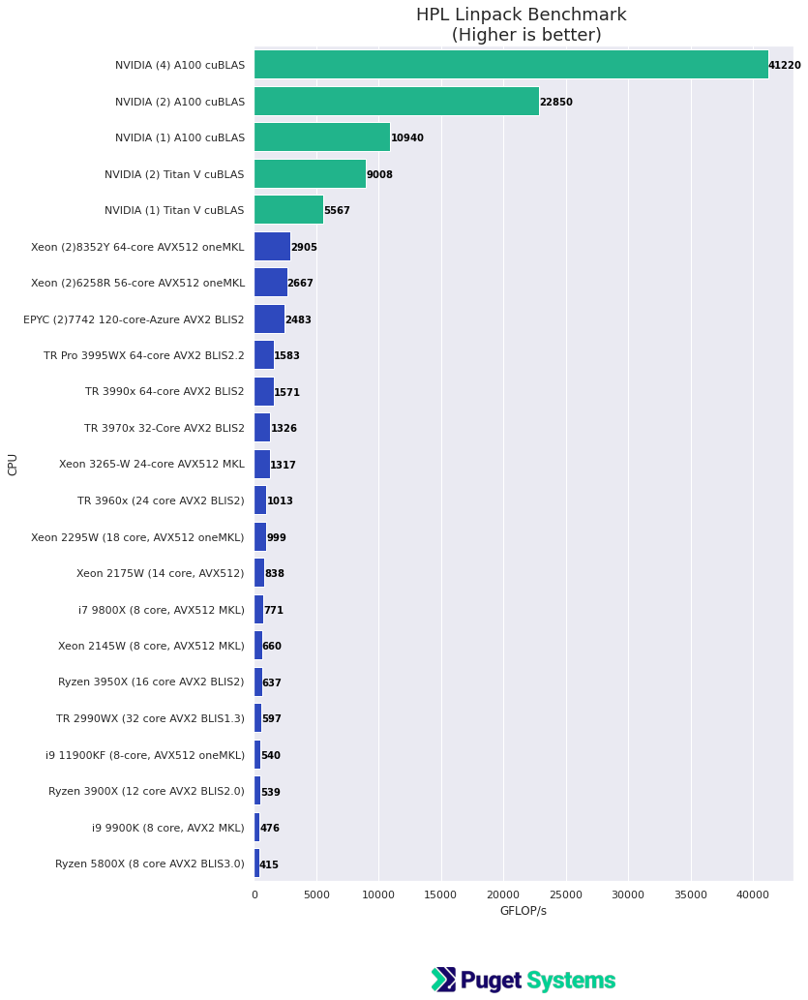

# Outstanding Performance of NVIDIA A100 PCIe on HPL, HPL-AI, HPCG Benchmarks

## Introduction

The NVIDIA A100 (Compute) GPU is an extraordinary computing device. It's not just for ML/AI types of workloads. General scientific computing tasks requiring high performance numerical linear algebra run exceptionally well on the A100. The NVIDIA RTX 30xx (GeForce) and "Quadro" RTX Ax000 (Professional) GPUs are also good for numerical computing tasks that don't require double precision floating point for accuracy i.e. FP64. However, the A100 excels at these workloads too in addition to making traditional high precision numerical computing tasks viable with GPU compute acceleration. 

- The A100 provides exceptionally good double precision numerical computing performance. 
- It's lower precision performance FP32, FP16 is also excellent and includes 32-bit Tensor-Cores, TF32, which when used with mixed precision can provide a large performance boost and still provide acceptable accuracy for many application. Especially for ML/AI model training. 
- The memory performance of the A100 is also a big plus and can provide 5 times the performance of even the best dual socket CPU systems for memory-bound applications. The A100 GPU comes with 40 or 80 GB of memory! 

I have run three "standard" HPC benchmarks that illustrate these remarkable performance characteristics of the A100.


## The benchmarks HPC, HPC-AI, HPCG

- [**HPL:** The HPL Linpack benchmark](https://www.netlib.org/benchmark/hpl/) is used to rank the [Top500 supercomputers](https://www.top500.org/) and is an optimized measure of double precision floating point performance from matrix operations. The benchmark finds a solution to large dense sets of linear equations.

- [**HPL-AI:** Mixed Precision Benchmark](https://icl.bitbucket.io/hpl-ai/) Is the same HPL benchmark but using lower/mixed precision that would more typically be used for training ML/AI models. On the A100 this utilizes TF32, 32-bit Tensor-Cores. This benchmark is now also part of the Top500 supercomputer rankings.

- [**HPCG:** High Performance Conjugate Gradients](https://www.hpcg-benchmark.org/), this is another benchmark used for ranking on the Top500 list. It is a multigrid preconditioned conjugate gradient algorithm, with sparse matrix-vector multiplication with global IO patterns. It is a workload typical of many problems involving numerical solutions of sets of differential equations. This is very much memory/IO-bound!

These 3 benchmarks provide a good measure of the numerical computing performance of a computer system. These are the benchmarks used to rank the largest supercomputer clusters in the world. Of course I'm running them on a single server or workstation. Still, having "grown up" with supercomputers I'm always impressed by the performance from a single node modern system. The 4 x A100 system I've tested provides more computing performance than the first multi million-dollar, Top500 supercomputer deployment I was involved with!

**Keep in mind these are "Benchmarks"!** I made an effort to find (large) problem sizes and good parameters that would showcase the hardware. Measured GPU performance is particularly sensitive to problems size (larger is generally better). For the GPU benchmarks I have used NVIDIA's optimized ["NVIDIA HPC-Benchmarks 21.4" container from NGC](https://ngc.nvidia.com/catalog/containers/nvidia:hpc-benchmarks). That is their Supercomputer benchmark set!  


## Test Systems

**NVIDIA A100 system**
-  **CPU** - 2 x Intel Xeon Platinum 8180 28-core
- **Motherboard** - Tyan Thunder HX GA88-B5631 Rack Server
- **Memory** - 12 x 32GB Reg ECC DDR4 (384GB total)
- **GPU** - 1-4 NVIDIA A100 PCIe 40GB 250W

**NVIDIA Titan-V system**
- **CPU** - Intel Xeon W-2295 18 Core
- **Motherboard** - Asus WS C422 PRO_SE
- **Memory** - Kingston 128GB DDR4-2400 (128GB total) [My personal system]
- **GPU** - 1-2 NVIDIA Titan-V PCIe 12GB

The other machines are from older CPU HPC benchmark posts (HPL and HPCG). See, for example the, recent [Intel Rocket Lake post](https://www.pugetsystems.com/labs/hpc/Intel-Rocket-Lake-Compute-Performance-Results-HPL-HPCG-NAMD-and-Numpy-2116/) or [AMD Threadripper Pro post](https://www.pugetsystems.com/labs/hpc/AMD-Threadripper-Pro-3995x-HPL-HPCG-NAMD-Performance-Testing-Preliminary-2085/) for references.

**Software**
- Ubuntu 20.04
- NVIDIA driver 460
- [NVIDIA HPC-Benchmarks 21.4](https://ngc.nvidia.com/catalog/containers/nvidia:hpc-benchmarks) (NGC containers)
- [NVIDIA Enroot 3.3](https://github.com/NVIDIA/enroot) (for running containers )

## Results

Here's the good stuff!

## HPL


This chart is pretty telling!  This is the same HPL Linpack problem run on the CPUs and GPUs. **4 x A100 out performs by a factor of 14 the best dual CPU system I've ever tested.** (That dual Xeon is the new Intel Ice Lake which is very good!) There are arguments for using CPUs but, the A100 is very compelling!

Note: The important HPL.dat parameters (N, NB, P, Q) used for the GPU runs are listed on the output lines below,

```
4 x A100
================================================================================
T/V                N    NB     P     Q               Time                 Gflops
--------------------------------------------------------------------------------
WR03L2L2      144000   288     2     2              48.26              4.122e+04 
--------------------------------------------------------------------------------
||Ax-b||_oo/(eps*(||A||_oo*||x||_oo+||b||_oo)*N)=        0.0000115 ...... PASSED
================================================================================

2 x A100
================================================================================
T/V                N    NB     P     Q               Time                 Gflops
--------------------------------------------------------------------------------
WR03L2L2      100000   288     2     1              29.17              2.285e+04 
--------------------------------------------------------------------------------
||Ax-b||_oo/(eps*(||A||_oo*||x||_oo+||b||_oo)*N)=        0.0042121 ...... PASSED
================================================================================

1 x A100
================================================================================
T/V                N    NB     P     Q               Time                 Gflops
--------------------------------------------------------------------------------
WR03L2L2       64000   288     1     1              15.99              1.094e+04 
--------------------------------------------------------------------------------
||Ax-b||_oo/(eps*(||A||_oo*||x||_oo+||b||_oo)*N)=        0.0038464 ...... PASSED
================================================================================


2 x Titan V
================================================================================
T/V                N    NB     P     Q               Time                 Gflops
--------------------------------------------------------------------------------
WR03L2L2       56000   288     2     1              13.00              9.008e+03 
--------------------------------------------------------------------------------
||Ax-b||_oo/(eps*(||A||_oo*||x||_oo+||b||_oo)*N)=        0.0041254 ...... PASSED
================================================================================

1 x Titan V
================================================================================
T/V                N    NB     P     Q               Time                 Gflops
--------------------------------------------------------------------------------
WR03L2L2       36000   288     1     1               5.59              5.567e+03 
--------------------------------------------------------------------------------
||Ax-b||_oo/(eps*(||A||_oo*||x||_oo+||b||_oo)*N)=        0.0040158 ...... PASSED
================================================================================


```


## HPL-AI


This is the mixed precision version of the HPL Linpack dense system solver benchmark. It's intention is to check lower precision floating point calculation that would be more typical in ML/AI model training. 

The benchmark has to pass the residual error accuracy the same as HPL and this is why there is no result for the 1 x A100. I was not able to get a result that would "pass" with 1 GPU unless I dropped the problem size significantly. However, dropping the problem size adversely affected the performance. I was not able to determine what was cause the calculation to "blow-up" and give NAN (not-a-number) results.

However the 2 x and 4 x A100 results were outstanding! (...and passed residual error tests) Over 118 tera-flops per second (TFLOPS) with 4 GPUs on a single node server ... stunning! 

Note: The important HPL.dat parameters (N, NB, P, Q) used are listed on the output lines below,

```
4 x A100
============================================================================================
         T/V                N    NB     P     Q               Time                 Gflops   
--------------------------------------------------------------------------------------------
HPL_AI   WR03L2L2      176000   288     2     2              30.66              1.186e+05   
--------------------------------------------------------------------------------
||Ax-b||_oo/(eps*(||A||_oo*||x||_oo+||b||_oo)*N)=       1.450442E-03 ...... PASSED

2 x A100
============================================================================================
         T/V                N    NB     P     Q               Time                 Gflops   
--------------------------------------------------------------------------------------------
HPL_AI   WR03L2L2      140000   288     2     1              27.55              6.640e+04   
--------------------------------------------------------------------------------
||Ax-b||_oo/(eps*(||A||_oo*||x||_oo+||b||_oo)*N)=       1.701634E-03 ...... PASSED

2 x Titan V
============================================================================================
         T/V                N    NB     P     Q               Time                 Gflops   
--------------------------------------------------------------------------------------------
HPL_AI   WR03L2L2       64000   288     2     1               4.83              3.620e+04   
--------------------------------------------------------------------------------
||Ax-b||_oo/(eps*(||A||_oo*||x||_oo+||b||_oo)*N)=       1.295506E-03 ...... PASSED

1 x Titan V
============================================================================================
         T/V                N    NB     P     Q               Time                 Gflops   
--------------------------------------------------------------------------------------------
HPL_AI   WR03L2L2       44000   288     1     1               3.36              1.689e+04   
--------------------------------------------------------------------------------
||Ax-b||_oo/(eps*(||A||_oo*||x||_oo+||b||_oo)*N)=       2.629309E-03 ...... PASSED


```

## HPCG


HPCG stresses memory/IO-communication performance. This is a (another) place where GPUs give great performance. The 4 x A100 achieves nearly 1 tera-flop per sec.. This is a massive increase over even the best CPU based system I have ever tested. Memory-bound code should run very well on A100! 

All of the HPCG benchmark runs were with the following input parameter file (hpcg.dat),

```
HPCG benchmark input file
Sandia National Laboratories; University of Tennessee, Knoxville
256 256 256
180
```

## NGC HPC Benchmarks Container Setup with Enroot

**For the sake of repeatability and verification the setup and job run details are given here.**

Setting up and running and optimizing these benchmarks is not a simple task. I would not have considered doing this "from scratch". Fortunately NVIDIA has the container setup they use for benchmarking large GPU cluster deployments available on NGC (NVIDIA GPU Cloud). The conainer used in this post is [NVIDIA HPC-Benchmarks 21.4](https://ngc.nvidia.com/catalog/containers/nvidia:hpc-benchmarks)

This container is not available to be "pulled" without an NGC (NVIDIA Developer) account.


You can [log-in or create an account here](https://ngc.nvidia.com/signin).

You will need to use a Oauth token to pull/import the container with Enroot. You can generate a token from the "setup" link available on the drop-down menu on the upper-right corner of the web page after you have logged in. Save your token somewhere and also, copy it to your clipboard to use in a "paste" command below.

## Creating the container sandboxes with enroot

Please see my recent post [Run "Docker" Containers with NVIDIA Enroot](https://www.pugetsystems.com/labs/hpc/Run-Docker-Containers-with-NVIDIA-Enroot-2142/) for an introduction and installation instructions for Enroot.

**Import the container from NGC**
```
enroot import 'docker://$oauthtoken@nvcr.io#nvidia/hpc-benchmarks:20.10-hpl'
```
Literally use "$oauthtoken", then after hitting return you be asked for a password. That is where you paste in the token you saved earlier.

Do the same for the HPCG container,
```
enroot import 'docker://$oauthtoken@nvcr.io#nvidia/hpc-benchmarks:20.10-hpcg'
``` 

**Creater the container sandboxes**

```
enroot create --name nv-hpl-bench nvidia+hpc-benchmarks+20.10-hpl.sqsh 

enroot create --name nv-hpcg-bench nvidia+hpc-benchmarks+20.10-hpcg.sqsh
```

**Start your container sandbox**

Before you start you containers you will need let the containers know you do not have any Mellanox Infinband networking devices (these really are supercomputer benchmarks)

```
export MELLANOX_VISIBLE_DEVICES="none"
```

Start your "container sandbox instance"

```
enroot start nv-hpl-bench
```

You would start the container sandbox for HPCG with a similar command but using the name you used when creating the sandbox (nv-hpcg-bench). 

## Command-lines for Running the Benchmarks

These benchmarks run with MPI. It took some experimenting to get the commands working correctly for these containers. 

In both containers the startup scripts .dat files and executables are in /working.  If you setup enroot to mount your home directory then you can copy that directory to your account home.

Here are examples, for all three benchmarks using 2 x A100, (or Titan V)

```
#HPL

mpirun --mca btl smcuda,self  -x UCX_TLS=sm,cuda,cuda_copy,cuda_ipc  -np 2 hpl.sh  --dat ./HPL.dat --cpu-affinity 0:0 --cpu-cores-per-rank 4 --gpu-affinity 0:1

#HPL-AI

mpirun --mca btl smcuda,self -x MELLANOX_VISIBLE_DEVICES="none" -x UCX_TLS=sm,cuda,cuda_copy,cuda_ipc  -np 2 hpl.sh --xhpl-ai --dat ./HPL.dat --cpu-affinity 0:0 --cpu-cores-per-rank 4 --gpu-affinity 0:1

#HPCG

mpirun --mca btl smcuda,self  -x UCX_TLS=sm,cuda,cuda_copy,cuda_ipc  -np 2 hpcg.sh --dat ./hpcg.dat --cpu-affinity 0:0 --cpu-cores-per-rank 4 --gpu-affinity 0:1 
```

--cpu-affinity is a : separated list of CPU locations for each MPI rank. The 2U 4 x A100 system I used had the PCIe root hub on CPU 0 for all 4 GPU slots. So 4 x GPU run would have --cpu-affinity 0:0:0:0  If the PCIe root hub had been dual then the GPU's would be on both CPUs and --cpu-affinity 0:0:1:1 would have been appropriate.

--gpu-affinity is the corresponding GPU list to use i.e. for all 4 A100's it was --gpu-affinity 0:1:2:3

The mapping can be complex (on a large cluster) but the above provides a simple working example for a single node.


## What about the RTX3090?

Of course you may be curious about something like the RTX3090. The benchmarks ran the same way. However, the single RTX3090 failed the same way too (I did not have 2 to test with). The benchmark where it might have given good relative performance, HPL-AI, failed to pass residual error, same as a single A100. The RTX3090 is an excellent GPU for ML/AI model training with FP32 and Tensor Cores. My only hesitations with recommending the 3090 for single precision workloads is the high power requirements (350W) and large size of most of the available cards limiting multi-GPU design. We are seeing more conventional blower fan designs again thankfully and power limits can be set in software but, they are still in short supply.  

The HPL double precision benchmark ran but, of course, the 3090 is using the GA102 GPU not the compute powerhouse GA100 so the results were over 20 times slower than a single A100. 

The 3090 does have very good memory performance and it ran the same HPCG benchmark at about 60% of the performance of the A100. 

## Conclusions

The A100 is an incredible computing device! I've said that before about NVIDIA GPUs and will probably continue to do so. They just keep making extraordinary performance improvements. Especially on the high-end compute line. 

I have been an advocate for using GPU acceleration for scientific programming since it was first possible to do so. It keeps becoming easier, and easier to code for GPU. NVIDIA's developer ecosystem is second to none. GPU acceleration has become so important that doing a machine learning framework without GPU support seems unreasonable. And, machine learning frameworks are becoming very good general purpose scientific computing systems often with very little effort needed to run on GPU. There has been in the past and there are in the works, other compute accelerator hardware projects but nothing has succeeded like NVIDIA GPUs. In fact, essentially all other accelerators have failed to reach significant acceptance and longevity. I strongly encourage you to try GPU acceleration in your new projects and ports of older work.

**Happy Computing --dbk @dbkinghorn**