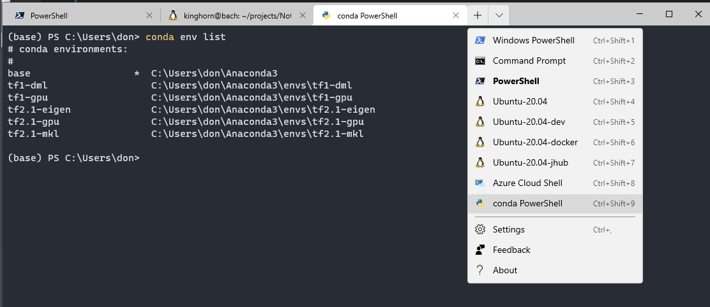

# Adding Anaconda PowerShell to Windows Terminal

In my opinion Windows Terminal (wt) is one of the best applications Microsoft has added to Windows 10 (ever). It is a nice terminal app similar to some of the good Linux terminal. It is a modern tabbed, customizable terminal. On my typical daily Windows desktop I will have wt open with several tabs, including; PowerShell, a couple of WSL2 Linux shells and an SSH remote session or two.

When running Python on Windows I use conda with either a Miniconda or full Anaconda install. And, I use it from PowerShell. Running conda from PowerShell is almost identical to running from bash on Linux. This helps to keep workflow consistency.  

When you install Miniconda3 or Anaconda3 on Windows it adds a PowerShell shortcut that has the necessary environment setup and initialization for conda. It's listed in the Windows menu as "Anaconda Powershell Prompt (Anaconda3)".

Examining the properties of this shortcut for the system I'm using right now shows,

```
%windir%\System32\WindowsPowerShell\v1.0\powershell.exe -ExecutionPolicy ByPass -NoExit -Command "& 'C:\Users\don\Anaconda3\shell\condabin\conda-hook.ps1' ; conda activate 'C:\Users\don\Anaconda3' "
```

(This is reflective of my user name and Anaconda install location on this particular machine.)

That's an easy way to start up your Python "Base" conda environment. However, this opens a separate/detached PowerShell instance and it would be nice to have this as an optional shell from Windows Terminal!

**What we will do in this post is add the functionality of the above start-up commands as a new shell option in Windows Terminal.** 

## Adding a new custom shell to Windows Terminal

**Note: I am using "Windows Terminal Preview Version: 1.4.2652.0".** If you are using an older version of Windows Terminal your setting.json file may be different than what I show below! ( If you are not using "Preview" I recommend that you go ahead and install it, it's quite nice! )

From Windows Terminal go to the settings option on the drop-down menu,

Clicking that will open the wt settings.json file in vscode (you are using vscode aren't you?!)

We will add a new profile to the end of the profiles list in this setting.json file.

Copy the profile entry for the default PowerShell terminal entry (should be the first entry). Past this to the end of the profiles. Don't forget to add a comma after what was previously last profile. 

```
,
{
    // Make changes here to the powershell.exe profile.
    "colorScheme": "Campbell Powershell",
    "guid": "{}",
    "name": "Windows PowerShell",
    "commandline": "powershell.exe",
    "hidden": false
}
```
I have removed the "guid" that was there since we will need to generate a new unique one for this profile.

### Generate a new "guid"
You will need a new unique guid for your terminal profile. In PowerShell run "New-Guid",
```
PS C:\> New-Guid
Guid
----
0352cf0f-2e7a-4aee-801d-7f27f8344c77
```
Don't use the one listed above. Make a new one! Copy your new guid to between the curly braces in the profile setting. For example,
```
"guid": "{0352cf0f-2e7a-4aee-801d-7f27f8344c77}",
```

### Complete the profile configuration

The finial profile configuration I settled on looks like,
```
{
    // custom PowerShell profile for conda.
    "colorScheme": "One Half Dark",
    "guid": "{0352cf0f-2e7a-4aee-801d-7f27f8344c77}",
    "name": "conda PowerShell",
    "commandline": "pwsh.exe -ExecutionPolicy ByPass -NoExit -Command \"& '~/Anaconda3/shell/condabin/conda-hook.ps1' ; conda activate '~/Anaconda3'\" ",
    "icon": "C:/Users/don/Documents/Icons/python.png",
    "startingDirectory": "~",
    "hidden": false
}
```

**Notes:**
- I used my favorite "One Half Dark" for the color scheme. [Here is a link for a list of built in themes.](https://docs.microsoft.com/en-us/windows/terminal/customize-settings/color-schemes)
- Remember to use the "New-Guid" command to generate a fresh guid for your configuration.
- I used pwsh.exe for the command line because I am using PowerShell core v7. The default installed PowerShell is v5.1. **You can use `powershell.exe` in the profile instead of pwsh.exe if you are using the default PowerShell.** 
- I liked to a Python icon downloaded from the net. You could use most any image you like to add a nice touch to your configuration.
- The starting directory is set to your user home directory, "~" is a shorthand for that.
- Documentation for customizing Windows Terminal is here [https://docs.microsoft.com/en-us/windows/terminal/customize-settings/profile-settings](https://docs.microsoft.com/en-us/windows/terminal/customize-settings/profile-settings)




If you are curious about how I got those customized WSL2 Ubuntu shells in there then have a look at,
[Note: How To Copy and Rename a Microsoft WSL Linux Distribution](https://www.pugetsystems.com/labs/hpc/Note-How-To-Copy-and-Rename-a-Microsoft-WSL-Linux-Distribution-1811/)

Hope this is helpful for you!
