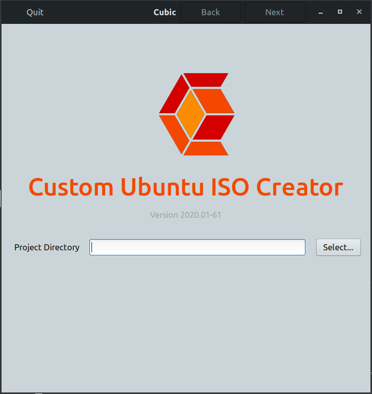
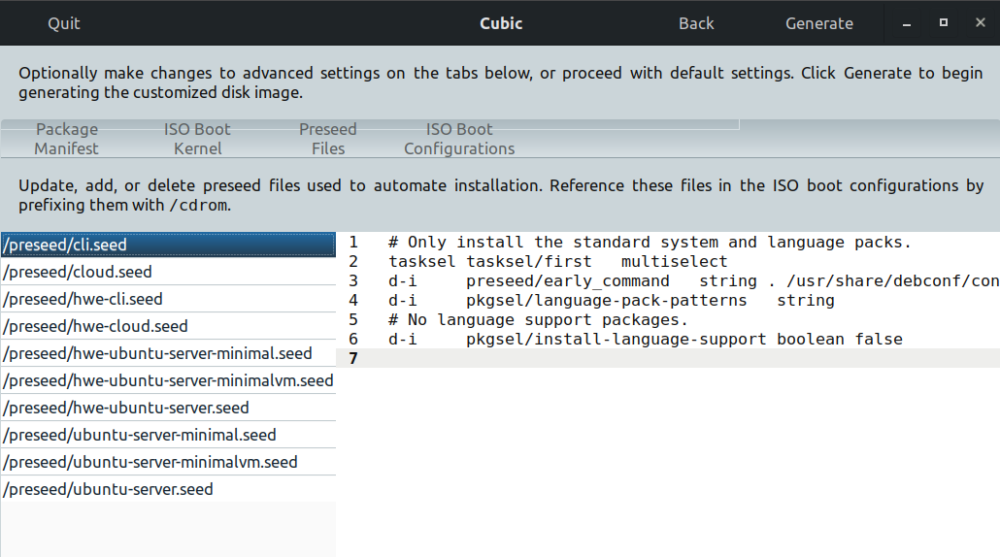

# Auto Install Ubuntu with Custom Preseed ISO

This note describes creating an ISO image for a fully automatic, customized Ubuntu 18.04 server install. 

The Ubuntu 18.04 install ISO used as the base for the customization is the [Ubuntu Alternative Download](http://cdimage.ubuntu.com/releases/18.04.3/release/) image that uses the Debian installer. In my Experience, installing Ubuntu on a wide variety of hardware has been very reliable using this installer rather than the "live" server ISO (which often fails because of GPU initialization).

Download with,
```
wget http://cdimage.ubuntu.com/releases/18.04.3/release/ubuntu-18.04.3-server-amd64.iso
```

Creating a custom install ISO requires mounting an existing install image, modifying several files, and possibly the installer boot image itself, followed by generating a new ISO image. This process is somewhat tedious and requires many steps aside from the actual customizations. Fortunately there are tools available to help with these "distractions".

For this work I used a program called **"cubic"** that provides a simple GUI interface that helps to maintain focus on the important customization tasks. It will take care of setting up a build directory with the mounted ISO image, give a list of the files that typically need to be modified (and an editor), and then generate the customized ISO image. 

It will also provide a root shell to a "chroot" (change root) environment to directly modify the installer runtime image. I did not need this feature since I'm using the simple Debian installer and have no reason to modify that, but it would be a convenient way to modify a "live" installer image.  

---

**To install cubic on an Ubuntu desktop system,**
```
apt-add-repository ppa:cubic-wizard/release
apt update
apt install cubic
```
then run `cubic`. You will need to sudo to root and then will be greeted with,



A quirk of the interface is that "actions" are commands in the header bar, (`Next` is your friend).

Create a directory for your ISO build i.e.  `mkdir iso-build` and "Select" that directory.

Then "Select" the install ISO file to be modified i.e. `ubuntu-18.04.3-server-amd64.iso`. Cubic will loopback mount the ISO image create a directory structure, copy the contents of the ISO to this directory and execute a "chroot" to the installer image and give you a root shell in that chroot. You can modify that installer image by adding files or editing existing ones. For example you could add extra repos to /etc/apt/sources.list or sources.list.d.

Im my case this "chroot" is the debian installer image for Ubuntu. If you were doing this with a "live" installer image you could install packages that would then transfer to an install using this ISO. I will only install packages from a `preseed` file. It doesn't make much sense to to make changes in this "chroot" for what I am doing. 

In the "chroot" for the installer I'm using you can see that it is a small Debian system (this is what runs to install Ubuntu)
``` 
root@i9:/ # cat /etc/debian_version 
buster/sid
```

---

**Doing "Next" logs out of the "chroot" and gives a convenient list of directories/files that make sense to change for modifying the ISO install behavior.**



From this "Preseed Files" panel a new file can be added (or edits made to existing files).  At this point you can use the editor in cubic or just sudo to a root shell on your system and make needed changes directly with out using cubic. The ISO files are in "original-iso-mount" in the cubic working directory that you started from. 

```
kinghorn@i9:~/Downloads/ISO/iso-build/original-iso-mount$ ls
boot  dists  doc  EFI  install  isolinux  md5sum.txt  pics  pool  preseed  README.diskdefines  ubuntu
```

I will add the following auto-inst.seed file to the preseed directory,

**auto-inst.seed**
```
## Ubuntu 18.104 pressed test 1
# This preseed file was adapted from the example at 
# https://help.ubuntu.com/lts/installation-guide/amd64/apbs04.html
# and lots of experimentation!

### Automatic Installation
d-i auto-install/enable boolean true
d-i debconf/priority select critical

### Localization
d-i debian-installer/locale string en_US.UTF-8
d-i localechooser/supported-locales multiselect en_US.UTF-8
# Keyboard
d-i console-setup/ask_detect boolean false
d-i keyboard-configuration/xkb-keymap select us

### Network config
d-i netcfg/choose_interface select auto
# to get a hostname from the DHCP server set unassigned-hostname below
d-i netcfg/get_hostname string U1804n1
d-i netcfg/get_domain string unassigned-domain
#d-i netcfg/hostname string U1804n1
d-i hw-detect/load_firmware boolean true

### Mirror settings
#d-i mirror/http/mirror select CC.archive.ubuntu.com
d-i mirror/country string manual
d-i mirror/http/hostname string archive.ubuntu.com
d-i mirror/http/directory string /ubuntu
d-i mirror/http/proxy string

### Account setup
# This is just for testing!!!
d-i passwd/user-fullname string Ubuntu User
d-i passwd/username string ubuntu
d-i passwd/user-password password ubuntu
d-i passwd/user-password-again password ubuntu
# or encrypted using a crypt(3) hash.
#d-i passwd/user-password-crypted password [crypt(3) hash]
# The installer will warn about weak passwords. If you are sure you know
# what you're doing and want to override it, uncomment this.
d-i user-setup/allow-password-weak boolean true

# Set to true if you want to encrypt the first user's home directory.
d-i user-setup/encrypt-home boolean false

### Clock and time zone setup
d-i	clock-setup/utc-auto	boolean true
# Controls whether to use NTP to set the clock during the install
d-i clock-setup/ntp boolean true

### Partitioning
# !!!DANGER don't use this without knowing what you are doing!!!
# comment out this block it you want the installer to ask about the 
# partitioning, which is much safer!

# The following will partition disk /dev/sda with an EFI partition, a root partition
# and a swap file. AND WONT ASK TO CONFIRM ANYTHING i.e. it will overwrite existing partitions
d-i preseed/early_command string umount /media
d-i partman/unmount_active boolean true
d-i partman-auto/disk string /dev/sda
d-i partman-auto/method string regular
d-i partman-auto/choose_recipe select atomic
# This makes partman automatically partition without confirmation, provided
d-i partman-partitioning/confirm_write_new_label boolean true
d-i partman/choose_partition select finish
d-i partman/confirm boolean true
d-i partman/confirm_nooverwrite boolean true

# The kernel image (meta) package to be installed;
#d-i base-installer/kernel/image string linux-generic
d-i  base-installer/kernel/altmeta   string hwe-18.04

### Package selection
# Install the Ubuntu Server seed.
#tasksel	tasksel/force-tasks	string server
tasksel tasksel/first multiselect openssh-server

# Individual additional packages to install
d-i pkgsel/include string build-essential dkms

# Only install basic language packs. Let tasksel ask about tasks.
d-i	pkgsel/language-pack-patterns	string
# No language support packages.
d-i	pkgsel/install-language-support	boolean false

# Policy for applying updates. May be "none" (no automatic updates),
# "unattended-upgrades" (install security updates automatically), or
# "landscape" (manage system with Landscape).
d-i pkgsel/update-policy select none

# Verbose output and no boot splash screen.
d-i	debian-installer/quiet	boolean false
d-i	debian-installer/splash	boolean false

# Avoid that last message about the install being complete.
# This will just finish and reboot
d-i finish-install/reboot_in_progress note
#d-i debian-installer/exit/poweroff boolean true
```

**If you use this preseed file be sure that you read and understand every line in it!** 

I built this preseed file using the example at https://help.ubuntu.com/lts/installation-guide/amd64/apbs04.html
along with lots of experimentation!


In order to use this new preseed file you will need to edit `boot/grub/grub.cfg` and `isolinux/text.cfg`
These are in the "original-iso-mount" directory (conveniently mounted and listed by cubic). 

**For grub.cfg I've added the following stanza,**

```
menuentry "Auto Install Ubuntu Server From Preseed" {
	set gfxpayload=keep
	linux	/install/hwe-vmlinuz  boot=casper file=/cdrom/preseed/auto-inst.seed auto=true priority=critical locale=en_US  quiet ---
	initrd	/install/hwe-initrd.gz
}
```

`file=/cdrom/preseed/auto-inst.seed auto=true priority=critical locale=en_US ` are telling the installer to use my auto-inst.seed preseed, do an auto install, only ask critical questions during the install and set the localization to en_US. The localization is needed here as a boot parameter since the first questions the installer asks about language happen before the preseed starts.

**In the isolinux/txt.cfg file the following changes need to be made,**

Change the "default" selection from "install" to "auto-install"
```
default auto-install
```

and add a menu entry

```
label  auto-install
  menu label ^Auto Install Ubuntu Server From Preseed
  kernel /install/hwe-vmlinuz
  append  boot=casper file=/cdrom/preseed/auto-inst.seed vga=788 initrd=/install/hwe-initrd.gz auto=true priority=critical locale=en_US  quiet ---
```

Note that I am using the "HWE" (Hardware Enablement) kernel.

**After making these changes you can click "Generate"** in cubic and it will create the new ISO image tagged with the current date and original ISO file name. `ubuntu-18.04.3-2020.01.29-server-amd64.iso`

I highly recommend that you test the new ISO install image in a virtual machine before running it on real hardware. You may have some debugging to do!


**Happy computing!  --dbk @dbkinghorn**