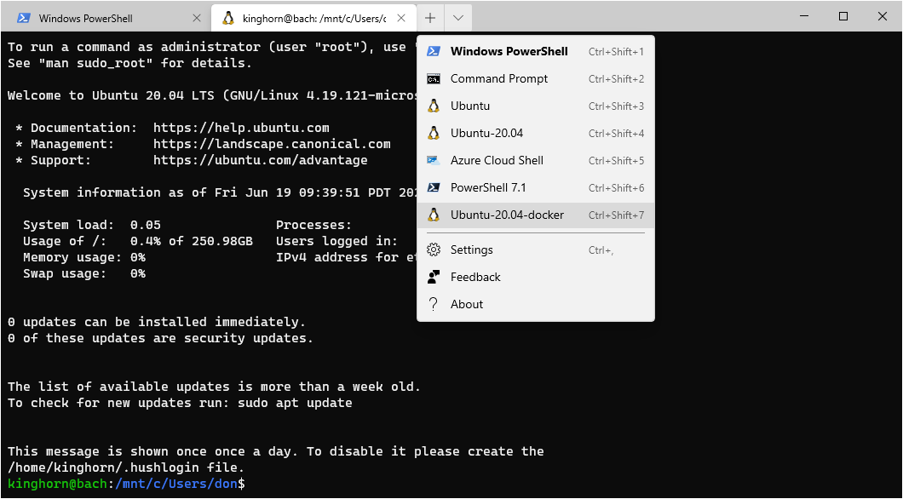

# How To Copy and Rename a Microsoft WSL Linux Distribution 

WSL on Windows 10 does not (currently) provide a direct way to copy a Linux distribution that was installed from the "Microsoft Store". The following guide will show you a way to make a working copy of an installed distribution with a new name.

For example: With Ubuntu-20.04 installed from the "Microsoft Store" we will create a copy to experiment with named Ubuntu-20.04-docker.

Assumptions:
- You have a recent Update of Windows 10 with WSL2 enabled. ( This should also work with WSL 1 but, in general, I recommend using WSL2 and the latest Microsoft Linux kernel ) 
- You have enough disk space to be installing and configuring multiple WSL Linux distributions on your Windows system.

The following steps are from a PowerShell session on a system with user "don" unless stated otherwise.

## Step 1)  Optional: Start with a fresh image of Ubuntu-20.04
 You can delete your existing distribution and install a fresh copy from the "store" or just use your existing image if it is in a state you are OK with.

Check installed distributions
```
C:\Users\don> wsl -l -v
  NAME            STATE           VERSION
* Ubuntu          Stopped         2
  Ubuntu-20.04    Stopped         2
```
Exit from the distribution you are going to delete if the STATE is "Running".

Delete the existing distribution, (Optional)
```
C:\Users\don> wsl --unregister Ubuntu-20.04
Unregistering...
C:\Users\don> wsl -l -v
  NAME      STATE           VERSION
* Ubuntu    Stopped         2
```
Get a fresh copy of the distribution if you did the delete (unregister) above.
- Open the Microsoft Store app and search for Ubuntu. 
- Select and install "Ubuntu 20.04 LTS". 
- Open the downloaded app and configure your user-name and password for the distribution.
- exit from the terminal

Check the image list with " wsl -l -v" If your Ubuntu-20.04 is a VERSION 1 then you can change it to VERSION 2 with,
```
wsl --set-version Ubuntu-20.04 2
```

## Step 2) Create directories to store your custom distribution images.
I'm putting image directories in "WSL-images" in my Windows home directory.
```
C:\Users\don> mkdir $HOME/WSL-images


    Directory: C:\Users\don


Mode                 LastWriteTime         Length Name
----                 -------------         ------ ----
d-----         6/18/2020   6:13 PM                WSL-images
```
Create the Ubuntu-20.04-docker directory.
```
C:\Users\don> mkdir $HOME/WSL-images/Ubuntu-20.04-docker


    Directory: C:\Users\don\WSL-images


Mode                 LastWriteTime         Length Name
----                 -------------         ------ ----
d-----         6/18/2020   6:30 PM                Ubuntu-20.04-docker
```

## Step 3) Export the Ubuntu-20.04 image to a tar file
We'll keep it in the WSL-images directory as a source for creating new distributions.
```
C:\Users\don> cd $HOME/WSL-images
C:\Users\don\WSL-images>

C:\Users\don\WSL-images> wsl  --export Ubuntu-20.04  Ubuntu-20.04-default.tar
C:\Users\don\WSL-images> ls


    Directory: C:\Users\don\WSL-images


Mode                 LastWriteTime         Length Name
----                 -------------         ------ ----
-a----         6/18/2020   6:44 PM     1011548160 Ubuntu-20.04-default.tar
```

## Step 4) Import the tar file as a new distribution
cd into the directory created earlier for the new distribution.
```
C:\Users\don> cd $HOME/WSL-images/Ubuntu-20.04-docker
C:\Users\don\WSL-images\Ubuntu-20.04-docker>
```
Now "import" the new distribution, i.e. create the new root filesystem. Syntax is; wsl --import Name-of-new-distro  Path-to-directory-for-new-distro  Source-distro-tar-file --version (1 or 2)
```
C:\Users\don\WSL-images\Ubuntu-20.04-docker>  wsl --import Ubuntu-20.04-docker $HOME/WSL-images/Ubuntu-20.04-docker $HOME/WSL-images/Ubuntu-20.04-default.tar --version 2
C:\Users\don\WSL-images\Ubuntu-20.04-docker> ls


    Directory: C:\Users\don\WSL-images\Ubuntu-20.04-docker


Mode                 LastWriteTime         Length Name
----                 -------------         ------ ----
-a----         6/18/2020   6:48 PM     1173356544 ext4.vhdx
```
The file ext4.vhdx is the ext4 Linux filesystem for the new distribution.

## Step 5) Check your new distribution

```
C:\Users\don\WSL-images\Ubuntu-20.04-docker> wsl -l -v
  NAME                   STATE           VERSION
* Ubuntu                 Stopped         2
  Ubuntu-20.04-docker    Stopped         2
  Ubuntu-20.04           Stopped         2
```

You can start the new distribution from PowerShell
```
C:\Users\don\WSL-images\Ubuntu-20.04-docker> wsl -d Ubuntu-20.04-docker
```
Or, if you are using Windows Terminal app (recommended!) it will be listed in the drop-down for a new shell session. [you will have to restart Windows Terminal for the new listing to be registered]



## Step 6) Configure your new distribution to start with the user-account you created in the original distribution

By default imported WSL distributions start as root. The user account that was created in the original Ubuntu-20.04 is in this new copy but you will need to add a configuration file in the new distribution to make it the default.

Start a new Ubuntu-20.04-docker terminal shell (you will be root). The shell will start in your Windows home directory so first execute "cd" by itself to more to the Linux system directory. Then create the file /etc/wsl.conf with, for example, the nano editor, 
```
root@bach:/mnt/c/Users/don# cd
root@bach:~# nano /etc/wsl.conf
```
and add the following,
```
[user]
default=kinghorn
```
Note: The Linux user name here is "kinghorn", use what ever user name you had chosen when you setup the original Ubuntu-20.04. Also, note that in the prompt "root@bach:" above, "bach" is the hostname of the Windows system I'm using. WSL sets the Linux hostname to that of the host Windows system.

Restart WSL:
Exit out of any WSL terminal sessions and then from PowerShell do,
```
C:\Users\don> wsl --shutdown
```
and then reopen a terminal for your new Ubuntu-20.04-docker. You're all set! You should be running the shell as your user rather than root now.

Of course, there is a reason I called my new distribution Ubuntu-20.04-docker, but that's for another post!

---
**Note: if you are reading this in Mid 2020**
In the terminal image shown above you may have noticed the kernel version,

"Welcome to Ubuntu 20.04 LTS (GNU/Linux 4.19.121-microsoft-WSL2-standard x86_64)"

That Microsoft Linux kernel along with a pre-release "developers" driver from NVIDIA, are part of what is needed for GPU compute in WSL. I am actually doing this on a Windows 10 Insider build 20150 system with an RTX2080Ti GPU and, yes, CUDA applications work!     

---
**Happy computing!  Take Care and Best Wishes --Don**


