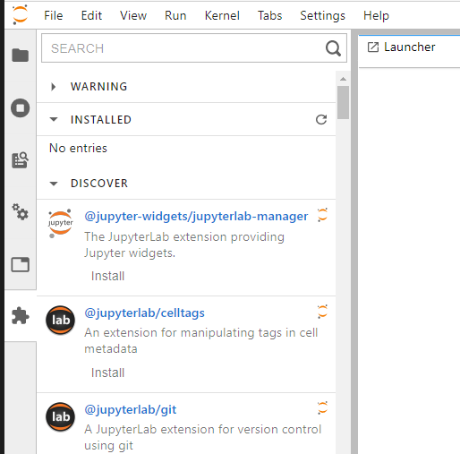
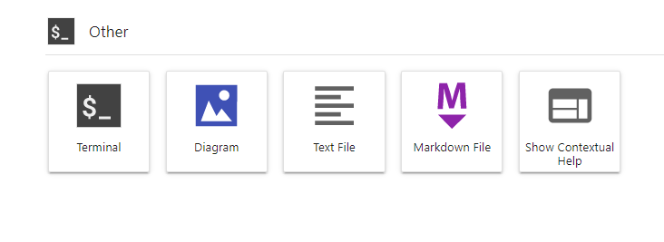

# How To Install JupyterLab Extensions (Globally for a JupyterHub Server)

The current JupyterHub version 2.5.1 does not allow user installed extension for JupyterLab when it is being served from JupyterHub. This should be remedied in version 3. However, even when this is "fixed" it is still useful to be able to install extensions globally for all users on a multi-user system. This is especially true if JupyterHub is serving JupyterLab to a controlled group of users. For example, a class of students, workshop attendees, or a work group that is trying to maintain a consistent development environment.

Here are the steps to add a JupyterLab extension for all users when JupyterLab is served from JupyterHub.

Find extensions. You can search on GitHub for "JupyterLab extensions". You can also use the "Extension panel" in the JupyterLab interface to find a link to an extension npm page. (After version 3 is released users should be able to install "personal" extensions from there. )



I'll be installing the drawio Diagraming extension ( [https://github.com/QuantStack/jupyterlab-drawio](https://github.com/QuantStack/jupyterlab-drawio) ) 

**Note: Installing extensions as root is a potential security risk for your server. Please be sure that you trust the extension source and author!** 

First sudo to a root shell (I'm using the terminal in JupyterLab),
```
(base) kinghorn@pslabs-ml1:~$ sudo -s
[sudo] password for kinghorn: 
root@pslabs-ml1:/home/kinghorn# 
```

Then activate the conda env for your JupyterHub/Lab (you may have to source conda.sh profile since root does not source that automatically) I have JupyterHun/Lab installed in the env "jupyterhub"
``` 
root@pslabs-ml1:/home/kinghorn# source /etc/profile.d/conda.sh 

root@pslabs-ml1:/home/kinghorn# conda activate jupyterhub
(jupyterhub) root@pslabs-ml1:/home/kinghorn# 
```
Now you can install the extension from the command-line,
```
(jupyterhub) root@pslabs-ml1:/home/kinghorn# jupyter labextension install jupyterlab-drawio
Building jupyterlab assets (build:prod:minimize)
```
Reload the browser page and the extension should be ready for use. It will be available for all JupyterHub users on the system.

There will now be an icon for drawio on the "Launcher" page "Other" section in JupyterLab. ...Ready for you flow-charting and diagraming pleasure!




