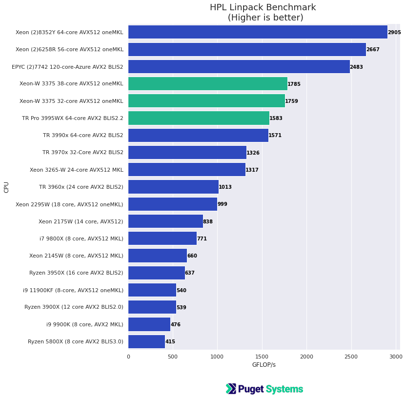
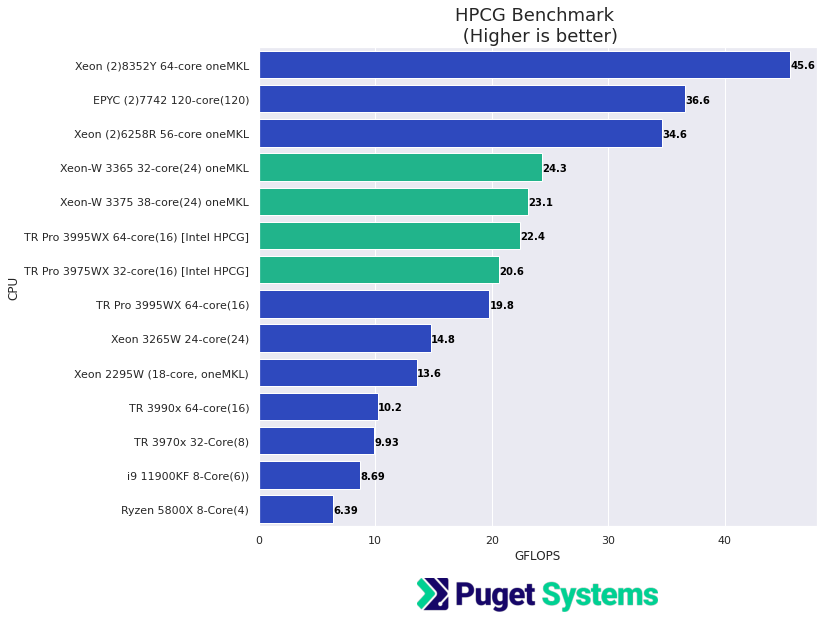
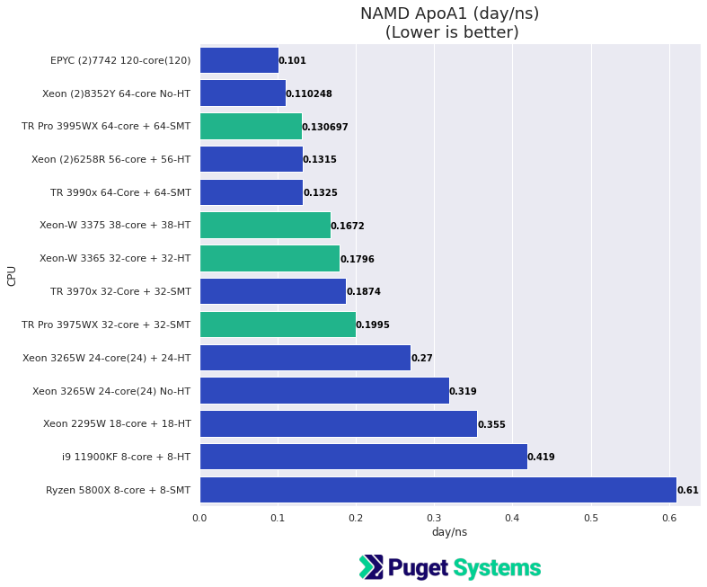
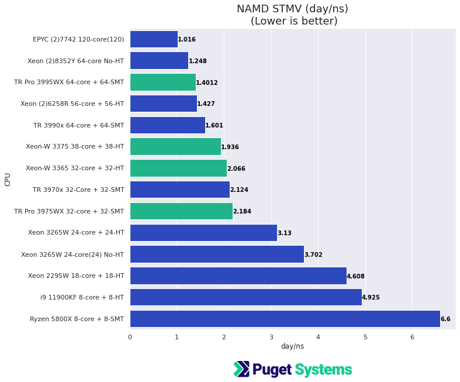

# Intel Ice Lake Xeon-W vs AMD TR Pro Compute Performance (HPL, HPCG, NAMD, Numpy)

## Introduction

The single socket version of Intel third generation Xeon SP is out, the Ice Lake Xeon W 33xx. This is a much better platform with faster large capacity 8 channel memory and PCIe v4 with plenty of lanes. The CPU itself is nicely improved and has new features like [Intel Deep Learning Boost (Intel® DL Boost) ](https://www.intel.com/content/www/us/en/artificial-intelligence/deep-learning-boost.html) (which I haven't tested).

The new Intel platform is very much like the AMD Threadripper Pro (single socket version of EPYC Rome) so this is the obvious comparison to make.

I want to point out that I did my testing on Linux and everything worked as expected and achieved excellent results for numerical compute workloads I tested. This is in contrast to my colleagues who tested desktop applications on Windows. They had trouble that seemed to be related to process/thread scheduling in Windows 10. Before finishing this post I did some quick testing with Python Numpy on Windows with the Xeon-W and didn't have any problems and got very good results under heavy load. This is just a warning that there could possible be some unresolved issues on Widows 10 right now.  

The tests in the results below examine performance from 4 perspectives,

- **HPL(Linpack)** The HPL benchmark is the primary performance measure used to rank the Top500 supercomputer list. It is heavily dependent on a good BLAS (Basic Linear Algebra Subprograms) library implementation.
- **HPCG** High Performance Conjugate Gradient is a more recent ranking benchmark used together with HPL on the Top500 list. HPCG is a good representation of workloads that are memory-bound.
- **NAMD** Molecular dynamics simulation is a very good "real-world" application. NAMD is a good representative of many highly parallel scientific applications.
- **Python Numpy** Numpy is the ubiquitous Python library for numerical Python. It is so widely used that the Numpy API is becoming a standard API interface included with most Python numerical computing frameworks i.e TensorFlow, PyTorch, PAX, etc.. On CPU it is very sensitive to BLAS library choice. Results are included for Xeon-W and TR Pro with Intel oneMKL and OpenBLAS.     

**Along with new testing on Ice Lake Xeon-W (and Numpy on TR Pro) there are also relevant results in the charts from previous testing for comparison. These results are referenced from the posts [AMD Threadripper Pro 3995x HPL HPCG NAMD Performance Testing (Preliminary)](https://www.pugetsystems.com/labs/hpc/AMD-Threadripper-Pro-3995x-HPL-HPCG-NAMD-Performance-Testing-Preliminary-2085/) and [Intel Rocket Lake Compute Performance Results HPL HPCG NAMD and Numpy](https://www.pugetsystems.com/labs/hpc/Intel-Rocket-Lake-Compute-Performance-Results-HPL-HPCG-NAMD-and-Numpy-2116/)**

## Test systems (new results)

**Intel Xeon-W Test Platform:**
- **CPU -** [Intel Xeon W-3375 38 Core ($4,499)](https://www.pugetsystems.com/parts/CPU/-Intel-Xeon-W-3375-2-5GHz-Thirty-Eight-Core-57MB-270W-14076)
- **CPU -** [Intel Xeon W-3375 32 Core ($3,699)](https://www.pugetsystems.com/parts/CPU/Intel-Xeon-W-3365-2-7GHz-Thirty-Two-Core-48MB-270W-14077)
- **Motherboard -** [Supermicro X12SPA-TF](https://www.pugetsystems.com/parts/Motherboard/Supermicro-X12SPA-TF-64L-14111)
- **Memory -** [8x DDR4-3200 16GB Reg. ECC (128GB total) ](http://www.pugetsystems.com/parts/Ram/Micron-DDR4-3200-16GB-ECC-Reg-MTA9ASF2G72PZ-3G2B1-13852)

**AMD Threadripper PRO Test Platform:**
- **CPU -** [AMD TR Pro 3995WX 64 Core ($5,489)](https://www.pugetsystems.com/parts/CPU/AMD-Ryzen-Threadripper-Pro-3995WX-2-7GHz-64-Core-280W-13974)
- **Motherboard -** [Asus Pro WS WRX80E-SAGE SE WIFI](http://www.asus.com/Motherboards-Components/Motherboards/All-series/Pro-WS-WRX80E-SAGE-SE-WIFI/)
- **Memory -** [8x DDR4-3200 16GB Reg. ECC (128GB total)](https://www.pugetsystems.com/parts/Ram/Micron-DDR4-3200-16GB-ECC-Reg-MTA9ASF2G72PZ-3G2B1-13852)

**Software:** (For the new results)
- Ubuntu 20.04.2
- Kernel 5.8
- gcc/g++ 9.3
- [AMD AOCC v 3.0 complier (clang)](https://developer.amd.com/amd-aocc/)
- [AMD BLIS library v 2-3.0 (HPL)](https://developer.amd.com/amd-aocl/)
- [Intel oneAPI oneMKL (HPL, HPCG)](https://software.intel.com/content/www/us/en/develop/tools/oneapi.html)
- HPL Linpack (Using pre-compiled binaries from AMD BLIS and Intel oneMKL at links above)
- [HPCG 3.1](https://www.hpcg-benchmark.org/) (AMD built from source with AOCC, and gcc was tested but, Intel oneMKL HPCG benchmark gave best result for both CPUs)
- [NAMD 2.14 (Molecular Dynamics)](https://www.ks.uiuc.edu/Research/namd/)
- [Numpy 20.1](https://numpy.org/) From Intel and Conda-Forge conda repositories (oneMKL and OpenBLAS)

## Results

So how do the Intel Ice Lake Xeon-W and AMD Threadripper Pro compare? The charts below will hopefully help answer that.

**Please note: the charts below contain new results AND older results. Reference links in [AMD Threadripper Pro 3995x HPL HPCG NAMD Performance Testing (Preliminary)](https://www.pugetsystems.com/labs/hpc/AMD-Threadripper-Pro-3995x-HPL-HPCG-NAMD-Performance-Testing-Preliminary-2085/) and [Intel Rocket Lake Compute Performance Results HPL HPCG NAMD and Numpy](https://www.pugetsystems.com/labs/hpc/Intel-Rocket-Lake-Compute-Performance-Results-HPL-HPCG-NAMD-and-Numpy-2116/)** 

**...Make comparative judgments with caution! (some older results were run with slightly older libraries and software versions. However, differences to updates should be minimal for these tests and all results should be relevant for general comparison.)**

## HPL

HPL Linpack is the standard measure of optimized raw floating point compute performance. It makes good heavy use of vector units (AVX) and BLAS libraries. 

- For the Intel Xeon systems the OpenMP threaded Linpack build from the current oneMKL library was used (older results used MKL 2020.1). Peak results for Xeon-W 3365 and 3375 were at problem size of 60000.

- For the AMD systems the optimized HPL binary build supplied with the AMD BLISv2-3 library was used (I have noticed very little performance difference between v2.x and 3.x versions). Best results were obtained with,
N = 114000 (number of simultaneous equations) [N=200000 on EPYC]
NB = 768  block size for level 3 BLAS (matrix) operations 

**Notes:**
- **Both of the 32 and 38 core Intel Ice Lake Xeon-W's out-performed even the 64-core TR Pro** 
- The 64-core Threadripper 3990x and Pro 3995WX performed nearly the same. this is expected for this benchmark since the "compute" core needed is very similar. 
- The Xeon's have a significant advantage from the AVX512 vector unit and the highly optimized MKL library (BLAS).

## HPCG
Memory performance bound!
Sparse 2nd order partial differential equation, multi-grid solver using Conjugate Gradient approximation.

This is a demanding benchmark that is limited by memory subsystem performance. It was designed as compliment to HPL to give a better overall indicator of HPC systems performance. 

**Notes:**
- **The Ice Lake Xeon's do very well on this benchmark because of the 8 memory channels available on this new design.**
- I made an effort to optimize the build for HPCG using AMD AOCC complier and libraries. However, Better results using gcc with --march=znver2 and even better results were obtained by using the Intel optimized HPCG benchmark on the AMD TR Pro systems!
- The TR Pro 3995WX does significantly better than the TR 3990x in this text because the Pro has 8 memory channels vs 4 on the non-Pro
- The dual EPYC system is much like having 2 of the TR Pro 3995WX. It has a total of 16 memory channels.
- The dual Xeon Ice Lake 8352Y and 6258R have a total of 16 and 12 memory channels total which has a significant impact on the performance.  

## NAMD

NAMD is a widely used Molecular Dynamics program with excellent parallel scalability, and **low dependence on specially optimized hardware libraries (like MKL)**. It makes a very good "real-world" parallel performance benchmark for both CPU and GPU. 

The test jobs are;
- ApoA1   (Apolipoprotein A1) ~ 92000 atoms
- STMV  (Satellite Tobacco Mosaic Virus)  ~ 1 million atoms

NAMD has very good GPU acceleration and in practice you would likely want ot include GPU acceleration. Version 2.x of NAMD requires good balance between CPU capability and GPUs. The upcoming version 3 should run "resident" on the GPU!. I expect very good results with version 3 on GPU and am eager to test.

## NAMD ApoA1

**Notes:**
- For this job run the number of compute cores available is the main limiting factor. NAMD scales very well on CPU. 
- This code when running on CPU only actually does significantly better when Hyper Threading or SMT are utilized. I say "actually" because for many highly parallel application this is not the case. When GPU acceleration is included HT or SMT slow things down. 

## NAMD STMV

**Notes:**
-  STMV is a much larger problem and memory performance starts to make more of a difference.
- Both the Intel Xeon's and AMD CPU do well and either offers a good platform for NAMD especially when NVIDIA GPUs are included.

## Numpy Linear Algebra

Python Numpy is central to much of the work being done in machine learning and scientific computing with Python. It is used internally by many packages and the API is being adopted/included as a standard interface for parts of ML frameworks like TensorFlow, PyTorch, JAX, and there are implementations like NVIDIA cupy that run with GPU acceleration including the frameworks mentioned earlier. (I will be doing comparative testing of Numpy API implementation soon.) 

The underlying BLAS library linked with Numpy is important for performance. The data-science ML focused Anaconda Python distribution by default links its numpy build with Intel MKL. The default library link from the main conda-forge build is linked with OpenBLAS. OpenBLAS has provided good performance on AMD CPU's in the past. Recent releases of Intel MKL (oneMKL) now include a properly optimized code path for AMD CPU's (have a look at a post I wrote in November of 2019 for "how things used to be",
[How To Use MKL with AMD Ryzen and Threadripper CPU's (Effectively) for Python Numpy (And Other Applications) ](https://www.pugetsystems.com/labs/hpc/How-To-Use-MKL-with-AMD-Ryzen-and-Threadripper-CPU-s-Effectively-for-Python-Numpy-And-Other-Applications-1637/))  

I've included a few Numpy linear algebra operation benchmarks comparing the Xeon-W 3375 38-core and the 64-core TR Pro 399WX. I used numpy envs from 3 base builds,Anaconda default MKL linked, Conda-Forge OpenBLAS linked, Intel Python MKL linked

**Take note of the version numbers in the table!** Numpy 1.19 with MKL 2020.2 is used for TR Pro in the Anaconda build to show what performance was like with older MKL. The Intel build of numpy is essentially the same as the Anaconda build and you can see the effect of the more optimal code path for AMD with the new MKL. 

**Also, note that things have changed since I ran those jobs! Of course. The latest Anaconda and Conda-Forge Numpy builds are at version 21.1**

<table class="blogtable">
<thead>
<tr><th>CPU</th><th>Numpy Version</th><th>Matmul (GFLOPS) </th><th>F-Norm (GFLOPS)</th><th>Cholesky (GFLOPS)</th></tr>
</thead>
<tbody>
<tr><td>Xeon-W 3375  </td><td> Anaconda   numpy-1.20.3 mkl-2021.3.0   </td><td> 2271 </td><td> 2251 </td><td> 902 </td></tr>
<tr><td>TR Pro 3995WX</td><td> Anaconda numpy-1.19.2 mkl-2020.2    </td><td>  501 </td><td>  484 </td><td> 401 </td></tr>

<tr><td>Xeon-W 3375  </td><td> Conda-Forge numpy-1.20.3  openblas-0.3.17</td><td>  348 </td><td>  346 </td><td> 235 </td></tr>
<tr><td>TR Pro 3995WX</td><td> Conda-Forge  numpy-1.20.3  openblas-0.3.17</td><td> 1421 </td><td> 1415 </td><td> 522 </td></tr>

<tr><td>Xeon-W 3375  </td><td> Intel numpy-1.20.3  mkl-2021.3.0-intel       </td><td> 2267 </td><td> 2247 </td><td> 893 </td></tr>
<tr><td>TR Pro 3995WX</td><td> Intel  numpy-1.20.3  mkl-2021.3.0-intel      </td><td> 1467 </td><td> 1459 </td><td> 933 </td></tr>

</tbody>

**Notes:**
- The 38-core Intel Xeon-W 3375 does very well with numpy linked to MKL as expected. It out-performs the 64-core TR Pro 3995WX significantly.
- The OpenBLAS build performed very badly with Intel! (I don't know why)
- The new Intel build is as good as the openBLAS build for the TR Pro thanks to the better code path for AMD in the recent MKL versions. 

## Conclusions

The Intel Ice Lake Xeon-W is great CPU. I already knew this from testing I did several months ago with the multi-socket Ice Lake Xeon-SP. For compute intensive workloads that are optimized for Intel this new Xeon-W is outstanding. Most of the testing in this post shows both the 32 and 38 core Ice Lake CPU's doing better than even the 64-core TR Pro. The testing I did in this post definitely favors Intel because with the exception of NAMD these tests had highly optimized builds for Intel. 

If you are working with applications optimized for Intel (with MKL) then the new Ice Lake Xeon is an obvious choice. Intel's oneAPI developer tools are excellent so, overall, this Ice Lake Xeon platform and ecosystem is easy to recommend. However, if you are not working in the Intel ecosystem then the AMD TR Pro is also an outstanding CPU and platform! I wouldn't hesitate to recommend either of these. 

I really like both of these platforms! They are very similar as far as the overall platform capability is concerned. If you are using Intel tools and Intel optimized applications then go with Intel. Otherwise it's a toss-up in my opinion. I think they are both great.

**Happy Computing --dbk @dbkinghorn**