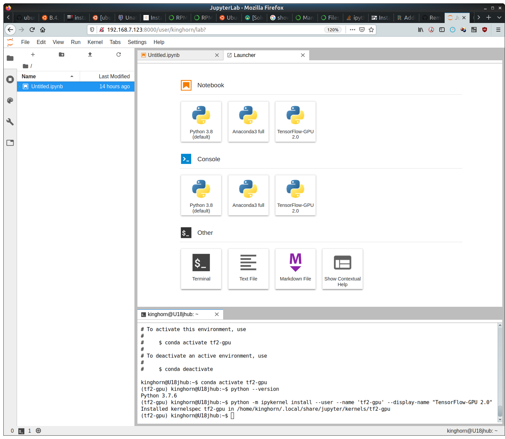

# How To Install JupyterHub on a Local Server

Jupyter notebooks (and Jupyterlab) are wonderful web browser based workspaces. They are a mainstay for Machine-Learning and Data-Science development work. They can be launched from a personal workstation or laptop that has a Python setup with Jupyter installed. You will also find Jupyter notebooks running from a JupyterHub instance on cloud resources for remote access.

The middle ground between a personal workstation and cloud is to run Jupyter notebooks from a local ("on-prem") server with JupyterHub. This allows a dedicated Linux server (or cluster) to provide a convenient easy to use computing resource for an individual or group of users. This post looks at installing JupyterHub and JupyterLab on a single "bare-metal" server.  

**This JupyterHub setup inspired by ["Install JupyterHub and JupyterLab from the ground up"](https://jupyterhub.readthedocs.io/en/stable/installation-guide-hard.html)**

## Base Server OS and software

This install testing configuration is using the following,

- Base Ubuntu Server 18.04.4 
- NVIDIA driver 435 (from graphics-drivers ppa)
- extra packages:(apt install) build-essentials, openssh, emacs-nox, dkms, curl, python3-venv
- JupyterHub version 1.1.0

While writing this post I tested the JupyterHub setup on a virtual machine and a (single node) multi-GPU server with multiple user accounts.

## Setup Plan

- JupyterHub installed with system Python in venv (virtual environment)
- Setup for LAN access i.e. no external public ip configuration, firewall or SSL certificates 
- conda installed globally from repo (to allow updating along with system updates)
- System-wide shared; conda, Python3 (miniconda3), and full Anaconda3 package distribution, for all users
- Users will be able to create their own private conda env's on the server that will run from JupyterHub
- JupyterHub authentication from local system login (PAM)

## Install JupyterHub

Create a system python venv for JupyterHub
```
sudo python3 -m venv /opt/jupyterhub
```

pip install using the python3 from the venv (important!),
```
sudo /opt/jupyterhub/bin/python3 -m pip install wheel 
sudo /opt/jupyterhub/bin/python3 -m pip install jupyterhub jupyterlab ipywidgets
```

Install nodejs for the http-proxy
```
sudo apt install nodejs npm
sudo npm install -g configurable-http-proxy
```

## JupyterHub Configuration
Create directory for jupyterhub config file and cd into it,
```
sudo mkdir -p /opt/jupyterhub/etc/jupyterhub/
cd /opt/jupyterhub/etc/jupyterhub/
```

Generate a config file,
```
sudo /opt/jupyterhub/bin/jupyterhub --generate-config
```

The generated jupyterhub_config.py file is nearly 1000 lines of commented configuration options. We will only change 1 line at this point, setting the default "spawner" to launch JupyterLab from the http-proxy URL. `grep -n c.Spawner.default jupyterhub_config.py` will show the line number that needs to be changed, 668 in my case.

Edit jupyterhub_config.py,
```
c.Spawner.default_url = '/lab'
```

Create a systemd "Unit" file for starting jupyterhub,
```
sudo mkdir -p /opt/jupyterhub/etc/systemd
```

edit
```
/opt/jupyterhub/etc/systemd/jupyterhub.service
```

to contain,
```
[Unit]
Description=JupyterHub
After=syslog.target network.target

[Service]
User=root
Environment="PATH=/bin:/usr/local/sbin:/usr/local/bin:/usr/sbin:/usr/bin:/opt/jupyterhub/bin"
ExecStart=/opt/jupyterhub/bin/jupyterhub -f /opt/jupyterhub/etc/jupyterhub/jupyterhub_config.py

[Install]
WantedBy=multi-user.target
```

Now link that file to the directory with the system's systemd Unit files,
```
sudo ln -s /opt/jupyterhub/etc/systemd/jupyterhub.service /etc/systemd/system/jupyterhub.service
```

Start jupyterhub, enable it as a service, and check that it is running,
```
sudo systemctl start jupyterhub.service 
sudo systemctl enable jupyterhub.service

sudo systemctl status jupyterhub.service
```
You should now have a jupyterhub server running on port 8000 listening on all interfaces on the system. Check the ip address for the server with,
```
ip address
```

then on your LAN from a separate system with a web browser, enter that address and port 8000. In my case it was,
``` 
192.168.7.123:8000
```

You should see the JupyterHub login page. Any user with an account on the system should be able to login with their username and password. 

At this point the only notebook kernel available will be the system Python3 that we installed JupyterHub with. We will replace that later with a more appropriate default from the Anaconda Python distribution. Lets do that ...

## Install conda (globally)

There is an officially maintained conda repository (both deb and rpm). Using that repo instead of installing miniconda3 or anaconda3 from the shell installer will allow conda to be kept up to date by normal system updates. 

**Note:** the conda install is essentially the same as installing "miniconda3" i.e. it installs conda and a base Python3 from Anaconda Python.

Add the public key for the repo,
```
curl -L https://repo.anaconda.com/pkgs/misc/gpgkeys/anaconda.asc | sudo apt-key add -
```

Then add the repo to /etc/apt/sources.list.d
```
echo "deb [arch=amd64] https://repo.anaconda.com/pkgs/misc/debrepo/conda stable main" | sudo tee  /etc/apt/sources.list.d/conda.list 
```

Install conda
```
sudo apt update
sudo apt install conda
```

conda installs into /opt/conda. In order to add it to users PATH we can link the provided environment script into the system profile.d directory.
```
sudo ln -s /opt/conda/etc/profile.d/conda.sh /etc/profile.d/conda.sh
```

User logins will now automatically source this profile to initialize conda.

## Create default conda envs for JupyterHub

Lets add an env for a default Python 3 based from the Anaconda distribution.

This will be a system global env for JupyterHub. 

**Note:** that we will need to be root i.e. use sudo, and root does not have conda on its PATH. We will need to use full paths to executables for the install. 

Create a directory for the global envs
```
sudo mkdir /opt/conda/envs/
```

Create a default Anaconda Python 3.8 env including ipykernel to make a kernel spec..
```
sudo /opt/conda/bin/conda create --prefix /opt/conda/envs/python3 python=3.8 ipykernel
```

Now using that python, create a kernel for use from jupyterhub,
```
sudo /opt/conda/envs/python3/bin/python -m ipykernel install --prefix=/opt/jupyterhub/ --name 'python3' --display-name "Python 3.8 (default)"
```

Starting JupyterLab from a JupyterHub login will now have this env available (for all users).

You might want to repeat the above steps to create a default Python 3.7 since 3.8 may break some current programs. (you could also add a python 2, but please don't do that!)

Let's do another global env for the full Anaconda3 package collection.

```
sudo /opt/conda/bin/conda create --prefix /opt/conda/envs/anaconda3 anaconda ipykernel
```

Add the kernel spec for use as another global default in JupyterHub,
```
sudo /opt/conda/envs/anaconda3/bin/python -m ipykernel install --prefix=/opt/jupyterhub/ --name 'anaconda3' --display-name "Anaconda3 full"
```

## KernelSpec list managment 
The section above showed how to create new kernel specs. The commands below are useful for removing a kernel spec,
```
/opt/jupyterhub/bin/jupyter kernelspec list

/opt/jupyterhub/bin/jupyter kernelspec remove <kernel_name>
```

**Note:** A kernel with kernelspec name of "python3" must exist. If it doesn't then JupyterHub adds one from its install evn that you may not want (in our case that was the system python3). To over-ride that automatic kernel spec you need to create a new one from an env that you do want to be available to users... and name it "python3"! (it could be any env that you want as a default.) That is why I named the env for the Anaconda python version 3.8 env "python3".

## User added envs and kernel specs
The individual users of your JupyterHub server can create their own private (only listed in their account) envs in the usual way. For example, I'll create a TensorFlow-GPU v2 env and jupyter kernel.

Here is a session from a terminal opened in JupyterLab running on the JupyterHub,
``` 
kinghorn@U18jhub:~$ conda create --name tf2-gpu tensorflow-gpu python=3.7 ipykernel
...
...
kinghorn@U18jhub:~$ conda activate tf2-gpu

(tf2-gpu) kinghorn@U18jhub:~$ python -m ipykernel install --user --name 'tf2-gpu' --display-name "TensorFlow-GPU 2.0"
Installed kernelspec tf2-gpu in /home/kinghorn/.local/share/jupyter/kernels/tf2-gpu
```
Notice that the kernel spec was installed in the proper location in my home directory.

My login session to JupyterHub now looks like,


## Conclusion

This JupyterHub setup, together with GitHub for managing project sources, gives a nice working environment that can be used from any computer with a web browser that can access the server. The JupyterHub server could be in a server-room, at-the-office over VPN, or sitting next to you. It could even be setup on your own workstation. This is server provides a Linux resource that can be accessed from a Windows PC/Laptop, a MacBook, or another Linux system. You can even connect from your cellphone! Since we have used JupyterLab as the interface there is a terminal shell available in your browser too. 

You could use this JupyterHub server as a personal compute device or have it as a shared resource with several colleagues, or use it for a class or tutorial. There are a wide array of use cases. The hardware can be a simple system or a high-end multi-GPU server. It can also be extended to clustered computing resources with a little more configuration work. It could also be installed on cloud resources. 

Many many possibilities! Enjoy!

**Happy computing!  --dbk @dbkinghorn**
