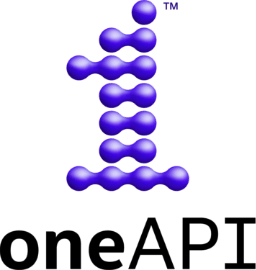
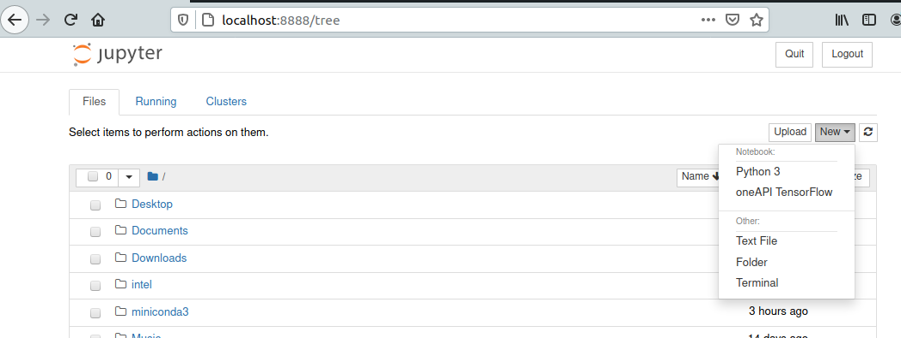
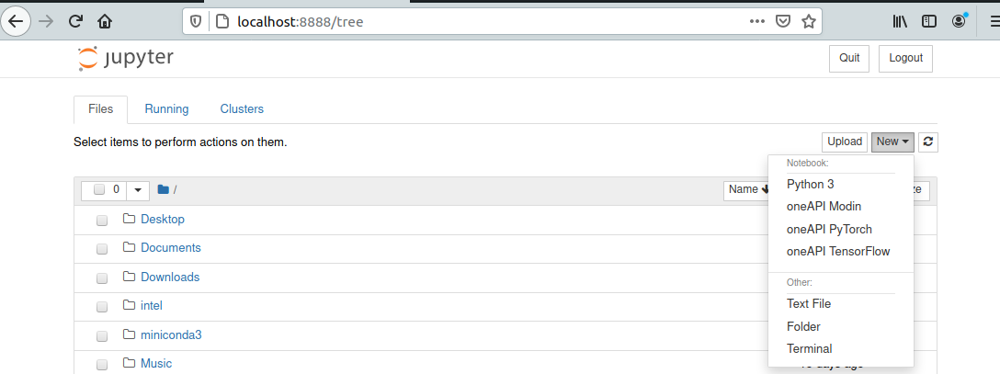

# How to Install Intel oneAPI AI Analytics Toolkit with conda



## Introduction

I recently wrote a post introducing Intel oneAPI that included a simple installation guide of the Base Toolkit.

[Intel oneAPI Developer Tools -- Introduction and Install](https://www.pugetsystems.com/labs/hpc/Intel-oneAPI-Developer-Tools----Introduction-and-Install-2054/)

In that post I had deliberately excluded the "Intel Distribution for Python" from the Base Toolkit install for two reasons.

- Intel Python in the Base Toolkit includes "conda" on its path when you source "setvars.sh for the oneAPI environment. This would interfere with any Anaconda or Miniconda install that you may have already done (recommended!).  
- The second reason was that I was going to write this post! Installing Intel Python along with the packages from the oneAPI AI Toolkit in conda envs lets you use them along with your Anaconda/Miniconda install. This is much cleaner and a better workflow in my opinion. (You may have other preferences.)

Note:the Data Analytics, and Deep Neural Network libraries found in the oneAPI Base Toolkit are also used to accelerate the AI Analytics toolkit along with Intel Python.

**What about GPUs?**
This is really about Intel hardware. At this point oneAPI is primarily for (Intel) CPUs. There is some support Intel GPUs, but unsurprisingly, no support for NVIDIA hardware. I look at oneAPI as the future ecosystem for Intel's inevitable accelerator components. There are many hours of a data-scientists or machine learning practitioners time that are spent with tasks like data prep, big memory requirements/problems etc.. Good CPU performance and optimized software could be a big plus.  

## What is the oneAPI AI Analytics Toolkit


Here are the components of the [oneAPI AI Analytics Toolkit](https://software.intel.com/content/www/us/en/develop/tools/oneapi/ai-analytics-toolkit.html), 

- [Intel Distribution for Python](https://software.intel.com/content/www/us/en/develop/tools/oneapi/components/distribution-for-python.html): Intel's Python build. This contains a lot of standard numerical python packages. Including things like numpy, scipy, etc.. It's a very good/useful base python distribution. 
- [Intel Optimization for TensorFlow](https://software.intel.com/content/www/us/en/develop/articles/intel-optimization-for-tensorflow-installation-guide.html): Intel's optimized build of TensorFlow
- [Intel Optimization for PyTorch](https://software.intel.com/content/www/us/en/develop/articles/getting-started-with-intel-optimization-of-pytorch.html): Intel's optimized build of PyTorch
- [Intel Distribution of Modin](https://modin.readthedocs.io/en/latest/using_modin.html): Intel's optimized build of Modin (a fast parallel alternative to Pandas and Dask)
- [Model Zoo for Intel Architecture](https://github.com/IntelAI/models): GitHub repository of pretrained models optimized for running on Intel architecture.
- [Intel Low Precision Optimization Tool](https://www.intel.com/content/www/us/en/artificial-intelligence/posts/intel-low-precision-optimization-tool.html): This is a python library to to assist with deploying fast low-precision models for inference. It takes advantage of Intel **DL Boost and Vector Neural Network Instructions (VNNI)** that are part of second generation Xeon Scalable using AVX512. (These features are even included in the upcoming ["Rocket Lake" desktop processor](https://newsroom.intel.com/news/intels-11th-gen-processor-rocket-lake-s-architecture-detailed/).)  

**The Python conda package bundles for the components listed above are,**

- [intel-aikit-tensorflow](https://anaconda.org/intel/intel-aikit-tensorflow)
- [intel-aikit-pytorch](https://anaconda.org/intel/intel-aikit-pytorch)
- [intel-aikit-modin](https://anaconda.org/intel/intel-aikit-modin)

>There are over 300 packages in the **[Intel channel on Anaconda Cloud](https://anaconda.org/intel/repo)**. Many of those packages are supplying python bindings for components of oneAPI. I expect there to be good python support for future Intel hardware accelerators. 

## Setting up the Intel oneAPI AI Toolkits with conda

**Prerequisites:**
- Well, these toolkits are optimized for Intel hardware, so yes, that's pretty much a requirement. I would also say "recent" Intel hardware with AVX512, DL Boost and VNNI, will likely perform the best. That means 2nd generation Xeon Scalable and Xeon W (maybe "Rocket Lake" too?).
- I am also, assuming that you have either a [full Anaconda Python](https://www.anaconda.com/products/individual) or [Miniconda](https://docs.conda.io/en/latest/miniconda.html) install on your systems and that you are familiar with conda usage.

I am using conda from Miniconda3 for the "env" setups (on Ubuntu 20.04).

---

**Quick Miniconda on Linux install:**
Miniconda provides conda and a base python. I prefer this to the full Anaconda setup since it's easy to create a dedicated "env" for projects with the specific packages and versions needed for what you are working on.  

It's simple to install Miniconda,

1) Download the installer from the [linux-installers page](https://docs.conda.io/en/latest/miniconda.html#linux-installers). (it's 90MB)
2) Check the SHA256 hash
```
 sha256sum Miniconda3-latest-Linux-x86_64.sh
```
3) Do the install (the installed Miniconda is just 343MB)
```
bash Miniconda3-latest-Linux-x86_64.sh
```
I say yes to "run conda init" which will add some path info to your .bashrc file. 

4) Exit and reopen your terminal
5) My preference is to not have the "base" env activated by default and just activate specific envs when needed. 
```
conda config --set auto_activate_base false
```
6) Read the [conda docs](https://docs.conda.io/projects/conda/en/latest/user-guide/index.html) if you are not familiar with it! 
---

Intel does have a concise guide for installing with conda, [Installing the Intel® AI Analytics Toolkit (AI Kit) with Anaconda](https://software.intel.com/content/www/us/en/develop/articles/installing-ai-kit-with-conda.html). I will mostly follow that but augment it with how I do a more complete setup.

## oneAPI TensorFlow AI Toolkit

This is the Intel python based, optimized, TensorFlow environment. Everything is built with Intel hardware optimizations and performance libraries.

I'm curious to try this myself. I can't always use NVIDIA GPU acceleration because of memory constraints or needing good double precision performance. (when I don't have access to something like A100 and have to use RTX GPU's). I sometimes, use machine learning frameworks for things other than ML/AI. I'm working on a quantum mechanics project right now where I need double-complex i.e. complex128 data types ... maybe not the best case for GPU.

**Create a conda env and install intel-aikit-tensorflow:**

```
conda create --name tf-oneapi -c intel intel-aikit-tensorflow
```
That will create the conda env and install packages and dependencies with Intel-Python as the python distribution using the Intel channel on Anaconda cloud. (you can name it anything you like)

**Activate the env:**
```
conda activate tf-oneapi
```
Here are a few of the more interesting packages that go into that env.
```
conda list
```
(truncated)
```
(tf-oneapi) kinghorn@ubase:~$ conda list
# packages in environment at /home/kinghorn/miniconda3/envs/tf-oneapi:
#
# Name                    Version                   Build  Channel

common_cmplr_lib_rt       2021.1.2              intel_266    intel
common_cmplr_lic_rt       2021.1.2              intel_266    intel
cryptography              2.9.2            py37h3ca606c_1    intel
daal4py                   2021.1           py37hdeddd62_3    intel
dal                       2021.1.1               intel_79    intel
dpcpp_cpp_rt              2021.1.2              intel_266    intel
fortran_rt                2021.1.2              intel_266    intel
icc_rt                    2021.1.2              intel_266    intel
impi-devel                2021.1.1               intel_76    intel
impi_rt                   2021.1.1               intel_76    intel
intel-aikit-tensorflow    2021.1.1                      0    intel
intel-openmp              2021.1.2              intel_266    intel
intelpython               2021.1.1                      1    intel
keras-preprocessing       1.1.2              pyhd3eb1b0_0  
libgcc-ng                 9.3.0              hdf63c60_101    intel
libstdcxx-ng              9.3.0              hdf63c60_101    intel
mkl                       2021.1.1               intel_52    intel
mkl-service               2.3.0            py37hfc5565f_6    intel
mkl_fft                   1.2.0            py37hb9c2cde_4    intel
mkl_random                1.2.0            py37h90a4e38_4    intel
mkl_umath                 0.1.0            py37hb46b53c_0    intel
numpy                     1.19.2           py37h02626c5_0    intel
numpy-base                1.19.2           py37h591eb60_0    intel
opencl_rt                 2021.1.2              intel_266    intel
openssl                   1.1.1h               h14c3975_0    intel
python                    3.7.9                h7af079d_1    intel
scikit-learn              0.23.2           py37h2ea0651_5    intel
scipy                     1.5.2            py37h83b3cbf_0    intel
tbb                       2021.1.1              intel_119    intel
tbb4py                    2021.1.1         py37_intel_119    intel
tensorboard               2.2.1              pyh532a8cf_0  
tensorboard-plugin-wit    1.6.0                      py_0  
tensorflow                2.2.0                    py37_2    intel
tensorflow-base           2.2.0                         0    intel
tensorflow-estimator      2.2.0              pyh208ff02_0  
```

**Install Jupyter**
You may want to try things out in a Jupyter notebook. If so you'll need to add that to the env, (assuming the env is still activated)
```
conda install jupyter ipykernel
```
Add a kernelspec for the env,
```
python -m ipykernel install --user --name tf-oneapi --display-name "oneAPI TensorFlow"
```
You can now start Jupyter and open a new notebook using oneAPI TensorFlow env,
```
jupyter notebook
```


## oneAPI PyTorch AI Toolkit

As with the TensorFlow Toolkit, the PyTorch toolkit is using the same base Intel python and it is optimized for Intel hardware.

PyTorch is a great machine learning framework with a feel very much like numpy. It is easy to use and makes a very good general scientific computing framework in addition to it's excellent ML/AI usage.

I will keep this setup section short since it is mostly the same procedure as the TensorFlow setup.

**Create a conda env and install intel-aikit-pytorch:**

```
conda create --name th-oneapi -c intel intel-aikit-pytorch
```
I used "th" in the name since that is the common "import as" short name for PyTorch.

**Activate the env:**
```
conda activate th-oneapi
```

**Install Jupyter and add a kernelspec**
(assuming the env is still activated)
```
conda install jupyter ipykernel
```
Add a kernelspec for the env,
```
python -m ipykernel install --user --name th-oneapi --display-name "oneAPI PyTorch"
```
Now you will have this env available in a jupyter notebook.

## oneAPI Modin AI Toolkit

The modin toolkit is geared more toward data analytics. Modin is significantly faster and compatible replacement for pandas. The toolkit also features tuned scikit-learn and XGBoost. XGBoost is a high performance [gradient boosting](https://en.wikipedia.org/wiki/Gradient_boosting) library that can handle huge datasets for regression and classification problems. It also appears to contain many applications for image analysis and manipulation.  

**Create a conda env and install intel-aikit-modin:**
```
conda create --name modin-oneapi intel-aikit-modin -c intel -c conda-forge
```
Note that you need to include the conda-forge channel in addition to the intel channel.

**Activate the env:**
```
conda activate modin-oneapi
```

**Install Jupyter and add a kernelspec**
(assuming the env is still activated)
```
conda install jupyter ipykernel
!!!FAIL!!!
```
I was not able to install jupyter and ipykernel with conda in this env! It was **unable to resolve the environment dependencies. Hopefully Intel will fix this soon**. However it is not critical so I will present a workaround for using this env with Jupyter 
## !Workaround for jupyter in intel-aikit-modin env!

The workaround consists of installing jupyter and ipykernl in the "Base" env and then starting jupyter notebooks from there. Note: if you are using a full Anaconda install instead of Miniconda then you wont need to do the jupyter and ipykernel install because they should already be in that "Base" env.

I don't personally like this workaround because I prefer to isolate "all" the packages I need for a project in envs and keep Miniconda "mini". Some people prefer to launch jupyter notebooks from "Base", so, you all will be happy.

**If you are using miniconda ...**
First deactivate your current env if it is not "Base", then,
```
conda activate base
```
Then install into base,
```
conda install jupyter ipykernel
```

**Add a kernelspec for the env,**
Do this if you are using Miniconda + the packages installed above, OR, if you are using full Anaconda for "Base".

```
python -m ipykernel install --user --name modin-oneapi --display-name "oneAPI Modin"
```

That will add the jupyter kernelspec along with the other kernelspecs you have already install. And, it will point to the correct "modin-oneapi" env. Just remember to start jupyter notebooks for it from "Base" i.e.
```
conda activate base
jupyter notebook
```

Another addition to the "New" menu for your jupyter notebook.




The last thing I'll mention here is the [Intel Model Zoo](https://github.com/IntelAI/models) on GitHub. Refer to [this page](https://software.intel.com/content/www/us/en/develop/articles/installing-ai-kit-with-conda.html) for information on how to get the repository and which version to checkout. (I'm sure that will change over time.) 

## Conclusion

Intel oneAPI is an ambitious project and the AI Analytics Toolkit components that we setup in this post will be important for Intel's future. These toolkits will surely support future Intel specialized acceleration hardware. 

This is just one of several toolkits from the oneAPI project. (see my post [Intel oneAPI Developer Tools -- Introduction and Install](https://www.pugetsystems.com/labs/hpc/Intel-oneAPI-Developer-Tools----Introduction-and-Install-2054/)) I'm looking forward to trying things out. Expect to see benchmarks soon!