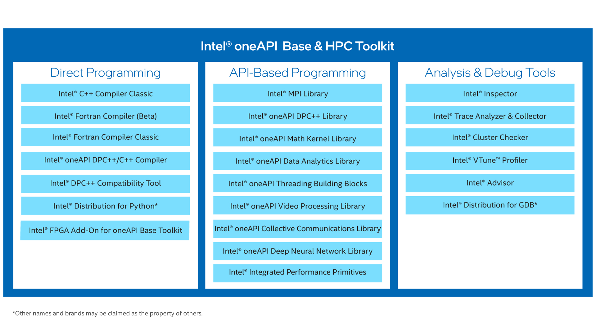
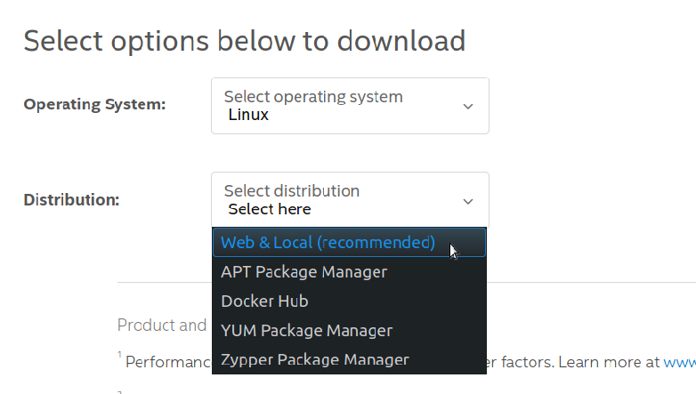
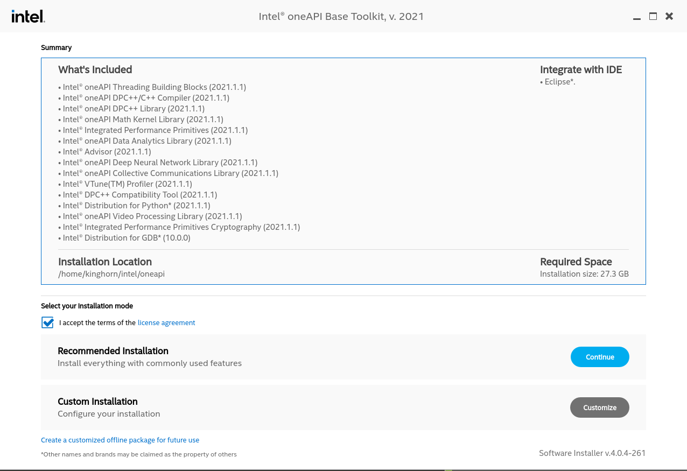
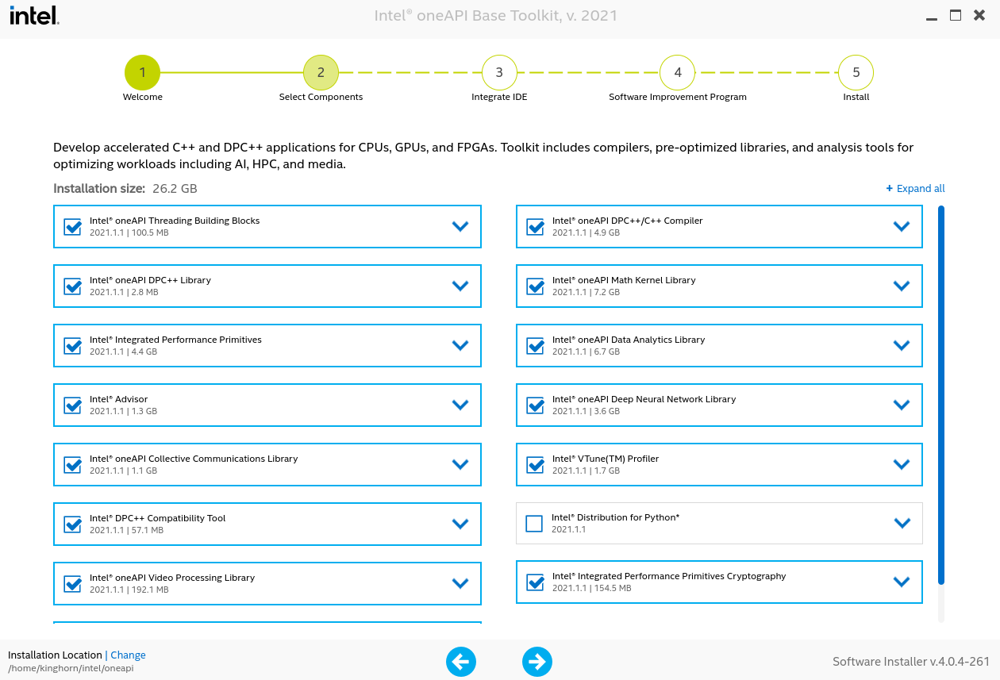
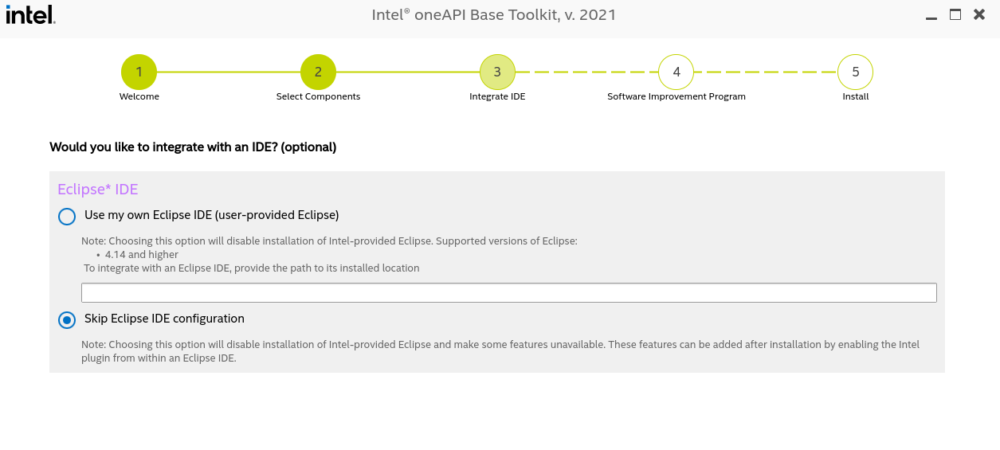
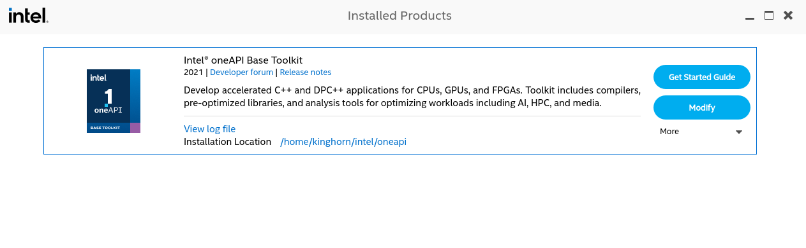
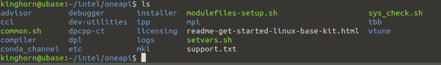

# Intel oneAPI Developer Tools -- Introduction and Install


## Introduction
Intel oneAPI is a massive collection of very high quality developer tools, and, it's free to use! OneAPI is Intel's new developer ecosystem. This is something that Intel has been working on for a few years and it went "gold" with release 1.0 at the end of 2020. I've been interested in this since having a conversation with some of the project developers a couple of years ago at the SuperComputing conference SC18 ... I really miss having face-to-face conversations at conferences! ... I remember thinking at the time, "this a seriously ambitious project", and indeed it is! 

If you have any interest in the future of Intel then you should be at least familiar with what oneAPI is. It will be an integral component of where they are headed.

In this post I'll give you a little background on what oneAPI is and my recommendations for doing an install setup to get started exploring the collection of tool-kits.

Note: I will be doing a separate post about setting up an environment for the oneAPI Machine Learning/AI/Data Science tools 

## What is Intel oneAPI

**Ambitious:**
To get an idea of what I meant by "ambitious" in the introduction, I'll quote the description from the initiative and specification site [https://www.oneapi.com/](https://www.oneapi.com/).  

> **oneAPI** is a cross-industry, open, standards-based unified programming model that delivers a common developer experience across accelerator architectures—for faster application performance, more productivity, and greater innovation. The oneAPI industry initiative encourages collaboration on the oneAPI specification and compatible oneAPI implementations across the ecosystem.

The [https://www.oneapi.com/](https://www.oneapi.com/) site is a good place to find concise documentation on many of the oneAPI components and get a feel for the "Big Picture" of the project and how it relates to the development community. This site is more about specifications and reference documentation than marketing, I recommend checking it out.

**Intel's Developer Ecosystem:**
oneAPI is Intel's developer ecosystem, and, it's about time they did this! A decade ago NVIDIA created a developer ecosystem around CUDA and pursued it relentlessly. It has been critical for their success with GPU's as compute accelerators. They have also, released free of charge the full platform compilers and tools from PGI (that they acquired a few years ago).  They have set a high standard for how things should be done in my opinion. oneAPI is the center point of Intel's creation of a proper developer ecosystem. It will take time an effort to bring all aspects of that together in a useful and cohesive way and they are working diligently on that. 

Intel has had great developer tools for many many years. Their compilers and libraries for their architecture are excellent and highly optimized. Their profiling and analysis program's are very good.  However, they have been mostly "locked away" with the commercial product bundles with "Intel Parallel Studio". **Now with oneAPI we have all of these wonderful compilers and tools available free of charge! What was formerly "Intel Parallel Studio XE" is now [Priority Support for Intel® oneAPI Base & HPC Toolkit](https://software.intel.com/content/www/us/en/develop/tools/oneapi/commercial-base-hpc.html).** There is a lot more to oneAPI than this, and it is all freely available now. 

Many of the tools listed in the graphic below were once only available with a paid license. There is some great stuff here and that is not all of it!



**Open Source:**
Many of the tools in oneAPI are open source and available on GitHub. (The formerly commercial products are still proprietary but freely available.) Here is a list of some of the GitHub repositories, 

- [oneAPI Data Parallel C++ (DPC++)](https://github.com/intel/llvm)
- [oneAPI Data Parallel C++ Library (oneDPL)](https://github.com/oneapi-src/oneDPL)
- [oneAPI Math Kernel Library (oneMKL)](https://github.com/oneapi-src/oneMKL)
- [oneAPI Collective Communications Library (oneCCL)](https://github.com/oneapi-src/oneCCL)
- [oneAPI Threading Building Blocks (oneTBB)](https://github.com/oneapi-src/oneTBB)
- [oneAPI Data Analytics Library (oneDAL)](https://github.com/oneapi-src/oneDAL)
- [oneAPI Deep Neural Network Library (oneDNN)](https://github.com/oneapi-src/oneDNN)
- [oneAPI Level Zero (LevelZero) (low-level hardware runtime API's)](https://github.com/oneapi-src/level-zero)
- [oneAPI Video Processing Library (oneVPL)](https://github.com/oneapi-src/onevpl)

**A Selection of Toolkits:**

I have mentioned the oneAPI Base and HPC Toolkits and will look at the AI Analytics Toolkit components in a separate post. Here is a list of the toolkit collection,  
- [Intel® oneAPI Base Toolkit](https://software.intel.com/content/www/us/en/develop/tools/oneapi/base-toolkit.html)
- [Intel® oneAPI HPC Toolkit](https://software.intel.com/content/www/us/en/develop/tools/oneapi/hpc-toolkit.html)
- [Intel® oneAPI IoT Toolkit](https://software.intel.com/content/www/us/en/develop/tools/oneapi/iot-toolkit.html)
- [Intel® oneAPI Rendering Toolkit](https://software.intel.com/content/www/us/en/develop/tools/oneapi/rendering-toolkit.html)
- [Intel® AI Analytics Toolkit](https://software.intel.com/content/www/us/en/develop/tools/oneapi/ai-analytics-toolkit.html)
- [Intel® Distribution of OpenVINO™ Toolkit](https://software.intel.com/content/www/us/en/develop/tools/openvino-toolkit.html)
- [Intel® System Bring-up Toolkit](https://software.intel.com/content/www/us/en/develop/tools/oneapi/system-bring-up-toolkit.html)


These links are on the [Intel Software Developer Tools pages -- https://software.intel.com/content/www/us/en/develop/tools.html](https://software.intel.com/content/www/us/en/develop/tools). That is separate from and a different focus from what is on the pages at [https://www.oneapi.com/](https://www.oneapi.com/).

Another entry point for information on oneAPI is [https://software.intel.com/content/www/us/en/develop/tools/oneapi.html](https://software.intel.com/content/www/us/en/develop/tools/oneapi.html)

**Overwhelming!**

Are you overwhelmed yet? There is a lot of "stuff" around oneAPI! If you have used Intel compilers and tools in the past then you will probably have a good idea of where to dive in. If you are new to all of this then it may be pretty intimidating. The next section is to help you get started with a good basic setup.

## Installing Intel oneAPI

**I'll be installing on an Ubuntu 20.04 system.** However, Intel is supporting oneAPI on several platforms,
- [Linux](https://software.intel.com/content/www/us/en/develop/documentation/get-started-with-intel-oneapi-base-linux/top.html)
- [Windows](https://software.intel.com/content/www/us/en/develop/documentation/get-started-with-intel-oneapi-base-windows/top.html)
- [masOS](https://software.intel.com/content/www/us/en/develop/documentation/get-started-with-intel-oneapi-base-hpc-macos/top.html)
- [Containers](https://software.intel.com/content/www/us/en/develop/documentation/get-started-with-intel-oneapi-base-linux/top/using-containers.html) 

Linux is likely the most well supported platform since it is critically important for HPC and Scientific computing, and ML/AI. **I may write about a Windows setup if there is interest.**

I do use containers often, however, oneAPI is a massive so I don't recommend using the containers unless you have a well suited use case. A docker container of the oneAPI basekit is 5GB and requires 25GB of disk space, and the container will not have many of the common system tools that you might want to use with it. (You could connect to it from VScode or Eclipse IDE though.)  

I mainly want to give you some guidance for a "personal" setup that you can explore and use to experiment with the nice collection of tools.

**Prerequisites**

You will need a few system tools installed,
```
sudo apt update
sudo apt install cmake pkg-config build-essential
```

**Download the oneAPI Base Toolkit**
[https://software.intel.com/content/www/us/en/develop/tools/oneapi/base-toolkit/download.html](https://software.intel.com/content/www/us/en/develop/tools/oneapi/base-toolkit/download.html)


I recommend that you use the "Web & Local" links so that you can do an install into your home directory in the intel subdirectory (default for user install).

The "local" install package which is a 3.5GB download. Check the [Download page](https://software.intel.com/content/www/us/en/develop/tools/oneapi/base-toolkit/download.html#operatingsystem=Linux&#distributions=Web%20&%20Local%20(recommended)&#options=Local) for the latest release. You use "wget" with the URL provided on that page or click the Download link to get it using your browser.

**Run the installer ... but don't use "sudo"**

I suggest that at least for your first install you do a "user" install. This will keep your system relatively clean and just install into your home directory.

From where you downloaded the Base toolkit do one of the following,

**... installer options**
- Running the installer "as is" will default to a GUI installer if you are using a desktop OS interface.
```
bash l_BaseKit_p_2021.1.0.2659_offline.sh
```
-  For an interactive command line interface,
```
bash l_BaseKit_p_2021.1.0.2659_offline.sh -a --cli
``` 
- For a silent command line install,
```
bash l_BaseKit_p_2021.1.0.2659_offline.sh -s -a --silent --eula accept
```
**Note: the name of the installer shell archive file (.sh) will likely be different for your download.**

The GUI installer is useful and I recommend it. There will be a couple of install options that will be simple to take care of with the GUI.

The following screenshots what I recommend for the setup;

The installer will start with a system check and then continue. Accept license agreement (read it if you have lots of time on your hands)


Select "Customize",

From the Customize screen I recommend you un-check (at least) "Intel Distribution for Python". Two reasons for that,
- If you install it here you will have that Python on your path by default when you source the environment variable script to use oneAPI. That could be annoying if you expect to have your usual Python available (Anaconda for example).
- The second reason is that I will write another post describing how to setup Intel Python and the onaAPI AI Analytics toolkit(s) in a conda env for use with your normal Python workflow. Note that the Data Analytics, and Deep Neural Ntework libraries are not just Python specific. (They are however used to accelerate tool included in the (separate) AI Analytics toolkit and Intel Python) 
- Of course you can ignore my recommendation! Or, customize as you see fit. 


Next you will get a warning about "Intel Graphics Runtime for OpenCL" unless you have an Intel GPU and driver installed. I'm ignoring that until I have a Xe GPU!

Continuing you come the the IDE integration screen. If you have Eclipse installed the installer will setup integration with that for you. I personally use VScode or command line editors for my dev work (emacs!).  

Note: On Windows and macOS I believe this is where you would have the option to integrate with Visual Studio or Xcode (Visual Studio install is required for oneAPI on Windows.)

Next is the option for the "Intel Software Improvement Program" which sends some anonymized information back to Intel.    

Then the install will proceed. Note that it may use up as much as 24GB of storage space.

After you have done an instal running the installer again will detect your configuration and give you an offer to "Modify" your install. Very handy.


**Setting Environment Variables to use oneAPI**
One last thing before you can use the tools available in the toolkit is to initialize the needed application and library paths. The default user install in in $HOME/intel/oneAPI,

You should probably explore that directory. One of the things you will find is **"setvars.sh"**. That is the file that you need to "source" from a terminal shell in order to initialize the oneAPI environment for that shell. You can add a line like,
```
source $HOME/intel/oneAPI/setvar.sh 
```  
to your .barshrc file if you want all newly started shell to be initialized. I don't recommend that because it can interfere with other "paths" and libraries in unexpected ways. Personally I prefer to create a script with that "source" line in my $HOME/bin directory and then just run it in any shell where I want access to the oneAPI compilers and tools. For example,
```
kinghorn@i9:~$ cat $HOME/bin/oneapienv.sh 
#! /usr/bin/env bash

source $HOME/intel/oneapi/setvars.sh
```
to make the executable,
```
chmod 755 $HOME/bin/oneapienv.sh
```
Note: if you don't have  "bin" directory in your home directory you can create it and (at least on Ubuntu) it will automatically be on your default path.

Read the documentation for the tools and compilers and enjoy!

## Conclusion

There is lots to explore with oneAPI! The Intel developer tools are among the best ever created and they are available to you free to use (you can pay for a support license). We just installed the Base toolkit, there is more that can be installed along with that. When you add additional toolkits the installer will find your Base install and add the new tools to that. The second toolkit that I installed was the [oneAPI HPC Toolkit](https://software.intel.com/content/www/us/en/develop/tools/oneapi/hpc-toolkit.html).
That toolkit provides the "Classic" C++ and Fortran compilers a new Fortran compiler and the Intel MPI library. I have a project going right now where I'm using these tools.

In a later post I will go through a setup with the oneAPI AI toolkit using conda from an Anaconda Python setup. We will do that by installing Intel Python and the toolkit(s) from the repositories on Anaconda cloud. 

I hope you have found this post helpful and wish you the best of luck exploring these excellent developers tools.

**Happy Computting --dbk @dbkinghorn**