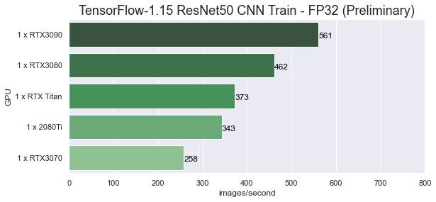
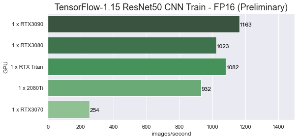
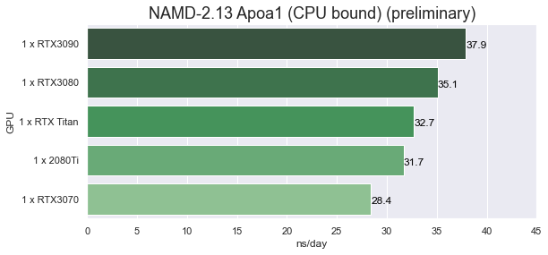
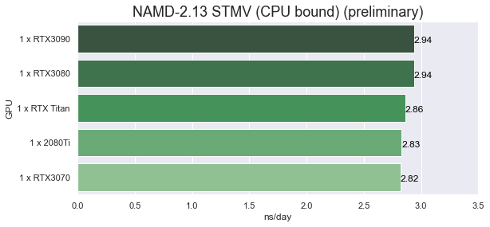
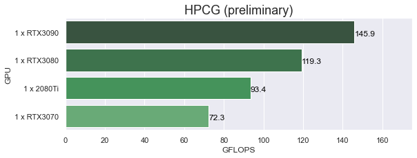

# RTX3070 (and RTX3090 refresh) TensorFlow and NAMD Performance on Linux (Preliminary)

## Introduction

This post is a results refresh to include **"preliminary"** findings for the new RTX3070 GPU. Results from the RTX3090 post will be included, with a few refreshes.
[RTX3090 TensorFlow and NAMD Performance on Linux (Preliminary)](https://www.pugetsystems.com/labs/hpc/RTX3090-TensorFlow-NAMD-and-HPCG-Performance-on-Linux-Preliminary-1902/)

IMPORTANT NOTICE
The RTX3070 is a new variation on Ampere architecture, i.e. GA103. The RTX3080 and RTX3090 are GA102. There was a new Linux NVIDIA driver released on launch day (Thur. OCt 29, 2020) This properly does recognize the RTX3070 but it is still an early "short term" release. I believe this driver (and CUDA version) is not working correctly for fp16/Tensorcores on this GPU!  


My colleagues have had mostly good results on various Windows applications and I believe it is also a very good gaming card. **My testing is concerned with compute performance! (ML/Ai and molecular modeling)**

The RTX3070 has only 8GB of memory making it less suitable for ML/AI and other computing work. However, at $500 I was hopeful that it would be a nice GPU for entry level compute tasks in a modest workstation build. From my current testing at this point I would recommend saving up for a RTX3080 or 3090. (This recommendation may change after new drivers and CUDA updates are released.)

This round of testing had much fewer problems than previously seen. There are new drivers now and updates on the NVIDIA NGC containers I've been using. 

I used my favorite container platform, [NVIDIA Enroot](https://github.com/NVIDIA/enroot). This is a wonderful user space tool to run docker (and other) containers in a user owned "sandbox" environment. Which I plan to write about soon. 

There were no significant job run problems! The NGC containers tagged 20.10 for TF1 and TF2 are working correctly.

- TensorFlow 2 is now running properly. NGC container tagged  20.10-tf2-py3 is working (but not tested in this post)
- The ptxas assembler is running correctly. 

I used the latest containers from NVIDIA [NGC]( https://ngc.nvidia.com/catalog/all) for TensorFlow 1.15. 

## Test system
**Hardware**
- Intel Xeon 3265W: 24-cores (4.4/3.4 GHz)
- Motherboard: Asus PRO WS C621-64L SAGE/10G (Intel C621-64L EATX) 
- Memory: 6x REG ECC DDR4-2933 32GB (192GB total)
- **NVIDIA RTX3070 RTX3090, (old results for RTX3080, TITAN and RTX2080Ti)**

**Software**
- Ubuntu 20.04 Linux
- Enroot 3.3.1 
- **NVIDIA Driver Version: 455.38**
- nvidia-container-toolkit 1.3.0-1
- NVIDIA NGC containers
    - nvcr.io/nvidia/tensorflow:20.10-tf1-py3
    - nvcr.io/hpc/namd:2.13-singlenode
    - nvcr.io/nvidia/cuda:11.1-runtime-ubuntu20.04  (with the addition of OpenMPI 4 for HPCG)

**Test Jobs**
- [TensorFlow-1.15](https://www.tensorflow.org): ResNet50 v1, fp32 and fp16
- [NAMD-2.13](https://www.ks.uiuc.edu/Research/namd/): apoa1, stmv
- [HPCG](https://www.hpcg-benchmark.org/software/view.html?id=280) (High Performance Conjugate Gradient)  "HPCG 3.1 Binary for NVIDIA GPUs Including Ampere based on CUDA 11"

**Example Command Lines**
- docker run --gpus all --rm -it -v $HOME:/projects nvcr.io/nvidia/tensorflow:20.10-tf1-py3
- docker run --gpus all --rm -it -v $HOME:/projects nvcr.io/hpc/namd:2.13-singlenode
- python nvidia-examples/cnn/resnet.py  --layers=50  --batch_size=32  --precision=fp32
- python nvidia-examples/cnn/resnet.py  --layers=50  --batch_size=64  --precision=fp16
- namd2 +p24 +setcpuaffinity +idlepoll +devices 0 apoa1.namd
- OMP_NUM_THREADS=24 ./xhpcg-3.1_cuda-11_ompi-4.0_sm_60_sm70_sm80

Note: I listed docker command lines above for reference. I actually ran the containers with enroot

**Job run info**
- The batch size used for TensorFlow 1.15 ResNet50 v1 was 32 at fp32 and 64 at fp16 for the RTX3070. GPUs The RTX3090 used 192 for both fp32 and fp16. 

- The HPCG benchmark used problem dimensions 128x128x128 (reduced for the 8GB mem on the RTX3070)

Output for RTX3070
```
1x1x1 process grid
128x128x128 local domain
SpMV  =   64.2 GF ( 404.3 GB/s Effective)   64.2 GF_per ( 404.3 GB/s Effective)
SymGS =   77.5 GF ( 598.2 GB/s Effective)   77.5 GF_per ( 598.2 GB/s Effective)
total =   73.3 GF ( 555.9 GB/s Effective)   73.3 GF_per ( 555.9 GB/s Effective)
final =   72.3 GF ( 548.7 GB/s Effective)   72.3 GF_per ( 548.7 GB/s Effective)
```

Output for RTX3090
```
1x1x1 process grid
256x256x256 local domain
SpMV  =  132.1 GF ( 832.1 GB/s Effective)  132.1 GF_per ( 832.1 GB/s Effective)
SymGS =  162.5 GF (1254.3 GB/s Effective)  162.5 GF_per (1254.3 GB/s Effective)
total =  153.8 GF (1166.5 GB/s Effective)  153.8 GF_per (1166.5 GB/s Effective)
final =  145.9 GF (1106.4 GB/s Effective)  145.9 GF_per (1106.4 GB/s Effective)
```
## Results

These results we run on the system, software and GPU's listed above. 
<style>
  table.blogtable {
    width: 95%;
    font-size: 14px;
    font-family: Helvetica, Arial, sans-serif;
    border-collapse: collapse;
    table-layout: fixed;
    margin: 4px 0 ;
    border-bottom: 2px solid #333;
  }

  h3.tableheading {
    margin-bottom: 20px;
  }

  table.blogtable thead th {
    background: #333;
    color: #fff;
  }

  table.blogtable th,td {
    padding: 8px 4px;
  }

  table.blogtable thead th {
    text-align: left;
  }

  table.blogtable tbody th {
    text-align: left;
  }

  table.blogtable tbody tr {
    color: #333;
  }
  table.blogtable tbody tr:hover {
    color: #960;
  }

  table.blogtable tbody tr:nth-child( even ) {
    background: #eee;
  }

  table.blogtable tbody col:nth-child(1) {
    white-space: nowrap;
  }
  </style>

<table class="blogtable">
<thead>
<tr><th>Benchmark Job </th><th>RTX3090 </th><th>RTX3080 (old) </th><th>RTX Titan (old)</th><th>RTX 2080Ti (old)</th><th>RTX3070</th></tr>
</thead>
<tbody>
<tr><td>TensorFlow 1.15, ResNet50 FP32  </td><td> 577 images/sec                </td><td> 462 images/sec                   </td><td> 373 images/sec                </td><td> 343 images/sec                </td><td> 258 images/sec  </td></tr>
<tr><td>TensorFlow 1.15, ResNet50 FP16  </td><td> 1311 images/sec               </td><td> 1023 images/sec                  </td><td> 1082 images/sec               </td><td> 932 images/sec                </td><td> 254 images/sec  </td></tr>
<tr><td>NAMD 2.13, Apoa1 (old)            </td><td> 0.0264 day/ns <br> (37.9 ns/day)  </td><td>  0.0285 day/ns<br> (35.1 ns/day)    </td><td> 0.0306 day/ns<br> (32.7 ns/day)  </td><td>  0.0315 day/ns <br> (31.7 ns/day) </td><td>  0.0352 day/ns <br> (28.4 ns/day) </td></tr>
<tr><td>NAMD 2.13, STMV  (old)           </td><td> 0.3398 day/ns <br>(2.94 ns/day)  </td><td>  0.3400 day/ns<br> (2.94 ns/day)    </td><td> 0.3496 day/ns<br> (2.86 ns/day)  </td><td>  0.3528 day/ns <br> (2.83 ns/day) </td><td>  0.355 day/ns <br> (2.82 ns/day) </td></tr>
<tr><td>HPCG Benchmark 3.1              </td><td> 145.9 GFLOPS                  </td><td>  119.3 GFLOPS                    </td><td> Not run                       </td><td>  93.4 GFLOPS                  </td><td>  72.3 GFLOPS                  </td></tr>
</tbody>
</table>

Note: (old) means that the results were not updated from those presented in the first RTX3090 performance post. The RTX3090 results are updated using the new driver and updated NGC TF1 container. The HPCG and NAMD results for the 3090 are from the older post (I did recheck them but there was little change). 


## Performance Charts

**Results from GPU testing pryor to the release of RTX3080 are not included in the charts since they are not strictly comparable because of improvements in CUDA and TensorFlow for the RTX20 series GPU's**

---

**TensorFlow 1.15 (CUDA11.1) ResNet50 benchmark. NGC container  nvcr.io/nvidia/tensorflow:20.10-tf1-py3**



The FP32 results show a good performance increase for the RTX30 GPUs and I expect performance to improve when they are more full supported. 



I feel that the FP16 results should be much higher for the RTX30 GPUs since this should be a strong point, I expect improvement with CUDA a update.  **The surprising results were how much better the RTX20 GPUs performed with CUDA 11 and TensorFlow 1.15. My older results with CUDA 10 and TensorFlow 1.13 where 653 img/s for the RTXTitan and 532 img/s for the 2080Ti!**

---

**NAMD 2.13 (CUDA11) apoa1 and stmv benchmarks. NGC container nvcr.io/hpc/namd:2.13-singlenode**





These Molecular Dynamics simulation tests with NAMD are almost surely CPU bound. There needs to be a balance between CPU and GPU. These GPU are so high performance that even the excellent 24-core Xeon 3265W is probably not enough. I will do testing at a later time using AMD Threadripper and EPYC high core count platforms. 

---

**HPCG 3.1  (xhpcg-3.1_cuda-11_ompi-4.0_sm_60_sm70_sm80)   nvcr.io/nvidia/cuda:11.0-runtime-ubuntu20.04  (with the addition of OpenMPI 4)**



HPCG is an interesting benchmark as it is significantly memory bound. The high performance memory on the GPUs has a large performance impact. The Xeon 3265W yields 14.8 GFLOPS. The RTX3090 is nearly 10 times that performance!

## Conclusions

The new RTX3070 GPU is lacking in compelling performance from this current testing. That may change when better updates for GA103 chip are available. For now I would recommend going with RTX3080 or better, the RTX3090 for compute.  

I can tell you that some of the nice features on the Ampere Tesla GPUs are not available on the GeForce RTX30 series. There is no MIG (Multi-instance GPU) support and the double precision floating point performance is very poor compared to the Tesla A100 ( I compiled and ran nbody as a quick check). There is also no P2P support on the PCIe bus.  However, for the many applications where fp32 and fp16 are appropriate these new GeForce RTX30 GPUs look like they will make for very good and cost effective compute accelerators.  

