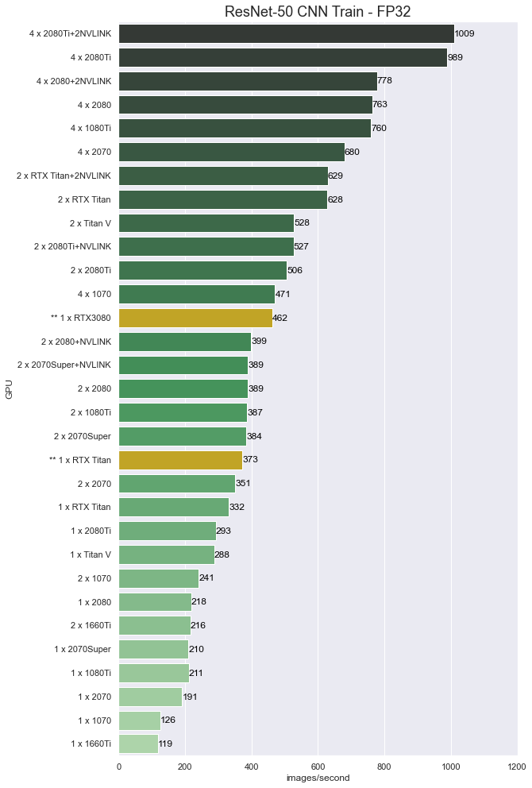

# RTX3080 TensorFlow and NAMD Performance on Linux (Preliminary)

## Introduction

The much anticipated NVIDIA GeForce RTX3080 has been released. 

**How good is the performance for Machine Learning and Molecular Dynamics on the RTX3080?** 
- First tests look exceptionally promising! **Initial results with TensorFlow running ResNet50 training looks to be nearly twice that of the RTX2080Ti.** 

- **NAMD molecular dynamics performance was as good as I've seen** and was basically CPU bound  with just one RTX3080 GPU on an Intel Xeon 24-core 3265W. 

The testing was problematic though. 
- Had to wait until the official launch on sept 17th to get a usable Linux display driver. (arrrggg!) This was annoying because the Tesla A100 had been supported for a couple of months.
- Only had a couple of hours of access to the card for testing and the scripts I had set up to automate the testing failed on the RTX3080 with the container application I was using. (had libnvidia-container error)
- I tried using TensorFlow from the Anaconda build but it failed on the RTX3080 with an error in the cuBLAS library. (that was with Google's ResNet50 benchmark)
- I had also tried the above earlier in the week using a pre-release Windows driver and had the same error.

But, I got things working by doing a quick install of docker and then using containers from NVIDIA NGC. https://ngc.nvidia.com/catalog/all  (which I tried earlier with an alternative to docker).

This is very brief early testing! I expect performance and compatibility to improve considerably soon. I'll be doing more thorough testing after a new driver revision and after software developers have had a chance to do more optimizations and debugging.  

## Test system
**Hardware**
- Intel Xeon 3265W: 24-cores (4.4/3.4 GHz)
- Motherboard: Asus PRO WS C621-64L SAGE/10G (Intel C621-64L EATX) 
- Memory: 6x REG ECC DDR4-2933 32GB (192GB total)
- **NVIDIA RTX3080 and RTX TITAN**

**Software**
- Ubuntu 20.04 Linux
- Docker version 19.03.12 
- NVIDIA Driver Version: 455.23.04
- nvidia-container-toolkit 1.3.0-1
- NVIDIA NGC containers
    - nvcr.io/nvidia/tensorflow:20.08-tf1-py3
    - nvcr.io/hpc/namd:2.13-singlenode

**Test Jobs**
- TensorFlow-1.15: ResNet50 v1, fp32 and fp16
- NAMD-2.13: apoa1, stmv

**Example Command Lines**
- docker run --gpus all --rm -it -v $HOME:/projects nvcr.io/nvidia/tensorflow:20.08-tf1-py3
- docker run --gpus all --rm -it -v $HOME:/projects nvcr.io/hpc/namd:2.13-singlenode
- python nvidia-examples/cnn/resnet.py  --layers=50  --batch_size=96  --precision=fp32
- python nvidia-examples/cnn/resnet.py  --layers=50  --batch_size=192  --precision=fp16
- namd2 +p24 +setcpuaffinity +idlepoll +devices 0 apoa1.namd

## Results

These results we run on the system and software listed above using the RTX Titan and RTX 3080. 

<table class="blogtable">
<thead>
<tr><th>Benchmark Job </th><th>RTX3080 </th><th>RTX Titan</th></tr>
</thead>
<tbody>
<tr><td>TensorFlow 1.15, ResNet50 FP32  </td><td> 462 images/sec    </td><td> 373 images/sec     </td></tr>
<tr><td>TensorFlow 1.15, ResNet50 FP16  </td><td> 1023 images/sec   </td><td> 1082 images/sec    </td></tr>
<tr><td>NAMD 2.13, Apoa1   </td><td>  0.0285 day/ns   35.11 ns/day    </td><td> 0.0306 day/ns (35.11 ns/day)  </td></tr>
<tr><td>NAMD 2.13, STMV    </td><td>  0.3400 day/ns   2.941 ns/day    </td><td> 0.3496 day/ns (2.860 ns/day)  </td></tr>
</tbody>
</table>

I had tried to run the Big_LSTM benchmark that I have run in the past, but it failed with out-of-memory errors no matter how small I made the batch_size. I had also run with TensorFlow 2.2 on the RTX Titan but did not have time to do this on the RTX 3080.

You can see that the $700 RTX 3080 gave excellent performance compared to the much more expensive RTX Titan (which has 24GB of expensive memory). I didn't compare directly to other cards because the RTX Titan was what I had available at the time. 

Note: that these results for the RTX Titan are much improved over past testing that I have done using earlier versions of the NGC TensorFlow container. This is especially true for the fp16 result as you will will see in the chart below.

## Comparative Charts

I will not present any charts with NAMD results because more CPU cores will be needed to balance performance to show better discrimination between different GPUs. My guess is that the (1 or 2) RTX 3080 would be an excellent on an AMD TR 3990x or 3970x platform for NAMD.  

**Results from older testing with new results mixed in!**

**NOTE: These are mixed results using numbers from testing using an older NGC TensorFlow-1.13 container. There has been significant improvements to the new TensorFlow-1.15 build.** 

## Conclusions

NVIDIA is keeping the "spirit" of Moore's Law alive! The "Ampere" GPU based RTX 3080 is a significant step forward in performance-per-dollar. The results presented in this post are preliminary. They will only get better as the driver matures and as software developers tune their applications for better performance on the architecture.

I can tell you that some of the nice features on the Ampere Tesla GPUs are not available on the GeForce 30 series. There is no MIG (Multi-instance GPU) support and the double precision floating point performance is very poor compared to the Tesla A100 ( I compiled and ran nbody as a quick check).  However, for the many applications where fp32 and fp16 are appropriate these new GeForce RTX30 GPUs look like they will make for very good and cost effective compute accelerators.  

