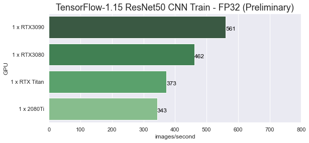
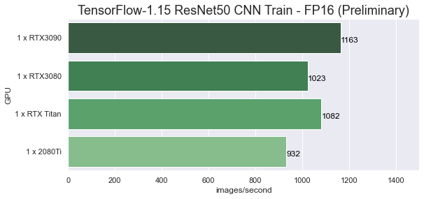
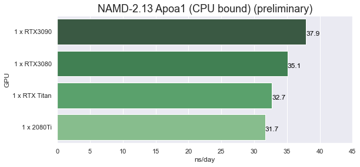
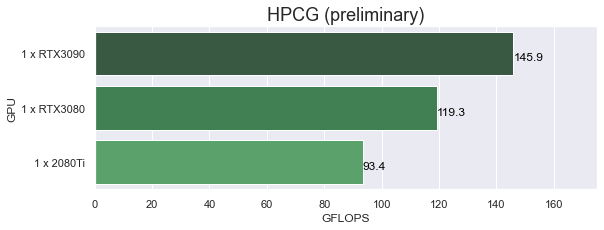

# RTX3090 TensorFlow and NAMD Performance on Linux (Preliminary)

## Introduction

IMPORTANT NOTICE
Shortly after finishing this post I was notified that CUDA has been updated to version 11.1 with support for RTX30 GPU's (GA102 and GA104  i.e. compute capability 8.6 sm_86) This is great news! As soon as the needed containers on NVIDIA NGC are updated I will be doing a fresh performance analysis. ... Including multi-GPU...

This post may be short lived, and that's a good thing!

The second new NVIDIA RTX30 series card, the GeForce RTX3090 has been released.

The RTX3090 is loaded with 24GB of memory making it a good replacement for the RTX Titan... at significantly less cost! The performance for Machine Learning and Molecular Dynamics on the RTX3090 is quite good, as expected.

This post is a follow-on to the post from last week on the RTX3080
[RTX3080 TensorFlow and NAMD Performance on Linux (Preliminary)](https://www.pugetsystems.com/labs/hpc/RTX3080-TensorFlow-and-NAMD-Performance-on-Linux-Preliminary-1885/)

Testing with the RTX3090 went smoother than with the RTX3080, which had been uncomfortably rushed and problematic.

I was able to use my favorite container platform, [NVIDIA Enroot](https://github.com/NVIDIA/enroot). This is a wonderful user space tool to run docker (and other) containers in a user owned "sandbox" environment. Last week I had some difficulties that were related to incomplete installation of all driver components.  Expect to see a series of posts soon introducing and describing usage of Enroot!

**The HPCG (High Performance Conjugate Gradient) benchmark was added for this testing.**

There were the same failures with the RTX3090 as with the 3080.
- TensorFlow 2 failed to run properly with a fatal error in BLAS calls
- My usual LSTM benchmark failed with mysterious memory allocation errors
- The ptxas assembler failed to run. This left ptx compilation to the driver which caused slow start up times for TensorFlow (a few minutes). See the output below,
```
2020-09-22 11:42:03.984823: W tensorflow/stream_executor/cuda/redzone_allocator.cc:312]
Internal: ptxas exited with non-zero error code 65280, output: ptxas fatal   : Value 'sm_86' is not defined for option 'gpu-name'

Relying on driver to perform ptx compilation. This message will be only logged once.
```
The reference to "sm_86" is referring to the "compute level", 8.6, for the GA102 chip. The Ampere GA100 chip has the code "8.0" i.e. sm_80. 

I used containers from NVIDIA [NGC]( https://ngc.nvidia.com/catalog/all) for TensorFlow 1.15, NAMD 2.13 and CUDA for HPCG. All of these applications were built with CUDA 11. 

**The current CUDA 11.0 does not have full support for the GA102 chips used in the RTX 3090 and RTX3080 (sm_86).**  

**The results in this post are not optimal for RTX30 series. These are preliminary results that will likely improve with an update to CUDA and the driver.** 

## Test system
**Hardware**
- Intel Xeon 3265W: 24-cores (4.4/3.4 GHz)
- Motherboard: Asus PRO WS C621-64L SAGE/10G (Intel C621-64L EATX) 
- Memory: 6x REG ECC DDR4-2933 32GB (192GB total)
- **NVIDIA RTX3090 RTX3080, RTX TITAN and RTX2080Ti**

**Software**
- Ubuntu 20.04 Linux
- Enroot 3.3.1 
- NVIDIA Driver Version: 455.23.04
- nvidia-container-toolkit 1.3.0-1
- NVIDIA NGC containers
    - nvcr.io/nvidia/tensorflow:20.08-tf1-py3
    - nvcr.io/hpc/namd:2.13-singlenode
    - nvcr.io/nvidia/cuda:11.0-runtime-ubuntu20.04  (with the addition of OpenMPI 4 for HPCG)

**Test Jobs**
- [TensorFlow-1.15](https://www.tensorflow.org): ResNet50 v1, fp32 and fp16
- [NAMD-2.13](https://www.ks.uiuc.edu/Research/namd/): apoa1, stmv
- [HPCG](https://www.hpcg-benchmark.org/software/view.html?id=280) (High Performance Conjugate Gradient)  "HPCG 3.1 Binary for NVIDIA GPUs Including Ampere based on CUDA 11"

**Example Command Lines**
- docker run --gpus all --rm -it -v $HOME:/projects nvcr.io/nvidia/tensorflow:20.08-tf1-py3
- docker run --gpus all --rm -it -v $HOME:/projects nvcr.io/hpc/namd:2.13-singlenode
- python nvidia-examples/cnn/resnet.py  --layers=50  --batch_size=96  --precision=fp32
- python nvidia-examples/cnn/resnet.py  --layers=50  --batch_size=192  --precision=fp16
- namd2 +p24 +setcpuaffinity +idlepoll +devices 0 apoa1.namd
- OMP_NUM_THREADS=24 ./xhpcg-3.1_cuda-11_ompi-4.0_sm_60_sm70_sm80

Note: I listed docker command lines above for reference. I actually ran the containers with enroot

**Job run info**
- The batch size used for TensorFlow 1.15 ResNet50 v1 was 96 at fp32 and 192 at fp16 for all GPUs except for the RTX3090 which used 192 for both fp32 and fp16 (using batch_size 384 gave worse results!) 

- The HPCG benchmark used defaults with the problem dimensions 256x256x256
Output for RTX3090
```
1x1x1 process grid
256x256x256 local domain
SpMV  =  132.1 GF ( 832.1 GB/s Effective)  132.1 GF_per ( 832.1 GB/s Effective)
SymGS =  162.5 GF (1254.3 GB/s Effective)  162.5 GF_per (1254.3 GB/s Effective)
total =  153.8 GF (1166.5 GB/s Effective)  153.8 GF_per (1166.5 GB/s Effective)
final =  145.9 GF (1106.4 GB/s Effective)  145.9 GF_per (1106.4 GB/s Effective)
```
## Results

These results we run on the system, software and GPU's listed above. 
<style>
  table.blogtable {
    width: 95%;
    font-size: 14px;
    font-family: Helvetica, Arial, sans-serif;
    border-collapse: collapse;
    table-layout: fixed;
    margin: 4px 0 ;
    border-bottom: 2px solid #333;
  }

  h3.tableheading {
    margin-bottom: 20px;
  }

  table.blogtable thead th {
    background: #333;
    color: #fff;
  }

  table.blogtable th,td {
    padding: 8px 4px;
  }

  table.blogtable thead th {
    text-align: left;
  }

  table.blogtable tbody th {
    text-align: left;
  }

  table.blogtable tbody tr {
    color: #333;
  }
  table.blogtable tbody tr:hover {
    color: #960;
  }

  table.blogtable tbody tr:nth-child( even ) {
    background: #eee;
  }

  table.blogtable tbody col:nth-child(1) {
    white-space: nowrap;
  }
  </style>

<table class="blogtable">
<thead>
<tr><th>Benchmark Job </th><th>RTX3090 </th><th>RTX3080 </th><th>RTX Titan</th><th>RTX 2080Ti</th></tr>
</thead>
<tbody>
<tr><td>TensorFlow 1.15, ResNet50 FP32  </td><td> 561 images/sec                </td><td> 462 images/sec                   </td><td> 373 images/sec                </td><td> 343 images/sec                </td></tr>
<tr><td>TensorFlow 1.15, ResNet50 FP16  </td><td> 1163 images/sec               </td><td> 1023 images/sec                  </td><td> 1082 images/sec               </td><td> 932 images/sec                </td></tr>
<tr><td>NAMD 2.13, Apoa1                </td><td> 0.0264 day/ns <br> (37.9 ns/day)  </td><td>  0.0285 day/ns<br> (35.1 ns/day)    </td><td> 0.0306 day/ns<br> (32.7 ns/day)  </td><td>  0.0315 day/ns <br> (31.7 ns/day) </td></tr>
<tr><td>NAMD 2.13, STMV                 </td><td> 0.3398 day/ns <br>(2.94 ns/day)  </td><td>  0.3400 day/ns<br> (2.94 ns/day)    </td><td> 0.3496 day/ns<br> (2.86 ns/day)  </td><td>  0.3528 day/ns <br> (2.83 ns/day) </td></tr>
<tr><td>HPCG Benchmark 3.1              </td><td> 145.9 GFLOPS                  </td><td>  119.3 GFLOPS                    </td><td> Not run                       </td><td>  93.4 GFLOPS                  </td></tr>
</tbody>
</table>

Note: that the results using TensorFlow 15.1 are much improved for the older RTX20 series GPUs compared to past testing that I have done using earlier versions of the NGC TensorFlow 1.13 container. This is especially true for the fp16 results. I feel there is a possibility of significantly better results for RTX30 after they have become fully supported (and optimized for)

## Performance Charts

**Results from past GPU testing are not included since they are not strictly comparable because of improvements in CUDA and TensorFlow**

---

**TensorFlow 1.15 (CUDA11) ResNet50 benchmark. NGC container  nvcr.io/nvidia/tensorflow:20.08-tf1-py3**



The FP32 results show a good performance increase for the RTX30 GPUs and I expect performance to improve when they are more full supported. 



I feel that the FP16 results should be much higher for the RTX30 GPUs since this should be a strong point, I expect improvement with CUDA a update.  **The surprising results were how much better the RTX20 GPUs performed with CUDA 11 and TensorFlow 1.15. My older results with CUDA 10 and TensorFlow 1.13 where 653 img/s for the RTXTitan and 532 img/s for the 2080Ti!**

---

**NAMD 2.13 (CUDA11) apoa1 and stmv benchmarks. NGC container nvcr.io/hpc/namd:2.13-singlenode**




These Molecular Dynamics simulation tests with NAMD are almost surely CPU bound. There needs to be a balance between CPU and GPU. These GPU are so high performance that even the excellent 24-core Xeon 3265W is probably not enough. I will do testing using a a later time using AMD Threadripper platforms. 

---

**HPCG 3.1  (xhpcg-3.1_cuda-11_ompi-4.0_sm_60_sm70_sm80)   nvcr.io/nvidia/cuda:11.0-runtime-ubuntu20.04  (with the addition of OpenMPI 4)**



I did not have the HPCG benchmark setup when I had access to the RTX Titan. HPCG is an interesting benchmark as it is significantly memory bound. The high performance memory on the GPUs has a large performance impact. The Xeon 3265W yields 14.8 GFLOPS. The RTX3090 is nearly 10 times that performance!

## Conclusions

The new RTX30 series GPUs look to be quite worthy successors to the already excellent RTX20 series GPUs. I am also expecting that the compute performance exhibited in this post will improve significantly after the new GPUs are fully supported with a CUDA and driver update. 

I can tell you that some of the nice features on the Ampere Tesla GPUs are not available on the GeForce RTX30 series. There is no MIG (Multi-instance GPU) support and the double precision floating point performance is very poor compared to the Tesla A100 ( I compiled and ran nbody as a quick check).  However, for the many applications where fp32 and fp16 are appropriate these new GeForce RTX30 GPUs look like they will make for very good and cost effective compute accelerators.  

