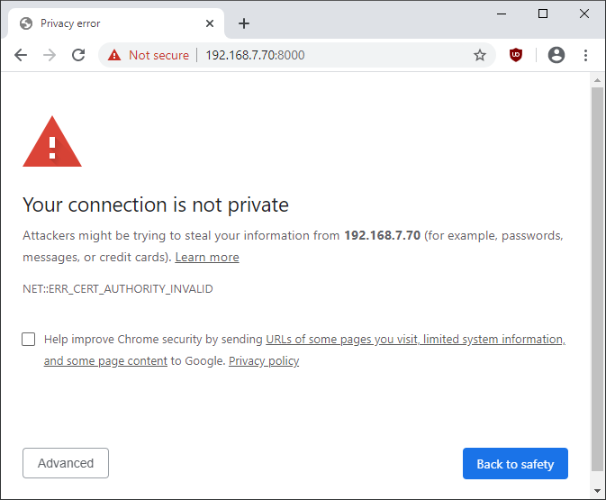
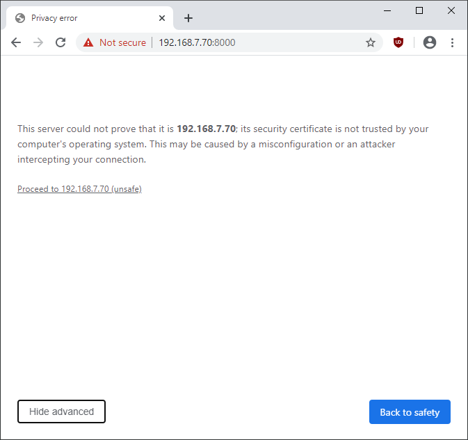
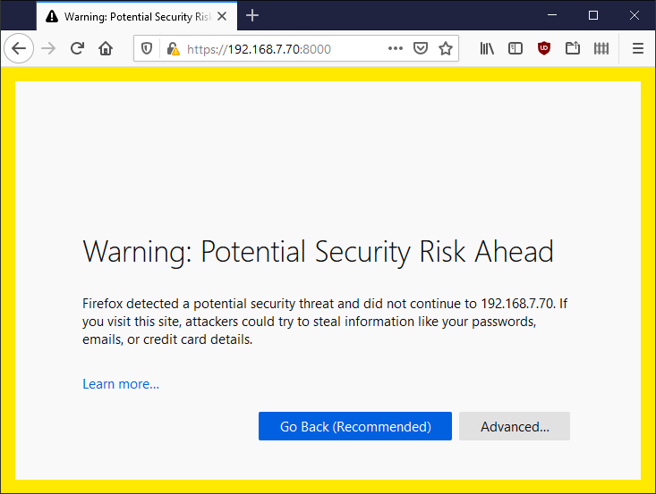
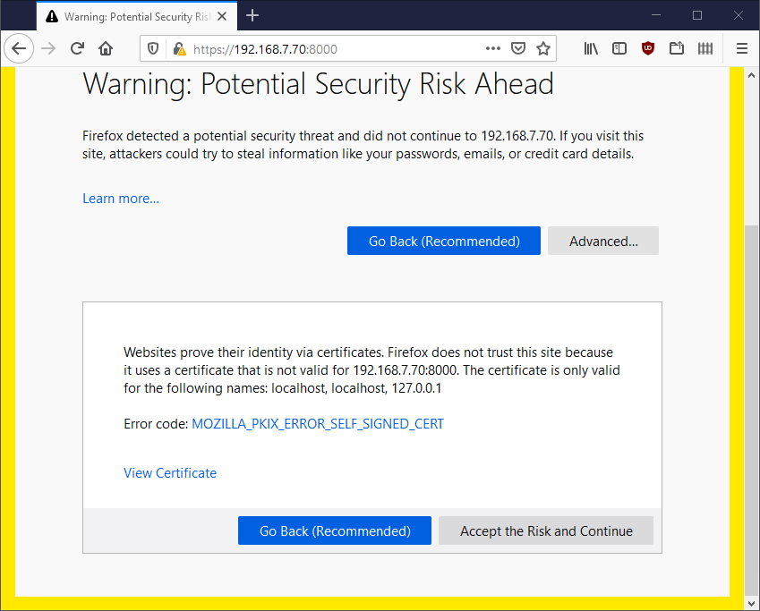
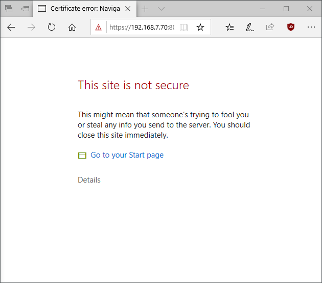
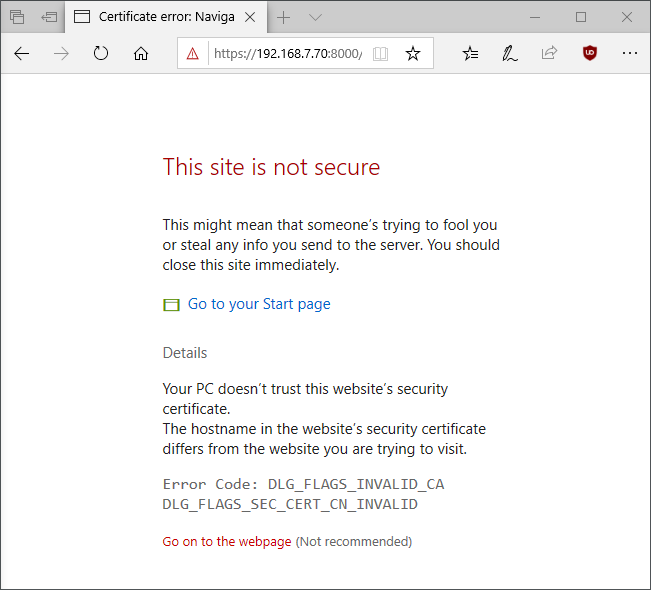

# Note: Self-Signed SSL Certificate for (local) JupyterHub

## Introduction

In this note I'll go through creating self-signed SSL certificates and adding them to a JupyterHub configuration. This will allow encrypted access to the server using https in a browser. 

I've been working with JupyterHub for serving JupyterLab notebooks from a remote system. This recent post ["Note: JupyterHub with JupyterLab Install using Conda"](https://www.pugetsystems.com/labs/hpc/Note-JupyterHub-with-JupyterLab-Install-using-Conda-1729/) describes the JupyterHub install and configuration that I have been using. That multi-user configuration is working well and I have even gotten "docker" containers working with it along with the "single user notebook servers". The configuration is intended to be served on a LAN or over a VPN and was using un-encrypted http for access. That is OK with trusted users on a trusted network. However, it is preferable to encrypt all network traffic to a web browser. 

For a system that is not using a registered public domain-name and ip address, adding SSL certificates to provide encryption can be accomplished using "self-signed" certificates. This is essentially being your own "Certificate Authority". These are perfectly good certificates and really no different than those issued by public CA's. But, web browsers do complain about them ... 

Web Browser software providers set their own requirements for certificates, [CA/Browser Forums](https://cabforum.org/). Certificates that are not signed by a public CA (certificate authority) are flagged with warnings even when they are served on non-public networks (including localhost). This is an annoyance and requires you to click on something like "Advanced", "Accept the risk", etc.. However, after you have accepted the certificate into your browsers key-store you should not have to take any special action. 

SSL setup can be complicated. This post is not intended to be a complete guide! There is a good discussion at [this Stack Overflow post](https://stackoverflow.com/questions/10175812/how-to-create-a-self-signed-certificate-with-openssl).

Following is the SSL configuration that I have added to the JupyterHub configuration linked near the top of this post. 

**The directory paths and configuration files are as described in the post ["Note: JupyterHub with JupyterLab Install using Conda"](https://www.pugetsystems.com/labs/hpc/Note-JupyterHub-with-JupyterLab-Install-using-Conda-1729/) .** 

##  Create SSL cert and key for using https to access JupyterHub

For what follows you need a version of openssl with version greater than or equal 1.1.1.

[You need to be root to make the following changes. You can get a root shell with "sudo -s"]

``` 
JHUB_HOME=/opt/conda/envs/jupyterhub
                                                                                                                                             
mkdir -p ${JHUB_HOME}/etc/jupyterhub/ssl-certs
cd ${JHUB_HOME}/etc/jupyterhub/ssl-certs

openssl req -x509 -newkey rsa:4096 -sha256 -days 3650 -nodes \
   -keyout jhubssl.key -out jhubssl.crt \
   -subj "/C=US/ST=Washington/L=Auburn/O=Puget Systems/OU=Labs/CN=Puget Systems Labs Self-Signed" \
   -addext "subjectAltName=DNS:localhost,DNS:localhost,IP:127.0.0.1"
```
That generates the certificate and key. 

## Edit the JupyterHub jupyterhub_config.py file to use the certificate and key.

Search for,
```
#c.JupyterHub\.ssl_cert = ''
 
#c.JupyterHub\.ssl_key = ''
``` 
in 
```
$JHUB_HOME/etc/jupyterhub/jupyterhub_config.py
```
Un-comment and change those lines to point to the SSL cert and key.
```
c.JupyterHub.ssl_cert = '/opt/conda/envs/jupyterhub/etc/jupyterhub/ssl-certs/jhubssl.crt'
c.JupyterHub.ssl_key = '/opt/conda/envs/jupyterhub/etc/jupyterhub/ssl-certs/jhubssl.key'
```

Restart JupyterHub,
```
systemctl restart jupyterhub
```

You can now access JupyterHub at https://(address-for-jhub):8000   Traffic between your browser and the server will be encrypted.

## Resources

SSL is complicated! 

- You can find good information searching on "Stack Overflow". 
- Ivan Ristić has a free book ["OpenSSL Cookbook"](https://www.feistyduck.com/books/openssl-cookbook/)
- And there is the [OpenSSL documentation (man pages)](https://www.openssl.org/docs/man1.1.1/). 

The most cryptic line in the openssl command I used, is
```
-subj "/C=US/ST=Washington/L=Auburn/O=Puget Systems/OU=Labs/CN=Puget Systems Labs Self-Signed"
```
These are answers to questions that openssl would ask in interactive mode (with "/" seperator). I used Puget System info here. You can use any info or even leave it out.

- C = Country name. The two-letter ISO abbreviation.
- ST= State or Province name.
- L = Locality Name. The name of the city where you are located.
- O = The full name of your organization.
- OU= Organizational Unit.
- CN= "Common Name". 
  
In older version CN would have been a fully qualified domaine name (FQDN). That is now added in the with SAN (subjectAltName)
- subjectAltName=DNS:localhost,DNS:localhost,IP:127.0.0.1"
I just used localhost here since there is no FQDN for the system. You could also enter the LAN ip address for the server here.

---

Remember, when you first access the server using https your browser will complain. After you have the certificate in your browsers key-store that should stop.

## Screen shots of browsers complaining; 

(The certificate is valid but browsers don't like self-signed certs because they could be created by someone doing a "man in the middle" attack on a public network.)

Chrome

click "Advanced", 

click "Proceed to ... (unsafe)"

Firefox

click "Advanced"

"Accept the Risk and Continue"

Edge

click "Details"

"Go on to the webpage"

With my current configuration that takes you to something like, (yes I changed the JupyterHub login page CSS styles -- why not!)


**Happy computing --dbk  @dbkinghorn -- Best wishes and stay safe!**