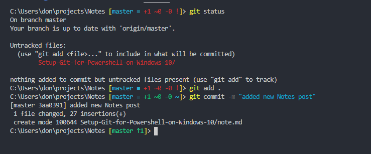

# Setup Git for PowerShell on Windows 10

## Install Official Git 

Get git from the official git website [git-scm.com](https://git-scm.com/). The download is a typical Windows installer. Note that this is maintained as a separate project called ["Git for Windows"](https://git-scm.com/).  Run the installer exe. The default install options will put git on your PATH. It will run from PowerShell, CMD, and "git bash" shell based on Msys (a Linux-like Gnu dev environment for Windows from the [MinGW](http://www.mingw.org/) project). 

The official git site contains an online version of the book ["Pro Git" by Scott Chacon and Ben Straub and published by Apress](https://git-scm.com/book/en/v2). This book contains a useful reference for PowerShell [A1.9 Appendix A: Git in Other Environments - Git in PowerShell](https://git-scm.com/book/en/v2/Appendix-A%3A-Git-in-Other-Environments-Git-in-PowerShell) 

The "common" recommendation for command-line git on Windows is to use the "git-bash" shell. However, git works nicely from the Windows PowerShell with one small addition...    

## Add posh-git to Powershell

[posh-git](https://github.com/dahlbyk/posh-git) adds **tab completion** for git and informative **color highlighted shell prompt notifications** that will keep you aware of pending actions in your repository. 

## Install posh-git:

### Check/Set Execution Policy
You will need to have "RemoteSigned" set for local PowerShell ExecutionPolicy. If you have enabled Windows "Developer Mode" you will likely have this set. Check with this command in PowerShell,

```
Get-ExecutionPolicy
```
this should return `RemoteSigned`. If not then do,
```
Set-ExecutionPolicy -Scope CurrentUser -ExecutionPolicy RemoteSigned -Force
```

### Install posh-git from "PowerShell Gallery"
PowerShell (version 5 or greater) has package management, and an official repository, ["PowerShell Gallery"](https://www.powershellgallery.com/).

```
Install-Module posh-git -Scope CurrentUser -Force
```
You may be asked to install ["NuGet"](https://www.nuget.org/) the .Net package manager. Go ahead and say "Yes" to that. 

### Load the module and add git "info" to your PowerShell prompt

To use posh-git you need to import its module into PowerShell

```
Import-Module posh-git
```
To make this module load by default (recommended) do,
```
Add-PoshGitToProfile -AllHosts
```
Now when you are in a directory with a git repo on your machine you will have a nice command-line git experience from PowerShell; command-completion and colorized git status information in your prompt.

## Example
I use posh-git in PowerShell from a terminal in VScode. Here's a screen-shot of the repo for this post,

The last line is reminding me to push to master on GitHub ... humm, maybe I should use a branch and merge...

---
**Happy computing! --dbk @dbkinghorn**

---