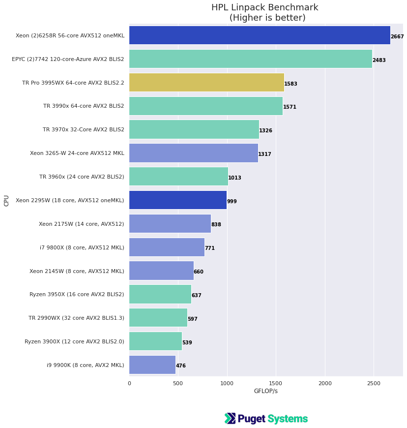
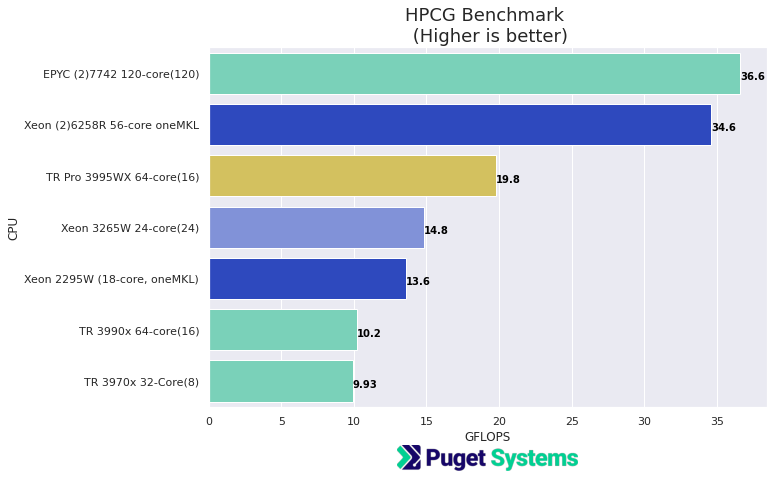
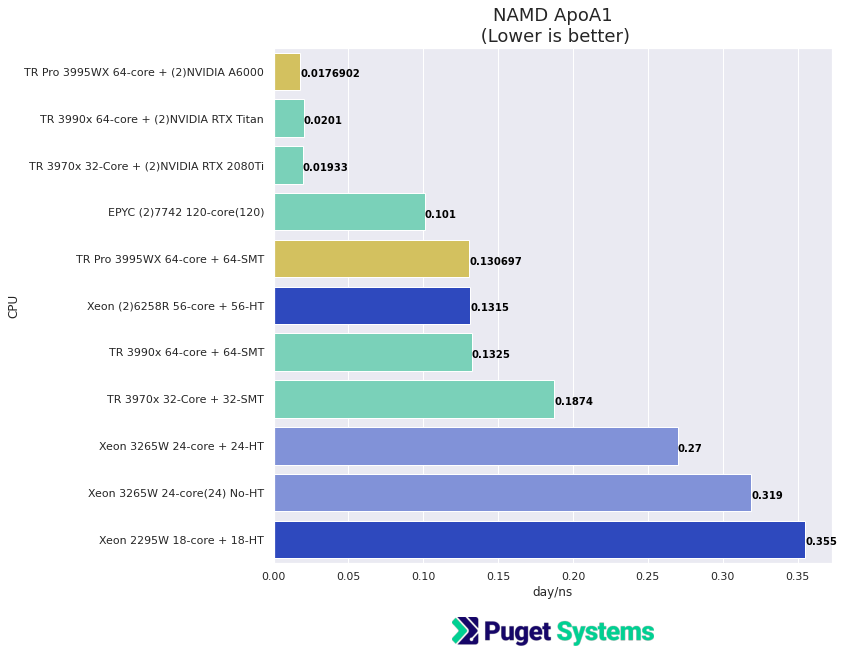
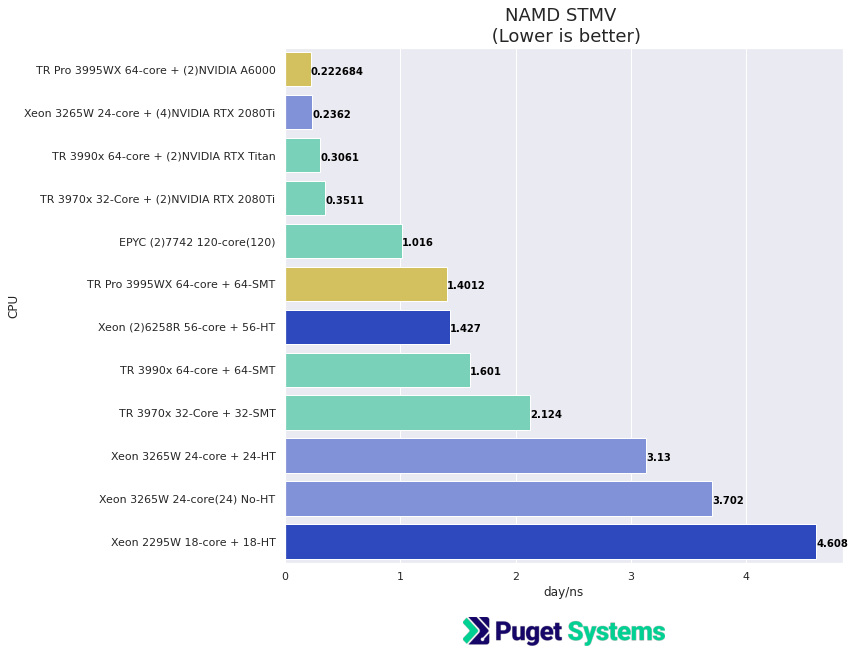

# AMD Threadripper Pro 3995WX HPL HPCG NAMD Performance Testing (Preliminary)

## Introduction

AMD has released the long awaited Threadripper Pro CPUs. I was able to spend a (long) day (and night) running compute performance testing on the flagship 64-core TR Pro 3995WX. In this post I've got some standard HPC workload benchmark results. This post is marked as "Preliminary" which is something I seem to do a lot with new hardware launches. There are a few motherboard glitches showing up in our qualification the TR Pro platform. Hopefully they will be resolved shortly after you read this.

The Threadripper Pro (TR Pro) is an interesting processor. It's not really "new". **It is essentially EPYC Rome for workstations.** It is using the same Zen2 cores and has the same 8 memory channels etc.. EPYC single socket wasn't an ideal platform for workstations. The motherboards and chipset were more suited for server configurations. TR Pro changes that. The platform motherboards are well suited for workstation use. The 8 memory channels and 128 PCIe lanes are a big plus.

Biggest strengths of TR Pro,
- 16 to 64 cores + SMT For application that have good parallel scaling this is an attractive alternative to dual socket systems. 
- 8 memory channels (That's doubled from the non-Pro TR) This can make a significant difference for applications that are memory bound. This is a fairly common problem for simulation applications using ODE (differential equation) solvers on grids. Also, the max memory configuration is 2TB! 
- PCIe v4 X16 support for multi-GPU!

Potential downsides,
- For applications with poor multi-core support the high core-counts may not be effective. But, the 16-core TR Pro could still be very good option.
- It's using the Zen2 core which has already been upgraded to Zen3 on Ryzen and the soon to be released EPYC Milan. I'm not certain about the upgrade path for TR Pro. 
- The developer ecosystem for architecture optimizations is relatively lacking. However, this should dramatically change this year because of development activity in support of the exa-scale [AMD based supercomputer (Frontier) going online at Oak Ridge National Labs](https://www.olcf.ornl.gov/frontier/) this year.   

The tests in the results below examine performance from 3 main perspectives,

- **HPL(Linpack)** The HPL benchmark is the primary performance measure used to rank the Top500 supercomputer list. It is heavily dependent on a good BLAS (Basic Linear Algebra Subprograms) library implementation.
- **HPCG** High Performance Conjugate Gradient is a more recent ranking benchmark used together with HPL on the Top500 list. HPCG is a good representation of workloads that are memory-bound.
- **NAMD** Molecular dynamics simulation is a very good "real-world" application. NAMD is a good representative of many highly parallel scientific applications.  

The performance charts contain fresh testing results for,
- TR Pro 3995WX 64-core
- dual Xeon 6258R 2 x 28-core 
- Xeon 2295W 18-core 

The Intel Xeon results were included for two reasons, I had access to them at the same time as the TR Pro, and it is of interest to compare TR Pro to a high-end dual Xeon system. The Xeon system is significantly more expensive but the TR Pro is competitive for performance.

**There are also older results in the charts for comparison. These results are from the post [HPC Parallel Performance for 3rd gen Threadripper, Xeon 3265W and EPYC 7742 (HPL HPCG Numpy NAMD)](https://www.pugetsystems.com/labs/hpc/HPC-Parallel-Performance-for-3rd-gen-Threadripper-Xeon-3265W-and-EPYC-7742-HPL-HPCG-Numpy-NAMD-1717/) Please refer to that post for details.**

## Test systems (new results)

**AMD Threadripper PRO Test Platform:**
- **CPU -** [AMD TR Pro 3995WX 64 Core ($5,489)](https://www.pugetsystems.com/parts/CPU/AMD-Ryzen-Threadripper-Pro-3995WX-2-7GHz-64-Core-280W-13974)
- **Motherboard -** [Asus Pro WS WRX80E-SAGE SE WIFI](http://www.asus.com/Motherboards-Components/Motherboards/All-series/Pro-WS-WRX80E-SAGE-SE-WIFI/)
- **Memory -** [8x DDR4-3200 16GB Reg. ECC (128GB total)](https://www.pugetsystems.com/parts/Ram/Micron-DDR4-3200-16GB-ECC-Reg-MTA9ASF2G72PZ-3G2B1-13852)
- **GPU -** 2 x NVIDIA RTX A6000 48GB (Used with NAMD testing)

**Intel Xeon Test Platforms:**
- **CPU -** [ 2x Intel Xeon Gold 6258R 28 Core [2 x $3,950]](https://www.pugetsystems.com/parts/CPU/Intel-Xeon-Scalable-Gold-6258R-2-7GHz-Twenty-Eight-Core-38-5MB-205W-13549)
- **Motherboard -** [Asus Pro WS WRX80E-SAGE SE WIFI](https://www.pugetsystems.com/parts/Motherboard/ASUS-WS-C621E-SAGE-12494)
- **Memory -** [Crucial 384GB DDR4-2666 REG ECC (12x32GB) ](https://www.pugetsystems.com/parts/Ram/Crucial-DDR4-2666-32GB-ECC-Reg-12628)

-

- **CPU -** [Intel Xeon W-2295 18 Core](https://www.pugetsystems.com/parts/CPU/Intel-Xeon-W-2295-3-0GHz-18-Core-24-75MB-165W-13417)
- **Motherboard -** [Asus WS C422 PRO_SE]
- **Memory -** Kingston 128GB DDR4-2400 (8x16GB)  [My personal system]

**Software:**
- Ubuntu 20.04.2
- Kernel 5.8
- gcc/g++ 9.3
- [AMD AOCC v 2.3 complier (clang)](https://developer.amd.com/amd-aocc/)
- [AMD BLIS library v 2.2 (HPL)](https://developer.amd.com/amd-aocl/)
- [Intel oneAPI oneMKL (HPL, HPCG)](https://software.intel.com/content/www/us/en/develop/tools/oneapi.html)
- HPL Linpack 2.2 (Using pre-compiled binaries from AMD BLIS and Intel oneMKL at links above)
- [HPCG 3.1](https://www.hpcg-benchmark.org/) (AMD built from source with AOCC, and gcc, Intel oneMKL)
- [OpenMPI 4](https://www.open-mpi.org/)
- [NAMD 2.14 (Molecular Dynamics)](https://www.ks.uiuc.edu/Research/namd/)

## Results

OK, here's the good stuff!

**Please note: the charts below contain new results AND older results from post [HPC Parallel Performance for 3rd gen Threadripper, Xeon 3265W and EPYC 7742 (HPL HPCG Numpy NAMD)](https://www.pugetsystems.com/labs/hpc/HPC-Parallel-Performance-for-3rd-gen-Threadripper-Xeon-3265W-and-EPYC-7742-HPL-HPCG-Numpy-NAMD-1717/) Please refer to that post.** 

**...Make comparative judgments with caution! (the results in light green and blue were run with slightly older libraries and software versions.)**

## HPL

HPL Linpack is a good measure of raw floating point compute performance and can make good use of vector units (AVX). 

- For the AMD systems the optimized HPL binary build supplied with the AMD BLISv2.2 library was used (v2.0 for older results). Best results were obtained with,
N = 114000 (number of simultaneous equations) [N=200000 on EPYC]
NB = 768  block size for level 3 BLAS (matrix) operations 

- For the Intel Xeon systems the OpenMP threaded Linpack build from the current oneMKL library was used (older results used MKL 2020.1). Peak results for Xeon 6258R and 2295W were at problem size of 30000.

**Notes:** 
- The 64-core Threadripper 3990x and Pro 3995WX performed nearly the same. this is expected for this benchmark since the "compute" core needed is very similar. 
- The Xeon's have an advantage from the AVX512 vector unit and the highly optimized MKL library.

## HPCG
Memory performance bound!
Sparse 2nd order partial differential equation, multi-grid solver using Conjugate Gradient approximation.

This is a demanding benchmark that is limited by memory subsystem performance. It was designed as compliment to HPL to give a better overall indicator of HPC systems performance. 

**Notes:**
- I made an effort to optimize the build for HPCG using AMD AOCC complier and libraries. However, I obtained better results using gcc with --march=znver2
- The TR Pro 3995WX does significantly better than the TR 3990x in this text because the Pro has 8 memory channels vs 4 on the non-Pro
- The dual EPYC system is much like having 2 of the TR Pro 3995WX. It has a total of 16 memory channels.
- The dual Xeon 6258R system has a total of 12 memory channels, 6 per CPU. That is also, using the Intel optimized HPCG benchmark from oneMKL. I also ran that with a build from source using gcc and obtained a result approximately %20 lower (28.1  GFLOPS).  

## NAMD

NAMD is a widely used Molecular Dynamics program with excellent parallel scalability, and low dependence on specially optimized hardware libraries (like MKL). It makes a very good "real-world" parallel performance benchmark. 

The test jobs are;
- ApoA1   (Apolipoprotein A1) ~ 92000 atoms
- STMV  (Satellite Tobacco Mosaic Virus)  ~ 1 million atoms

NAMD also has very good GPU acceleration! (There are a few GPU accelerated results in the charts. Note that NAMD requires good balance between CPU capability and GPUs)

## NAMD ApoA1

**Notes:**
- The TR Pro 3995WX performed slightly better than the dual Xeon 6258R system when using just CPU. It was also similar to the TR 3990x
- The standout result is the TR Pro 3995WX + 2 NVIDIA RTX A6000 GPUs!

## NAMD STMV

**Notes:**
- Again the TR Pro 3995WX performed slightly better than the dual Xeon 6258R system when using just CPU. STMV is a much larger problem and the 3995WX did significantly better than the TR 3990x
- The result is using the TR Pro 3995WX + 2 NVIDIA RTX A6000 GPUs is very good and I believe there is enough CPU performance with the 3995WX to support 4 GPUs!

## Conclusions

Bottom line is, I would make a strong recommendation for the TR Pro 3995WX as an option for a high-end scientific computing workstation processor. It has excellent application performance, excellent memory performance and provides a very good platform for multi-GPU. 

I do have a few reservations that I had mentioned earlier. The biggest concern is the developer ecosystem. Intel has been making great progress in this regard with the recently released version 1 of oneAPI. And, NVIDIA is very strong in this regard. However, I do expect AMD to get a lot of attention this year as a result of the Frontier supercomputer at Oak Ridge National Labs and because of preparation for the 2023 installation the "El Capitan" supercomputer.

