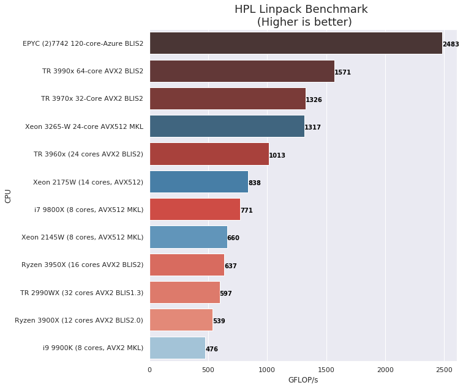
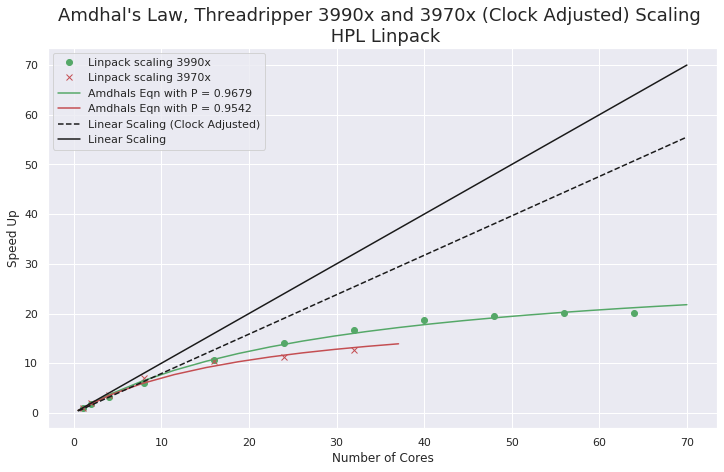
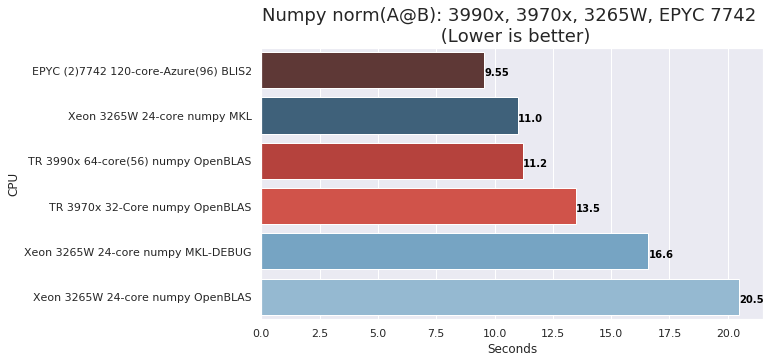
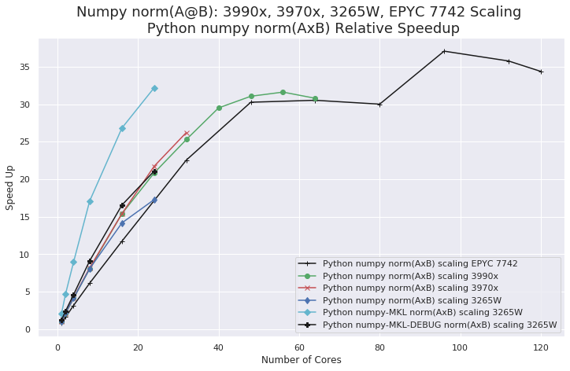
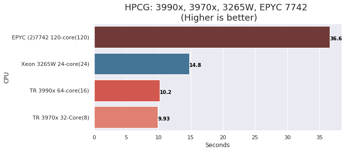
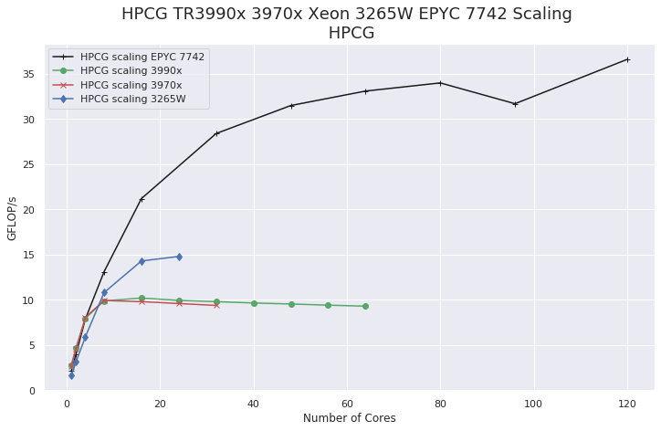
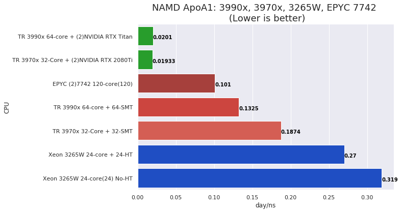
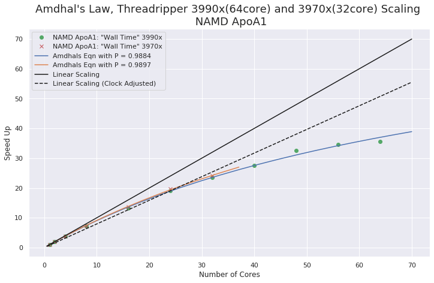
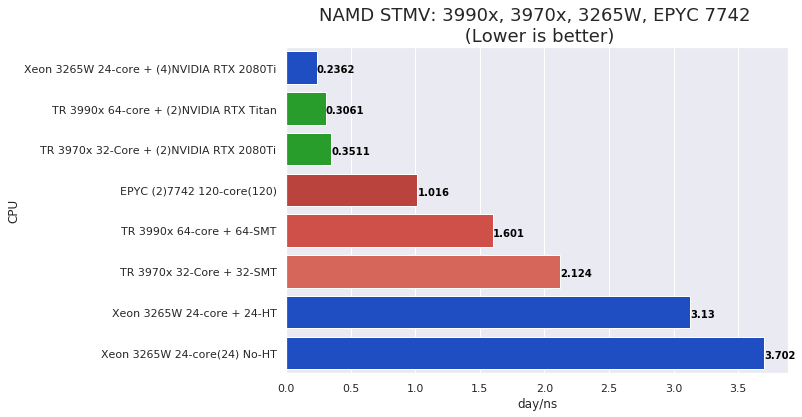

# HPC Parallel Performance for Threadripper, Xeon-W and EPYC - HPL HPCG Numpy NAMD

## Introduction

>On March 19, 2020 I did a webinar titled,
[ **AMD Threadripper 3rd Gen HPC Parallel Performance and Scaling ++(Xeon 3265W and EPYC 7742)** ](https://www.pugetsystems.com/landing/Webinar-AMD-Threadripper-3rd-Gen-HPC-Parallel-Performance-and-Scaling-98)
There is a recording at the link above (requires registration). The **++(Xeon 3265W and EPYC 7742)** part of that title was added after we had scheduled the webinar. It made the presentation a lot more interesting that the original Threadripper only title! 

That webinar was a discussion of testing results that I had not published as a blog post. This post remedies that.

We will look at HPC performance with four recently released high core count processors.  
- AMD Threadripper 3970x and 3990x
- Intel Xeon 3265W 
- AMD EPYC 7742

The testing results should give you an idea of how these processors perform with respect to,
- Double precision floating point performance
- Parallel Scaling
- Memory performance  

All of the performance charts that were in the webinar are in this post. 

## The 4 systems under test

Three of the test systems are using processors that we currently offer in workstation configurations; TR 3970x, 3990x and Xeon 32xxW. We are in the process of qualifying EPYC single socket platform components for workstations and dual socket machines. I wanted to include EPYC in this testing to compare memory subsystem performance to the Threadripper. The EPYC system I used was a dual EPYC 7742 instance running on Azure.

Basic configurations are:

## AMD Threadripper 3990x and 3970x

- AMD TR 3990x: 64-cores (4.3/3.45 GHz) [Max boost / All-core-turbo frequencies]   
- AMD TR 3970x: 32-cores (4.5/3.8 GHz)
- Motherboard: Gigabyte TRX40 AORUS
- Memory: 8x DDR4-2933 16GB (128GB total)

**Software**
- Ubuntu 20.04 (pre-release)
- Kernel 5.4.0-14-generic
- gcc/g++ 9.2.1
- AMD BLIS library v 2.0
- HPL Linpack 2.2 (Using pre-compiled binary at link above)
- HPCG 3.1 (built from source)
- OpenMPI 3.1.3 (installed from source)
- NAMD 2.13 (Molecular Dynamics)
- Anaconda Python: numpy with OpenBLAS 

## Intel Xeon 3265W

- Intel Xeon 3265W: 24-cores (4.4/3.4 GHz)
- Motherboard: Asus PRO WS C621-64L SAGE/10G (Intel C621-64L EATX) 
- Memory: 6x REG ECC DDR4-2933 32GB (192GB total)

**Software**
- Ubuntu 20.04 (pre-release)
- Kernel 5.4.0-14-generic
- gcc/g++ 9.2.1
- Intel MKL 2020.1 
- HPL Linpack (from MKL Benchmarks)
- HPCG 3.1 (built from source)
- Intel MPI 
- NAMD 2.13 (Molecular Dynamics)
- Anaconda Python: numpy with OpenBLAS, MKL, MKL(Debug)

## AMD EPYC 7742 (dual socket) 

- AMD EPYC 7742: 2 x 64-cores (3.4/?? GHz)  [4 cores on each CPU reserved by VM host]
**Microsoft Azure HB120rs v2 Instance** 
- Memory: 480GB 

**Software**
- Ubuntu 18.04 
- Kernel 5.4.0-14-generic
- gcc/g++ 9.2.1 (7.5) [Binaries were built with 9.2.1]
- AMD BLIS library v 2.0
- HPL Linpack 2.2 (Using pre-compiled binary at link above)
- HPCG 3.1 (built from source)
- OpenMPI 3.1.3 (installed from source)
- NAMD 2.13 (Molecular Dynamics)
- Anaconda Python: numpy with OpenBLAS 

## Testing applications (HPC Benchmarks)

## HPL (Linpack)

  HPL Linpack is the standard performance ranking benchmark for the Top500 Supercomputer List.  It is a good measure of raw floating point compute performance and can make good use of vector units (AVX). It's my favorite CPU benchmark.

- For the AMD systems the optimized HPL binary build supplied with the AMD BLISv2.0 library was used. 
N = 114000 (number of simultaneous equations) [N=200000 on EPYC]
NB = 768  block size for level 3 BLAS (matrix) operations 

- For the Intel Xeon-W the OpenMP threaded Linpack build from the MKL 2020.1 library was used. 

## Python Numpy norm(AxB)

This benchmark is a simple Frobenius norm of a matrix Product,
- n = 20000 # (n x n matrices)
- A = np.random.randn(n,n).astype('float64')
- nrm = np.linalg.norm(A@B) # i.e.  sqrt(trace[(AB)’ AB])

Anaconda Python numpy with
- OpenBLAS (for AMD)
- MKL (for Intel) Also ran with OpenBLAS on Intel for comparison.

## HPCG High Performance Conjugate Gradient

 Sparse 2nd order partial differential equation, multi-grid solver using CG approximation.

This is a demanding benchmark that is limited by memory subsystem performance. It was designed as compliment to HPL to give a better overall indicator of HPC systems performance. It is now a secondary benchmark for the Top500 Supercomputer List. I haven't used this in the past but I think it may now be my second favorite CPU benchmark!

## NAMD

NAMD is a widely used Molecular Dynamics program with excellent parallel scalability, and low dependence on specially optimized hardware libraries (like MKL). It makes a very good "real-world" parallel performance benchmark. 

The test jobs are;
- ApoA1   (Apolipoprotein A1) ~ 92000 atoms
- STMV  (Satellite Tobacco Mosaic Virus)  ~ 1 million atoms

NAMD also has very good GPU acceleration! (will show some of that in the charts)

## Performance Charts and Plots

Now on to the good stuff!

## HPL

The top 4 results in the chart below are from the processors tested for this article. The others are included for comparison.

**Notes:** There are a few notable comparisons in the chart,
- The 32-core Threadripper performed well against the Xeon-W despite being "limited" by AVX2 for this job. The Xeon has an advantage here with the AVX512 vector unit and the highly optimized MKL library.
- The 32-core TR 2990x is outperformed about 2.5 times over by the 32-core 3970x. This could be partly from the improvements made in AMD's BLIS v2 library.  

## HPL Scaling (Clock Adjusted)

This chart with results for the TR 3970x and 3990x is included to show core scaling and as a reminder that true linear scaling is not possible because of the dynamic clocks in modern processors. The dashed line is "ideal" scaling adjusted for the change of core clock going from max-turbo to all-core-turbo as the number of cores in used increases.   For a discussion of [Amdhal's Law see the excellent wikipedia article](https://en.wikipedia.org/wiki/Amdahl%27s_law).

## Python Numpy norm(AxB)

This simple Python numpy test is still taking advantage of linked BLAS libraries for performance. With Anaconda Python distribution the default link is to Intel MKL, however you can create envs using OpenBLAS. It is also possible to set a debug mode for MKL so that it thinks it is using an AVX2 type of processor. I first discussed this in a [post in Aug. 2019](https://www.pugetsystems.com/labs/hpc/AMD-Ryzen-3900X-vs-Intel-Xeon-2175W-Python-numpy---MKL-vs-OpenBLAS-1560/).

There are three job runs with the Xeon-W 3265 in the chart. The worst result is from using numpy linked with the same OpenBLAS that was used (and performed well for) the AMD processors. Using MKL with debug mode for AVX2 improved the result somewhat but the full MKL result for the 3265 is nearly double that of the OpenBLAS result.  Note that the OpenBLAS version used does not have AVX512 optimizations.

The chart below shows the core scaling. The light blue, black and dark blue lines are for the Xeon 3265 runs mentioned above. Performance for the two high core count AMD processors leveled off significantly near max core count. The TR 3970x scaled well to its max core count.  

## Python Numpy norm(AxB) Scaling

## HPCG

This is the first that I have used HPCG for CPU benchmarking and I will definitely continue to use it.  These results are "eye openers"! HPCG is memory bound. This is a common problem for many applications especially differential equation solvers. Really most computation is memory limited to some extent which is why so much effort is put into cache architectures, pre-fetching, branch prediction etc..  The EPYC has 8 memory channels per socket and the Xeon W has 6 memory channels. The Threadripper processors have just 4 memory channels. That makes a big difference in this benchmark! 

## HPCG Scaling

To me the most interesting chart in this post is the HPCG core scaling. You can clearly see the performance limitation from the memory subsystem. The Xeon W and the EPYC scaled with a smooth leveling-off near max cores. The Threadripper's essentially both peaked by 8 cores!  There was no special optimization done for the HPCG build. It's that same code built the same way for all of the processors. I feel this a very good comparative benchmark for memory performance and representative is many real-world problems. 

## NAMD ApoA1

NAMD is a very good molecular dynamics program with excellent parallel scalability. It makes a good benchmark because it is easy to setup and use and has good performance on a wide range of platforms. It was also one of the early codes to take advantage of GPU acceleration. There are parts of the dynamic forces that need to computed on CPU and some that work well on GPU. It give best performance when there is enough CPU capability to keep up with GPU's. You roughly need 12-18 CPU core per one NVIDIA 2080Ti level of GPU for good balance and hardware utilization.

The results are in units of day/ns. Thats days to compute 1 nano second of simulation! NAMD jobs can run for a long time with big simulations even on modern high performance hardware.  

An interesting aspect of these job runs is the benefit from using Hyper threads or SMT threads when running on CPU only. When GPU's are included this no longer applies and "non-core" threads actually slow things down (which is often the case for many high performance applications).
## NAMD ApoA1 Scaling

The scaling plot shows the great parallel scaling of NAMD on CPU cores. This is from my Threadripper testing with the dashed line representing "Adjusted Linear" scaling accounting for core clock frequency shift going from Max turbo to All-core-turbo. 
## NAMD STMV

The SMTV job is approximately one million atoms. That is a very large simulation, and it was a landmark calculation with it was first achieved. With modern supercomputer clusters it is possible to now do much larger simulation. That's an example of computing capability pushing the boundaries of possibility with science.

Since this job run is much larger than the ApoA1 job you see more separation from performance efficiency across the tested systems.  

## Conclusion

These are all great processors! 

I was particularly impressed by the Threadripper 3970x 32-core. The 32-cores of that processor were well utilized and gave a very good performance value (it is significantly less expensive that the other 3 processors tested).  

Notes:
- The HPCG benchmark reveled performance issues that should be considered when specifying a system configuration. The Threadripper can have a large performance drop for memory-bound applications. 
- We only looked at single job HPC applications, multiple simultaneous jobs could be effective on the high core count processors?? 
- AMD EPYC clearly address the memory issues observed with Threadripper. We are currently qualifying platforms for EPYC and I expect a single socket EPYC to be a great fit for many HPC Workstation applications.
- Intel Xeon is also an excellent platform. I am particularly happy with our new systems on the  "Asus PRO WS C621-64L SAGE/10G" board. The "32xx-W 64L" processors provide enough PCIe lanes to allow a 4 x GPU workstation without needing PCIe switches a.k.a. PLX chips. That makes for a robust multi-GPU workstation that can also take advantage of the AVX512 vector units on the Xeon CPU and the excellent Intel performance libraries like MKL. 

There are wonderful high performance workstation CPU options available now! And, it is only getting better. I am very happy with the current AMD Zen2 based processors and looking forward to seeing processors on Zen3 and especially Zen4 (with AVX512). Intel is also looking strong going forward and I am quite happy with the current Xeon W 64L platform. They appear to be refocusing on their strengths and consolidating some of their lineup. Their software ecosystem efforts are also looking interesting. [OneAPI](https://software.intel.com/en-us/oneapi) is certainly an ambitious project and hints at future support for new accelerated computing hardware.       

**Happy computing!  and please stay safe, best wishes --Don**