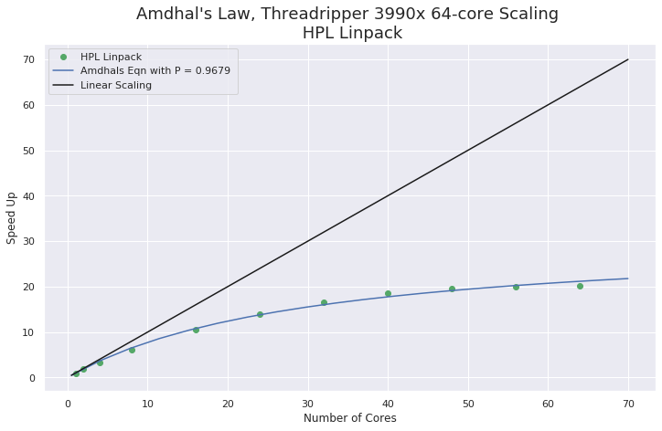
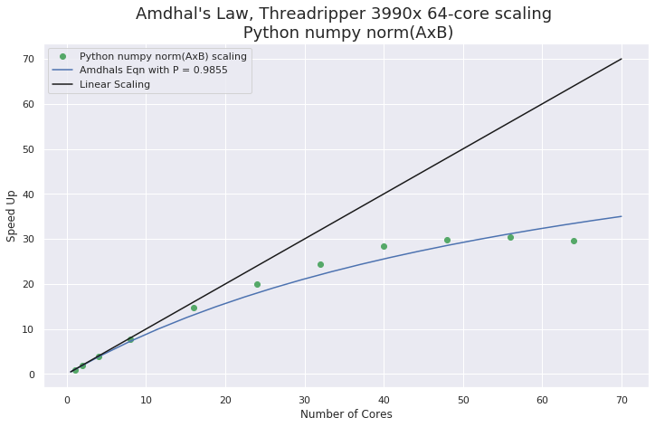
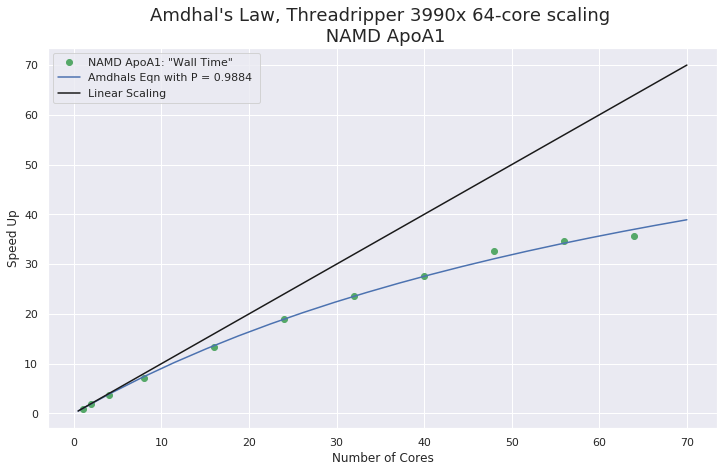

# Threadripper 3990x 64-core Parallel Scaling

64 cores is a lot of cores! How well will parallel applications scale on that many cores? The answer, of course, is, it depends on the application.  

In this post I'm presenting simple Amdhal's Law scaling results for applications that I have been benchmarking with recently. This is simple speed-up vs number-of-cores. Speed-up is relative to performance on 1-core with the number of cores increasing from 1 to 64. SMT threads are disabled in the BIOS so all processes run on "real" cores.

Test applications are;
- HPL Linpack (multi-thread linked to BLIS lib)
- Python numpy ( norm(A@B) on large matrices )
- NAMD ApoA1 and STMV Molecular Dynamics

**Linpack and the numpy tests showed rather poor scaling but NAMD scaling was good considering the large number of cores on this single socket system.**

---
These were difficult challenges for the 3990x since none of these applications are "embarrassingly parallel". That is, they all require core-memory access exchange and inter-process communication. With 64 cores I would only expect good scaling when processes and data are independent with minimal communication and fast accumulation. **64-cores accessing memory at the same time is likely to expose limitations on the memory subsystem more than individual core performance.**    

---

## System Configuration

- AMD Threadripper 3990x
- Motherboard Gigabyte TRX40 AORUS 
- Memory 8x DDR4-2933 16GB (128GB total)
- 1TB Samsung 960 EVO M.2
- NVIDIA RTX 2080Ti GPU (not used for compute)
- Ubuntu 20.04 (pre-release)
- Kernel 5.4.0-14-generic 
- gcc/g++ 9.2.1
- [AMD BLIS library v 2.0](https://developer.amd.com/amd-aocl/blas-library/) 
- [HPL Linpack 2.2](Using pre-compiled binary at link above)
- [OpenMPI 3.1.3](installed from source)
- [NAMD 2.13 (Molecular Dynamics)](http://www.ks.uiuc.edu/Research/namd/)
- [Anaconda Python](https://www.anaconda.com/distribution/): numpy 

**Note:** I was able to install using Ubuntu 20.04 by including a kernel boot parameter  `mce=off` during install and then added that to `/etc/default/grub` as  `GRUB_CMDLINE_LINUX_DEFAULT="mce=off"`. That disables "Machine Check" error reporting. I expect this to be resolved by the time Ubuntu 20.04 is in finial release. 

## Amdhal's Law Plots
See Wikipedia for an explanation of [Amdhal's Law](https://en.wikipedia.org/wiki/Amdahl%27s_law).

Here is the python code used to generate the plots (using the HPL data as an example).

```
import numpy as np
import matplotlib.pyplot as plt
from scipy.optimize import curve_fit
import seaborn as sns
sns.set() # not using seaborn but this makes the plots look better
%matplotlib inline

# job run times in seconds
hpl = np.array([12064,6334,3652,1980,1139,861,724,647,619,601,599])
# convert to relative speed-up
hpl = hpl[0]/hpl

numcores = np.array([1,2,4,8,16,24,32,40,48,56,64])

def amdhal(n,P):
    return hpl[0]/((1-P)+(P/n))

popt, pcov = curve_fit(amdhal, numcores, hpl)

# generate the plot
plt.rcParams["figure.figsize"] = [12,7]
#plt.figure(figsize=(16,9))
fig, ax = plt.subplots()
ax.plot( numcores, hpl, "o", color='g', label='HPL Linpack') # test results
xt = np.linspace(0.5,70,20)
ax.plot(xt, amdhal(xt,popt)  ,  label='Amdhals Eqn with P = %.4f ' %(popt[0]))  # plot the model function
ax.plot(xt,hpl[0]*xt, color='k', label='Linear Scaling')
plt.xlabel("Number of Cores")
plt.ylabel("Speed Up")
plt.title("Amdhal's Law, Threadripper 3990x 64-core Scaling \n HPL Linpack", fontsize=18)
ax.legend()
```

## HPL Linpack Scaling 1-64 cores

This is HPL provided by AMD with the BLIS library. The problem size was chosen as %80 of the 128GB system memory as a multiple of the block size (768). The following python snippet gives 104448. That was used in the HPL.dat input file.  

```
python -c 'print( int( (128 * 1024 * 0.80 // 768) * 768 ) )'

104448
```

The plot is from run-time in seconds converted to speed-up vs number of cores.



You can see from the plot that there is no speed-up after 48 cores. **Ideal linear scaling is represented by the black line.**

## Python numpy (norm(A@B))

This is a simple numpy test computing the frobenius norm of a matrix product. 

The conda env for this was created using OpenBLAS,
```
conda create --name openblas-np numpy blas=*=openblas
```
The python code is,
``` 
import numpy as np
import time

n = 20000

A = np.random.randn(n,n).astype('float64')
B = np.random.randn(n,n).astype('float64')

start_time = time.time()
nrm = np.linalg.norm(A@B)
print(" took {} seconds ".format(time.time() - start_time))
print(" norm = ",nrm)
```
`OMP_NUM_THREADS` was set from 1 to 64 for the job runs.



In this plot you see performance flatten out by 48 cores. The fall-off is enough to spoil the Amdhal curve fit and even declines slightly at 64 cores. The results up to 40 cores however are very good.

## NAMD ApoA1 ~ 92000 atoms 500 time steps

The molecular dynamics program NAMD in general scales well across cores, nodes and GPU's. I consider the results here for the ApoA1 job run to be good. I do believe the slowdown at higher core counts is memory bottleneck during accumulation of forces. It's not unexpected.

Run commands were similar to,
```
../../NAMD_2.12_Linux-x86_64-multicore/namd2 +p64 +setcpuaffinity +idlepoll apoa1.namd
```


## NAMD STMV ~ 1 million atoms 500 time steps

The scaling for the STMV job run is even better than the smaller ApoA1 problem. 


## Conclusion

Hopefully these results give you some reality on running processes on 64 cores at once! THere will be problems that will not perform well with that many thread or MPI ranks on a single socket node. Other programs will do better. NAMD is a good example. Even thought it would be nice to see better scaling with NAMD it is still quite good and if you combine these 64 cores with a couple of NVIDIA RTX 2080Ti or RTX Titan GPU's it would make a very nice molecular dynamics workstation.

I will likely get more opportunity to test on the 3990x. It would be nice to run some testing with applications that are more linear by nature. It would also be interesting to run the same tests in this post on the AMD EPYC rome 64-core server processor. I expect that EPYC may do better because of better memory handling. I'll try to do that if possible.  

**Happy computing! --dbk @dbkinghorn**