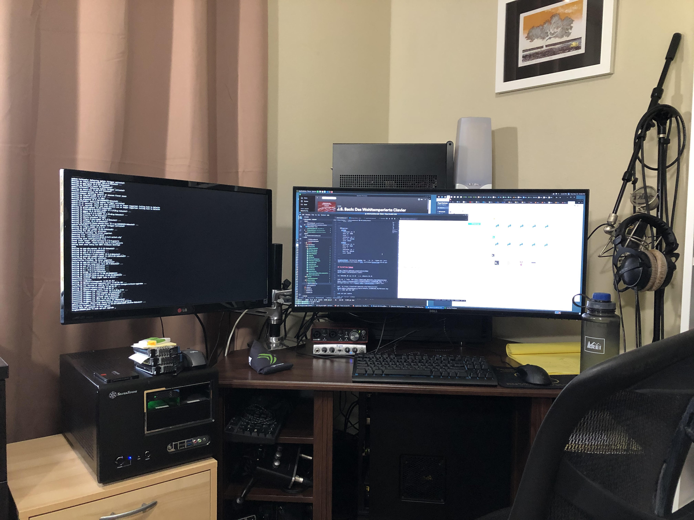
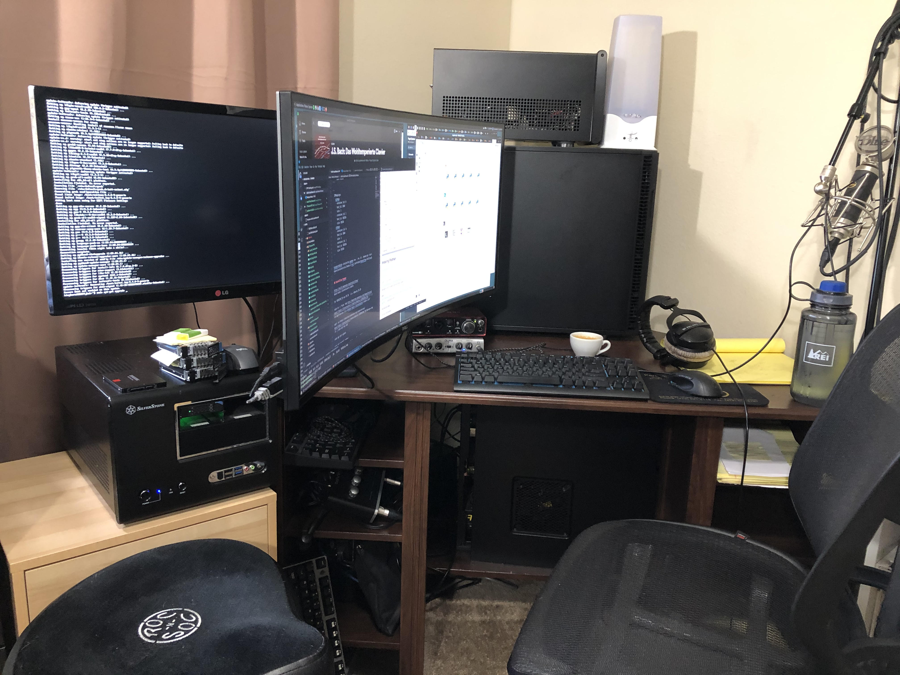
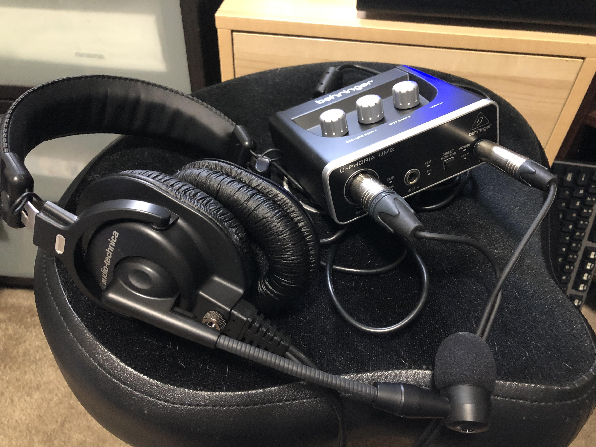

# Adjusting to Working from Home - Don in Labs

## Introduction

When the Corona virus hit Washington State Jon (Jon Bach the founder of PugetSystems) was quick to formulate multi-phase guidelines and actions to help keep everyone, and the company itself, safe and healthy. One of the first things was to ask everyone who could work from home to do so. This was even before the governor made the "Stay at Home" order. "Work from home" was just one of many steps we took early on ... yeah, this is a great company!     

For myself "Work from home" was something I had already been doing for a few years. I started working from home after Puget went through a growth period. Office and desk space became tight. It was an easy decision for me. I had a space to use at home and was living within a 15 minute drive to the office so I could pop in whenever needed. I was already well setup for the "Stay at Home" order. You might not be so lucky, and could be struggling with a new situation. 

I'll show you my personal setup for getting work done from home and offer some tips for those of you that are finding yourself disoriented from "the new way to work". This could become the new normal for a lot of you. I hope my words are encouraging and useful!   

## My home office setup

I'm fortunate to have an extra room to use for an office and hobby space. I have 3 main zones; music/guitar, a workbench for projects and working on guitars, and my main computer/work area. I'm only going to show you the work area because everything else is a mess ... I very much need to do some de-cluttering and Spring cleaning!

**There are 4 workstations in that photo;**
- The small one on the left and the one above the monitor are the first version of the "Peak Mini". I bought two of them when I first started at Puget Systems almost 8 years ago. They still work great. I have Windows on one and an "Icy-dock" in the one on the left. They are Intel Haswell i7 4770's. I use them for testing system configurations and such. The Icy-dock is handy for swapping drives. There is a stack of carriers sitting on top loaded with OS configurations. 
  - That system is right now running an iteration of a remote "appliance" configuration I'm working on. It has an NVIDIA Titan V in it and a JupyterHub configuration. You can see JupyterLab connected to it in the browser window on my main monitor. (photo is a bit washed out)
- There is a nice system behind the main monitor that I use as a **Windows workstation**.
  - Intel Core i9 9920X 12-core
  - 128 GB memory
  - 1 TB Samsung 970 EVO
  - NVIDIA RTX 2080Ti 
  - Windows 10 Insider edition.
  - I sometimes use this machine as my main workstation. I'm running "Win10 insider" on it so I can play with things like WSL2 (I feel like calling that **Microsoft Linux**). WSL is really nice to have on a Windows machine for an old Linux guy like me. I can work on that system the same as on my main Linux system. I use mostly the same applications on both and even have the desktops looking similar. For me it's an easy transition back and forth from Windows and Linux.  
-  There is a machine under the desk that is my main **Linux workstation**.
   -  Intel Xeon-W 2175 14-core 
   -  128 GB memory
   -  1Tb Samsung 960 EVO and 800GB Intel PCIe NVMe 750
   -  NVIDIA Titan V (often two of those)
   -  That is my Scientific workstation and my primary work environment. It is running Ubuntu 19.10 and will be refreshed to 20.04 soon. I do GPU accelerated compute on this box. I often have it running maxed out with some machine learning problems or some "science" that I'm messing with. I do a lot of the same compute work on the Windows machine too! I occasionally have them both grinding on something. They are very capable systems.

That's the main computer hardware I sit in front of every day. I have a nice Dell gaming laptop that I use quite a bit too... and an Apple Mac-mini. There is also space next to the desk where I can setup test-bench systems with some of the nifty testing hardware from Puget Labs.

For testing new hardware I usually stop by Puget Labs, setup a system and then SSH into it over VPN from home. We have a bunch of Raritan ipKVM's that come in handy too!

Right now I am remotely connected to a system at Puget Labs that has 4 RTX 2080Ti's. That system is running a remote access stack that I'm working on with JupyterHub, Cockpit, VScode and Docker. I connect from my home machines with a browser interface, SSH, and VScode. You will hear more about this in a few weeks...     

**Software you typically see on my workstations;**

- A couple of Firefox browser windows with documentation and resources for what I'm working on and maybe a few other web-apps.
- Python running in a Jupyter notebook or JupyterLab (numpy pandas, matplotlib, seaborn).
- A Chrome browser window with work related communication, document tabs and Google apps.
- MS VScode editor for writing documents and code. 
- A couple of multi-tab/session terminal windows running Bash or Bash and PowerShell on Windows.
- Git and GitHub for source control. I'm trying to keep everything on GitHub and then clone, pull or push things to whatever computer system I'm working on. 
- This post is in source control on GitHub and I'm writing it in Markdown using VScode.
- The Spotify app.

I use the same workflow and same software in Linux and Windows. The look-and-feel is mostly the same too. I only occasionally use any other software than listed above and rarely something that is not cross-platform between Linux and Windows.  

I am now using Zoom for on-line meetings and it's desktop application does not work in Linux, which is a shame. It does work pretty well though. I just use it from my Windows laptop which works out great with the headset I'll mention later. 

**Other important parts of my setup.**

**Monitors:** Multiple monitors are great, and needed for what I do. The small one is just for connecting "other" hardware. That big monitor in the photo is a **Dell UltraSharp U3417W** 34" curved, really nice. It has very sharp text display and I can read off of it all day long without eye strain. It's big enough to handel what I used to do with a dual display setup. It also has a **built-in KVM** so I can switch Keyboard, Mouse and Display back and forth between the Linux and Windows workstations. 

**Keyboard and Mouse:** I like mechanical keyboards. I'm now using a Corsair K63 with pretty "Ice Blue" backlight. Took awhile for this one to "break-in" but it's pretty nice now. I have a couple of CoolerMaster Quickfire keyboards that I like too but I love the backlight on the Corsair. I'm using a Roccat Kone gaming mouse that I like a lot ... have a few Logitech wireless mice with the fast scroll-wheel that are nice too.

**Audio:** I don't care for most motherboard on-board audio so I have **USB audio interfaces** on the 2 workstations. An old Lexacon Alpha on the Linux box and a very nice Focusrite Scarlett 2i2 on the Windows box.  Those are to the left of the monitor in the photo. I'll probably add a small mixer so I don't have to move the headphones back and forth.  It's "over-kill", I know, but I have the interfaces and they sound great! [I have a Mac mini and another larger Focusrite interface for my music stuff.]

**Headphones:** I highly recommend the **Beyerdynamic DT770's**. **If you are going to work from home get a good set of "cans"!** These sound great, are very comfortable, and have great noise attenuation. They work better than most "noise-cancelling" headphones that I've tried for blocking out annoying noise. They are "studio" headphones but have a very pleasant sound-scape. You can get them in 250, 80 and 32 ohm. I use the 80ohm and they work well with pretty much all audio sources. The 32ohm are more for low power sources like a phone and the 250's are more suitable for use with an external headphone amp. The only possible downside really is that they usually go for $150-200 and some folks won't want to spend that ... they are absolutely worth it in my opinion. 

**Music:** I like working when it's quite like early morning. However, when the background noise picks up or I'm just having trouble focusing and getting in-the-zone. I'll fire up Spotify and put on some nice music. I usually go for something I like but that I won't be too engaged with (I really love music if you hadn't guessed that by now) My favorite is J.S. Bach solo piano works. There is usually a nice tempo and tamber with a steady volume level. In the photo you can see Spotify with András Schiff – J.S. Bach, Das Wohltemperierte Klavier one of my favorite recordings for working.   

**Comfort:** Make yourself comfortable! **Chair** the chair in the photo is an Office Depot "WorkPro" mesh chair (I took the arms off). It's not expensive and not too bad. We have a bunch of these at the office and I liked them enough to get one for home. I have been planning on treating myself with something "extra-nice" too. A comfortable place to park your rear is a must. 

Here's a shot of how I usually work,

I have those monitors on an **Ergotron monitor stand/arms**. I can swing them around to a few useful positions. My favorite is to have the large monitor off the front of the desk. I tilt the chair back put my feet up on the "drum thrown" with keyboard on my lap and arm on the desk for the mouse. Really comfy for me and **I get "in the zone" pretty easily like that.**     

**Light:** I have a window off to the side of my desk. Natural light is nice and a view is great to give you eyes and mind a break. You may have been wondering about the thing on top of the system near the wall behind my desk ... that's a "Happy Light"!  This is the Northwest US and we have a fair number of gray rainy days. That light really perks me up. It's bright and daylight balanced. It's great in the Winter when the days are short. I am often at my desk before sunrise. Turning on that light for a few hours in the morning wakes me up and helps me stay focused. Some folks like a dark room to work in, I prefer lots of light. 

**Coffee:** You'll notice a yummy golden espresso behind my keyboard. If you are working from home and you like coffee a home espresso machine is great!  I'm using a Breville Barista Pro with the flash boiler. I can have a great espresso in less than 2min any time I want.

**On-line Communication:**
I'm now using Zoom on my laptop with it's webcam and the headset below to get face time with my friends and colleagues at work. That's been wonderful!

That's an Audio-Technica BPHS1 Broadcast Stereo Headset. I got it on Amazon bundled with that little inexpensive Behringer U-Phoria UM2 USB audio interface for a bit over $200. That's a USB compliant interface so there is nothing to install it just works. The headset works very well and seem to be pretty popular with broadcasters. The microphone is perfect for speech, it's not in your way. It has very good background sound rejection which can be really important when you are at home. You can use a gaming headset or USB microphone like the Blue Yetti with good results too, but this headset is the best thing I've tried so far for speech. My studio recording mics are too sensitive and unwieldy to use for this application. 

## Tips and Tricks

A lot of what I mentioned above could be considered as "tips". Here's a few more points to consider that I found helpful when I stated working at home.

- Create a comfortable dedicated space for working. You want it to be easy to spend time there and not be distracted by your home life. It can be anywhere that you designate for "work only". Even if it is only dedicated for that during your "work hours".  
- If you have home distractions that interfere with your focus, be firm with yourself and others about the fact that you really are WORKING from home. It can take a while for a spouse, kids, roommates etc. to get used to the fact that you are really working. Be kind but firm. And, resist the call of your muses. 
- At first be very disciplined. Don't let yourself slip into your "off work home life" while you are "on the clock".
- After you truly establish discipline, embrace flexibility! You will likely find that you get more done at home. Become mindful of how you work best. Be creative and experiment. You might find that getting up early and diving in on some "deep work" before anything else saps your energy works well. Or maybe, you get a "second wind" in the evening, late, and can really focus on something that you couldn't grasp onto earlier in the day. Once you have established discipline you can be more flexible. Take a break or two during the day and if applicable and spend some time with family or a hobby. It may be refreshing and help you to be more focused when you are at your desk. Be careful with that though! Don't wast your time, schedule it in with your day along with your work. But, only do this if you can really manage it. Many people have a hard time with "work-life" separation and balance.     
- Accept that you will have bad days. I think having a bad day is made worse by being at home. It may be *because* you are at home -- something comes up that you just can't escape and it saps your energy and focus. When it happens be kind to yourself (and others), forgive, don't fight it, accept it, give yourself a break. To a large extent, when you are working from home you are your own boss. Be the best, most understanding, boss ever!          

I really hope you've enjoyed this post and feel encouraged by it if you find yourself suddenly working from home. 

Best wishes to all!  --dbk  