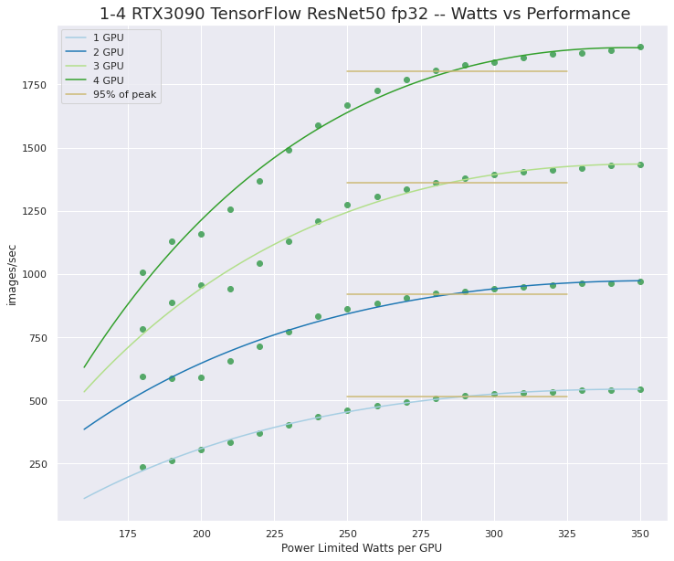
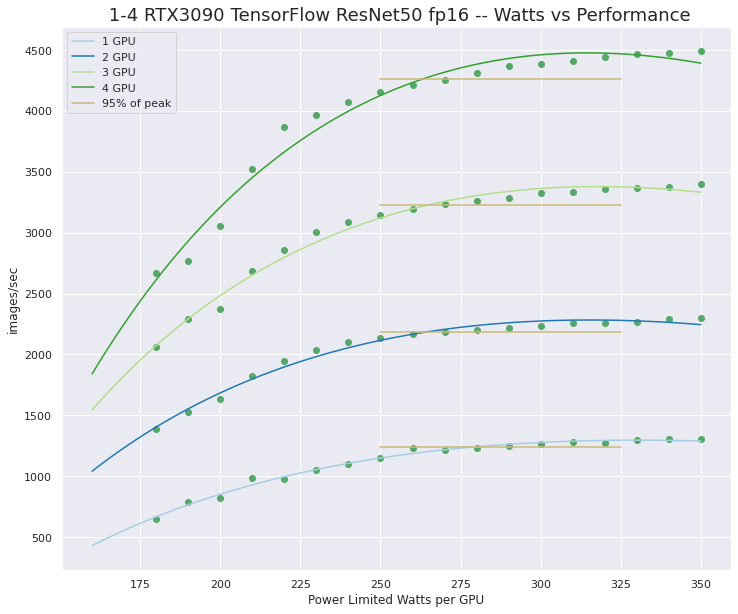
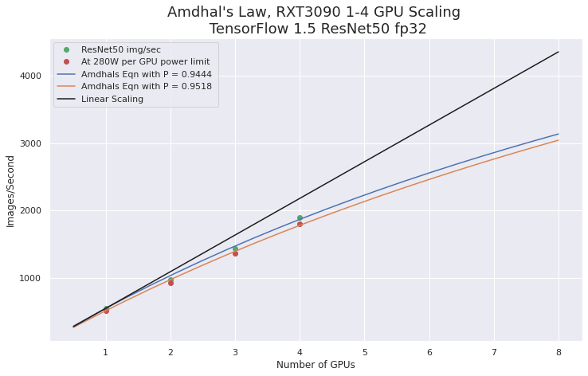
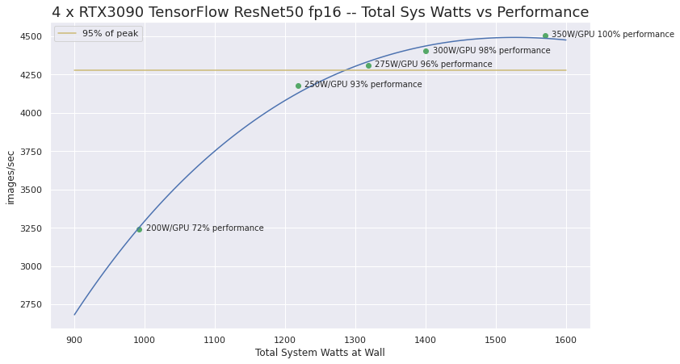

# Quad RTX3090 GPU Wattage Limited "MaxQ" TensorFlow Performance 


TL;DR: Can you run 4 RTX3090's in a system under heavy compute load? Yes, by using nvidia-smi I was able to reduce the power limit on 4 GPUs from 350W to 280W and achieve over 95% of maximum performance. The total power load "at the wall" was reasonable for a single power supply and a modest US residential 110V, 15A power line. At least look at the plots below. 

## Introduction
The NVIDIA RTX3090 is a very capable GPU for accelerated compute intensive tasks like ML/AI model training. It offers a significant performance improvement over the last generation RTX20 GPUs. It also uses at LOT more power! The TDP Wattage for the RTX3090 is 350W. This is OK for high performance system builds with 1, 2, or even 3 GPUs. What if you want to push that to 4 GPUs?

Can you run heavy compute loads on Quad RTX3090 GPUs without using 2 power supplies and within the constraints of a US 110V 15A power line?

Yes! It's possible to sensibly make use of 4 RTX3090's. How? By using the NVIDIA System Management Interface (nvidia-smi) to apply power limits to the GPUs. I was able to achieve 95% of maximum compute performance with a GPU power limit of around 280W. That is a power draw similar to using 3 RTX3090's at full (350W) but with much better performance!

## MaxQ?

This testing was inspired by what NVIDIA and their partners do for some of their laptop GPUs. They have a "feature" called "MaxQ". That's an abuse of an aeronautical engineering term and not really appropriate but, hey, it sounds good and the basic idea is great!  I set out to find "MaxQ" for the RTX3090 with the goal of finding a stable 4 GPU configuration with good performance per Watt.

The core idea of MaxQ is simple. The GPU performance increases rapidly as the current (Wattage) is increased from some minimal value. However, as the current approaches the max TDP, performance gains diminish significantly. You are trying to find the "sweet spot". You can define "sweet spot" in several ways; it could be where the derivative (slope) of the power vs performance curve has dropped below 1 (linear). You don't actually have to calculate anything because it is obvious from just looking at the power vs performances curves. I set my criteria for "sweet spot" to be 95% of the performance at full TDP wattage. It will be very obvious in the plots. 

I had use of a testbed system with 4 RTX3090's with 2 power supplies and sufficient power "at the wall" to run them at full power under heavy load. I collected a lot of data and have some interesting plots. After a description of the test setup and procedure we'll dive into the plots. 

## Test system
**Hardware**
- Intel Xeon 3265W: 24-cores (4.4/3.4 GHz)
- Motherboard: Asus PRO WS C621-64L SAGE/10G (Intel C621-64L EATX) 
- Memory: 6x REG ECC DDR4-2933 32GB (192GB total)
- PSU1: EVGA SuperNOVA P2 1600W (80 PLUS Platinum)
- PSU2: Super Flower Leadex Platinum 850W (80 PLUS Platinum)
- **NVIDIA 4 RTX3090s  Gigabyte GeForce RTX 3090 TURBO 24GB Blower**

**Software**
- Ubuntu 20.04 Linux (Server)
- Enroot 3.3.1 
- **NVIDIA Driver Version: 455.38**
- nvidia-container-toolkit 1.3.0-1
- nvidia-smi
- NVIDIA NGC containers
    - nvcr.io/nvidia/tensorflow:20.10-tf1-py3

**Test Jobs**
- [TensorFlow-1.15](https://www.tensorflow.org): ResNet50 v1, fp32 and fp16


**Testing Script**
```
#!/usr/bin/env bash
# Generate data for maxQ plot

GPU_NAME='RTX3090'
TEST_DIR=$HOME/quad-gpu/maxQ

OUT_FILE=${TEST_DIR}/${GPU_NAME}_maxQ.out

# setup environment variables, etc.
export ENROOT_MOUNT_HOME=y
CUDA_VISIBLE_DEVICES=0,1,2,4
sudo nvidia-smi -pm 1 -i 0,1,2,3

for w in {100..350..10}
do

sudo nvidia-smi -pl $w -i 0,1,2,3
#enroot start ngc-tf1-10 python nvidia-examples/cnn/resnet.py  --layers=50  --batch_size=96  --precision=fp32 -i 120 | tee ${OUT_FILE}
enroot start ngc-tf1-10 mpiexec --allow-run-as-root --bind-to socket -np 4 python nvidia-examples/cnn/resnet.py --layers=50 -b 96 --precision=fp32 -i 180 | tee ${OUT_FILE}

ips=$(grep -E '^\s+[0-9]+\s+' ${OUT_FILE} | tr -s ' ' | cut -d ' ' -f 4 | sort -n | tail -1 ) 

echo "$w, $ips" >> ${TEST_DIR}/maxQ.data
done
exit 0
```
Note: I am using NVIDIA enroot to run the docker container image 20.10-tf1-py3 from NGC. I used enroot to import the docker image and create a local container "sandbox" named ngc-tf1-10. This script could also be setup using docker. Also, since I'm using enroot running in user space I really didn't need --allow-run-as-root, but you would need that with docker. --bind-to socket is also not needed in my case since I was using a single socket system.

## Setting GPU power limits with nvidia-smi
To set the power limits nvidia-smi can be used. Here are the needed commands,

**Set Persistence Mode**
"When persistence mode is enabled the NVIDIA driver remains loaded even when no active clients,
 such as X11 or nvidia-smi, exist."
 I did this to keep any changes to the GPU runtime settings from reverting to defaults after job runs had completed. **This may be unnecessary(?)** Must be done as root and it does not survive a system reboot (only available on Linux). 
```
sudo  nvidia-smi -pm 1 
or 
sudo nvidia-smi --persistence-mode=1
```
This should set all of the GPUs but I use the "-i" flag to explicitly specify the GPUs by id. For example `-i 0,1,2,3` for all 4 GPU's in the system.  

**Set GPU Power Limits**
Setting the GPU power limit to 280W can be done with,
```
sudo nvidia-smi -pl 280 
or 
sudo nvidia-smi  --power-limit=280
```
Please see the NVIDIA [nvidia-smi documentation for details.](http://developer.download.nvidia.com/compute/DCGM/docs/nvidia-smi-367.38.pdf) It's a very powerful tool! 

You can monitor power usage during a job run with, ( -q query, -d display type, -i GPU ID, -l 1 repeat every 1 second )
```
 nvidia-smi -q -d POWER -i 0 -l 1 | grep "Power Draw"
```

## Power vs Performance Plots

A number of jobs were run using TensorFlow 1.5 with a ResNet50 CNN training on synthetic data. The jobs ran for several minutes and data was collected for 1 to 4 GPUs using fp32 and fp16 precision. **The plots convey a lot of information!**

I used a simple model function to fit a curve to the data points to aid in visualization (it does not have the correct asymptotic behavior) Scipy curve_fit was used to find fitting parameters. For example,
```
def fcn(x,a,b,c):
    return a  + b*x + c*np.log(1+x)
popt32x1, pcov = curve_fit(fcn, watts, fp32x1)
popt32x1

array([-8.38597282e+03, -5.26458024e+00,  1.83816919e+03])
```

---


Notes:
- The plot shows power vs performance curves for 1-4 GPU's
- The yellow lines are indicators for the 95% performance point for each curve
- You can clearly see that performance gains decrease closer to TPD wattage
- You can also see that the multi-GPU performance scaling going from 1 to 4 GPU's is excellent
- It is also clear how much performance is improved by using 4 GPUs at restricted power vs 3 GPUs at full power. 
- There was some erratic performance at low power levels. In some cases wattage under 180 seemed to be ignored and the GPUs would run without the power limit. I had varied the power per GPU from 100W to 350W in steps of 10 but dropped the results from under 180W because of this. 

---


Notes:
- These curves using fp16 (Tensorcores) are similar to the fp32 job runs

---

The following [Amdhal's Law](https://en.wikipedia.org/wiki/Amdahl's_law) plot shows how well ResNet50 with TensorFlow is scaling for multi-GPU. This scaling holds up with the power limits.  



---

This last plot shows the performance with 4 RTX3090's. The scale of this plot makes it easier to see the performance change vs wattage. It would be quite reasonable to run these GPUs at 250W instead of 350W and "settle" for 93% of max performance!

This plot also shows the total system power draw "at the wall" as measured with 2 ["Kill A Watt"](https://en.wikipedia.org/wiki/Kill_A_Watt) meters. (and 2 power supplies)  This should give an idea what to expect for the total system current load. 



## Conclusions, Caveats, and Unanswered Questions

I hope this testing gives you an sense of the feasibility of running a quad RTX3090 workstation. You could probably do this at full power by using 2 power supplies and an isolated 110V 20A power-line. (or 2 15A lines) Even better would be running on a 240V line. However, if you are considering this for use at home or at an office or lab that has restrictive power resources then you likely need to limit power for the GPUs or just do a build with 3 instead of 4 GPUs. You may not be able to have a full power circuit dedicated for one machine!  Even if you can get the needed power it is worth considering lowering the GPU power limit to be more energy efficient!

**Caveats**
- This power limit solution is system configuration based (not firmware based). You have to ensure that the limits are set properly before you start running jobs.
- A high quality power supply like the 1600W EVGA that was used in this testing is essential. That PSU has good circuit protection and will shut the system down on over-current situations. This is what I observed when trying to run 4 GPUs at full power and job load with just that single PSU. 
- You could trip circuit breakers on the power lines you are using. If you start up a large job and the power limit configuration was not set for some reason you might have problems if you overload the power line!

**Unanswered Questions**
- Is this going to be reasonable in a "production" ready system build? I was running on an open-air testbed. I did not monitor temperatures. These Gigabyte blower style cards are excellent, but with 4 of them in a case they will be packed tightly and will require exceptionally good air flow through the chassis. Also well controlled ambient temperature would be needed.  Remember you are considering power draw around that of a hair-dryer. There will be a lot of heat generated when the system is running a heavy job load.
- Will limiting the power to the GPUs affect other tasks, like running the display or other things that put a load on the GPU?  Probably. I ran my testing with an Ubuntu 20.04 server install without a GUI. I was connected remotely and didn't do anything else with the GPUs other than monitor them during the testing.  
- Can you do this on a MS Windows 10 system?  I may try to do this on Windows. The NVIDIA driver for Windows does install nvidia-smi but it's not on your execution path, you will have to search for it. Also, Windows does not support "persistance mode" which may be needed(?).
- The big question is -- Will Puget Systems offer this as a system configuration option? I will say no ... unless we can do the power limits in the GPU firmware. We are working are trying to arrange this but even if we are successful there could be issues with warranties, RMA's etc..

I can't say that I 100% recommend running 4 RTX3090's with power limits in a production system. But it is really tempting! If you want to do this you may have to order a system with 3 GPUs that is physically capable of supporting 4 and add the 4th GPU and do the configuration yourself. 

I will probably do a follow-up post to this with instructions on how to setup a Systemd Unit file do do the power limit setting automatically at boot. I may also try this on Windows. One thing is certain, the NVIDIA RTX3090 is an amazing GPU! I do highly recommend this and also the RTX3080 for ML/AI work with a desktop system. The issues I had with drivers, CUDA libraries and frameworks in early testing are going away, as expected. I think one more update on software will take care of any lingering problems. 

I you have questions or suggestions for a inclusions in a followup post let me know in the comments.

**Happy computing! --dbk**