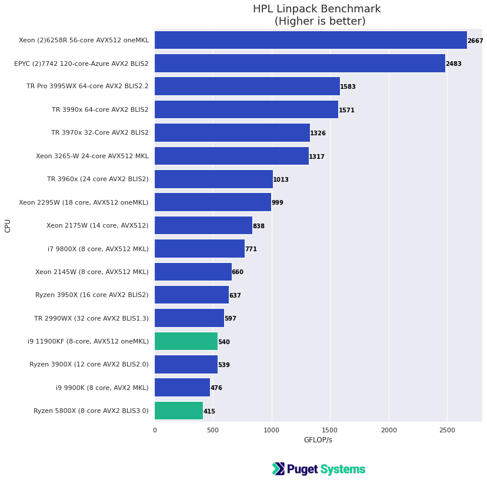
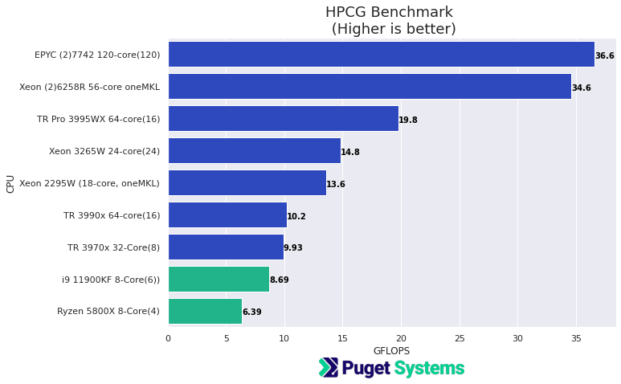
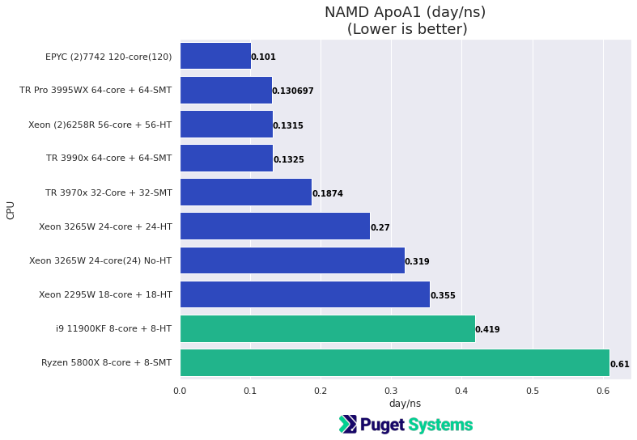
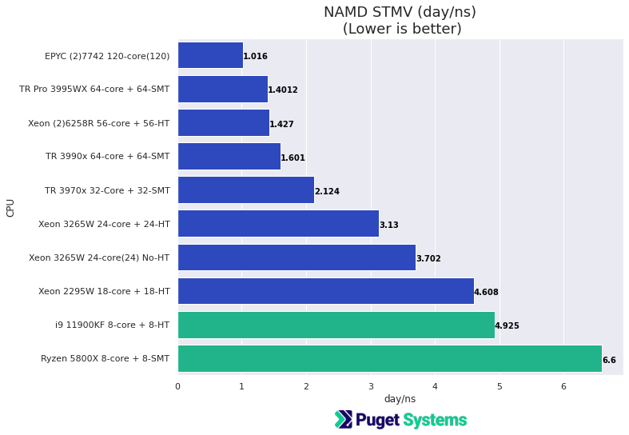

# Intel Rocket Lake Compute Performance Results HPL HPCG NAMD and Numpy

## Introduction

The new Intel Rocket Lake CPUs have been officially released. There were numerous posts and reviews before the official release date of March 30 2021, but I haven't seen anything about the numerical compute performance. I've had access to a Core-i9 11900KF 8-core CPU and have compared it with (my own) AMD 5800X system.

I'm not completely sure what to make of Rocket-Lake. It is a departure from the usual Core-i processors in that it has newer features found on recent Intel Xeon processors. Rocket Lake looks more like Core-X. It has AVX512 and DL-boost. (see the lscpu flags output below)

Here are some of the more interesting new features from a compute perspective.

**New compute features**
- AVX512
- DL Boost
    - VNNI -- an extension to AVX-512
    - bfloat16 arithmetic (16-bit floating point numbers)

- PCIe v 4.0
- DDR 3200 memory
- 2 memory channels
- Intel Xe-LP graphics (I used the "F" CPU which does not have on-board graphics hardware)

Here is the (very ugly) capabilities "flags" portion of "lscpu" output.

**Core i9 11900KF**
```
Flags:                           fpu vme de pse tsc msr pae mce cx8 apic sep mtrr pge mca cmov pat pse36 clflush dts acpi mmx fxsr sse sse2 ss ht tm pbe syscall nx pd
                                 pe1gb rdtscp lm constant_tsc art arch_perfmon pebs bts rep_good nopl xtopology nonstop_tsc cpuid aperfmperf tsc_known_freq pni pclmul
                                 qdq dtes64 monitor ds_cpl vmx est tm2 ssse3 sdbg fma cx16 xtpr pdcm pcid sse4_1 sse4_2 x2apic movbe popcnt tsc_deadline_timer aes xsa
                                 ve avx f16c rdrand lahf_lm abm 3dnowprefetch cpuid_fault invpcid_single ssbd ibrs ibpb stibp ibrs_enhanced tpr_shadow vnmi flexpriori
                                 ty ept vpid ept_ad fsgsbase tsc_adjust bmi1 avx2 smep bmi2 erms invpcid mpx avx512f avx512dq rdseed adx smap avx512ifma clflushopt in
                                 tel_pt avx512cd sha_ni avx512bw avx512vl xsaveopt xsavec xgetbv1 xsaves dtherm ida arat pln pts hwp hwp_notify hwp_act_window hwp_epp
                                  hwp_pkg_req avx512vbmi umip pku ospke avx512_vbmi2 gfni vaes vpclmulqdq avx512_vnni avx512_bitalg avx512_vpopcntdq rdpid fsrm md_cle
                                 ar flush_l1d arch_capabilities

```
and for comparison
**Xeon W 2295**
```
Flags:                           fpu vme de pse tsc msr pae mce cx8 apic sep mtrr pge mca cmov pat pse36 clflush dts acpi mmx fxsr sse sse2 ss ht tm pbe syscall nx pd
                                 pe1gb rdtscp lm constant_tsc art arch_perfmon pebs bts rep_good nopl xtopology nonstop_tsc cpuid aperfmperf pni pclmulqdq dtes64 moni
                                 tor ds_cpl vmx smx est tm2 ssse3 sdbg fma cx16 xtpr pdcm pcid dca sse4_1 sse4_2 x2apic movbe popcnt tsc_deadline_timer aes xsave avx 
                                 f16c rdrand lahf_lm abm 3dnowprefetch cpuid_fault epb cat_l3 cdp_l3 invpcid_single intel_ppin ssbd mba ibrs ibpb stibp ibrs_enhanced 
                                 tpr_shadow vnmi flexpriority ept vpid ept_ad fsgsbase tsc_adjust bmi1 avx2 smep bmi2 erms invpcid cqm mpx rdt_a avx512f avx512dq rdse
                                 ed adx smap clflushopt clwb intel_pt avx512cd avx512bw avx512vl xsaveopt xsavec xgetbv1 xsaves cqm_llc cqm_occup_llc cqm_mbm_total cq
                                 m_mbm_local dtherm ida arat pln pts hwp hwp_act_window hwp_epp hwp_pkg_req avx512_vnni md_clear flush_l1d arch_capabilities


``` 

**Pricing**

- The Rocket Lake 8-core i9 11900KF is priced at $513
- I ran the same testing against an AMD 8-core Ryzen 5800X priced at $449 A better comparison would have perhaps been the Ryzen 5900X 12-core priced at \$539

## Systems under test (New results)

I would have liked to have used more test systems but these are what I had available. I will include some older results in the charts for comparison.

**Intel Rocket Lake test platform**
- **Intel Core i9 11900KF 8-core ($513)**
- **Gigabyte Z490 Vision D motherboard**
- **4x DDR4-3200 16GB (64GB total)**

**AMD Ryzen - My personal system**
- **AMD Ryzen 7 5800X 8-core ($449)**
- **ASUS B550M Plus motherboard**
- **4x DDR4-2666 16GB (64GB total)**

I would have much preferred DDR4 3200 memory for the AMD system but this is what I had available. This is my personal AMD Zen3 development/test system.

**Software:** (For the new results)
- Ubuntu 20.04.2
- Kernel 5.8
- gcc/g++ 9.3
- [AMD AOCC v 3.0 complier (clang)](https://developer.amd.com/amd-aocc/)
- [AMD BLIS library v 3.0 (HPL)](https://developer.amd.com/amd-aocl/)
- [Intel oneAPI oneMKL (HPL, HPCG)](https://software.intel.com/content/www/us/en/develop/tools/oneapi.html)
- HPL Linpack (Using pre-compiled binaries from AMD BLIS and Intel oneMKL at links above)
- [HPCG 3.1](https://www.hpcg-benchmark.org/) (AMD built from source with AOCC, and gcc was tested but, Intel oneMKL HPCG benchmark gave best result for both CPUs)
- [NAMD 2.14 (Molecular Dynamics)](https://www.ks.uiuc.edu/Research/namd/)
- [Numpy 20.1](https://numpy.org/) From Intel and Conda-Forge conda repositories 

## Results

**Please note: the charts below contain the two new system results AND older results from post [HPC Parallel Performance for 3rd gen Threadripper, Xeon 3265W and EPYC 7742 (HPL HPCG Numpy NAMD)](https://www.pugetsystems.com/labs/hpc/HPC-Parallel-Performance-for-3rd-gen-Threadripper-Xeon-3265W-and-EPYC-7742-HPL-HPCG-Numpy-NAMD-1717/) and, [AMD Threadripper Pro 3995x HPL HPCG NAMD Performance Testing (Preliminary)](https://www.pugetsystems.com/labs/hpc/AMD-Threadripper-Pro-3995x-HPL-HPCG-NAMD-Performance-Testing-Preliminary-2085/) Please refer to these posts for additional information.** 

**...Make comparative judgments with caution! (there are older results for comparison that use older libraries and software versions.)**

The bar colors in the charts that follow are blue for older results and green for new results to be consistent with other posts by my colleagues at Puget Systems on Rocket Lake.  

## HPL

HPL Linpack is a good measure of raw floating point compute performance and can make good use of vector units (AVX). It is the standard performance ranking benchmark for the Top500 Supercomputer List.

- For the AMD Ryzen 5800X the optimized HPL binary build supplied with the AMD BLISv3.0 library was used (v2.2 and v2.0 for older results). Best results were obtained with,
N = 60000 (number of simultaneous equations) NB = 768  block size for level 3 BLAS (matrix) operations 

- For the Intel Xeon systems the OpenMP threaded Linpack build from the current oneMKL library was used (older results used older Intel MKL libraries). Peak results were at problem size of 80000.


**Notes:** 
- There are some very high performance CPUs in that chart! The 11900KF and 5800X are very modest CPUs. 
- The Xeon's have an advantage from the AVX512 vector unit and the highly optimized MKL library.
- **The biggest surprise, is how poorly the i9 11900KF did on this benchmark!** I had expected it to be better than the i7-9800X and Xeon 2145W 8-core processors.  

## HPCG
Memory performance bound!
Sparse 2nd order partial differential equation, multi-grid solver using Conjugate Gradient approximation.

This is a demanding benchmark that is limited by memory subsystem performance. It was designed as compliment to HPL to give a better overall indicator of HPC systems performance. 


**Notes:**
- I compiled HPCG using AMD AOCC v3.0 complier and libraries as well as gcc. However, I obtained by far the best results using Intel's HPCG benchmark from oneMKL. **The result with oneMKL on the AMD 5800x was over twice the performance of the build using AMD AOCC compiler.**
- **The Ryzen 5800X was at a disadvantage on this benchmark because of the slower DDR4 2666 memory.** Memory channels and speed are the main contributors to performance on this benchmark.
- The dual EPYC system is much like having 2 of the TR Pro 3995WX. It has a total of 16 memory channels.
- The number in parentheses is the number of CPU cores being used when the best results were obtained. This is a memory-bound benchmark.

## NAMD

NAMD is a widely used Molecular Dynamics program with excellent parallel scalability, and low dependence on specially optimized hardware libraries (like MKL). It makes a very good "real-world" parallel performance benchmark. 

The test jobs are;
- ApoA1   (Apolipoprotein A1) ~ 92000 atoms
- STMV  (Satellite Tobacco Mosaic Virus)  ~ 1 million atoms

**NAMD has very good GPU acceleration! The charts below are CPU only, using NAMD simply as a comparative benchmark.** In the "real-world" you would usually want to include one or two GPUs.  
## NAMD ApoA1


**Notes:**
- Both of these CPUs gave respectable results given their low core count. NAMD has very good CPU scaling. **The i9 11900KF did very well especially in comparison with the 18-core Xeon 2295W.**
- Hyper threading, HT, and, Symmetric Multi-Threading, SMT are useful for NAMD when using CPU alone. You can see that in the chart results for the Xeon 3265W.  When using GPUs it is better to not not use HT of SMT.   

## NAMD STMV


**Notes:**
- **A surprise with this test is that the 8-core i9-11900KF did well compared to the 18-core Xeon 2295W.**

## Numpy norm(AxB) ??? 

I have been doing testing with Python Numpy recently mostly because of the on-going issues between Intel and AMD for code optimizations for applications linked with Intel MKL library. In the past MKL would choose a non-optimal code path for AMD processors leading to poor performance. This has changed recently! And, the testing I did on i9-11900KF had an interesting twist. The performance of the i9-11900KF appears to have followed a non-optimal code path when I tested it with OpenBLAS! The result is very similar that what I used to see for AMD CPUs with MKL.

I am not presenting complete testing for numpy here. I just wanted to share this interesting and somewhat amusing result.

```
| Job               | i9-11900KF             | Ryzen 5800X                        |
|-------------------|------------------------|------------------------------------|
| Mat Norm oneMKL   | 28.5 sec               | 37.3 sec                           |
| Mat Norm openBLAS | 132.6 sec              | 34.3 sec                           |
```

You can see two very notable things in those results.
- First, the AMD Ryzen had respectable results when using numpy linked with the new Intel oneMKL. 
- Second, the i9-11900KF obviously took a very poor code path with openBLAS!

These results could be due to the newness of Rocket Lake?? It is notabale and comendable that Intel oneMKL gave good performance on the Ryzen 5800X. (Thank you for doing that Intel!)

To put the above results in perspective have a look at a post I wrote in November of 2019,
[How To Use MKL with AMD Ryzen and Threadripper CPU's (Effectively) for Python Numpy (And Other Applications) ](https://www.pugetsystems.com/labs/hpc/How-To-Use-MKL-with-AMD-Ryzen-and-Threadripper-CPU-s-Effectively-for-Python-Numpy-And-Other-Applications-1637/)

The python code for that test is very simple. If you would like to try this yourself on your system,
```
import numpy as np
import time

n = 20000

A = np.random.randn(n,n).astype('float64')
B = np.random.randn(n,n).astype('float64')

start_time = time.time()
nrm = np.linalg.norm(A@B)
print(" took {} seconds ".format(time.time() - start_time))
print(" norm = ",nrm)
```

## Conclusions

The Intel Core i9 11900KF is considerably different architecture than previous Core series processors and the first Core desktop processor to include AVX512. However, where I would have thought that AVX512 would have had a large impact (HPL) it performed poorly compared to Xeon and Core-X family of processors. 

I did not test any of the interesting new features like DL-Boost (16-bit floating point with AVX512 vectorization) or the new Xe-LP graphics. The testing in this post was just my "standard" CPU compute performance testing. 

The i9-11900KF is certainly a good processor but given the closeness of the price to the AMD Ryzen 12-core 5900X. I would expect the 50% additional cores of 5900X to mostly outperform it.

I did not get an opportunity to compare other CPUs in the new Rocket Lake release (or other AMD CPUs). From what I have seen elsewhere it looks like the i7-11700K is likely a better value than the i9 version. 

The overall platform for Rocket Lake is a significant step forward for Intel with the inclusion of PCIe v4 and is just a slight teaser of more formidable processors that should emerge from Intel later this year. 

**Happy computing! --dbk**